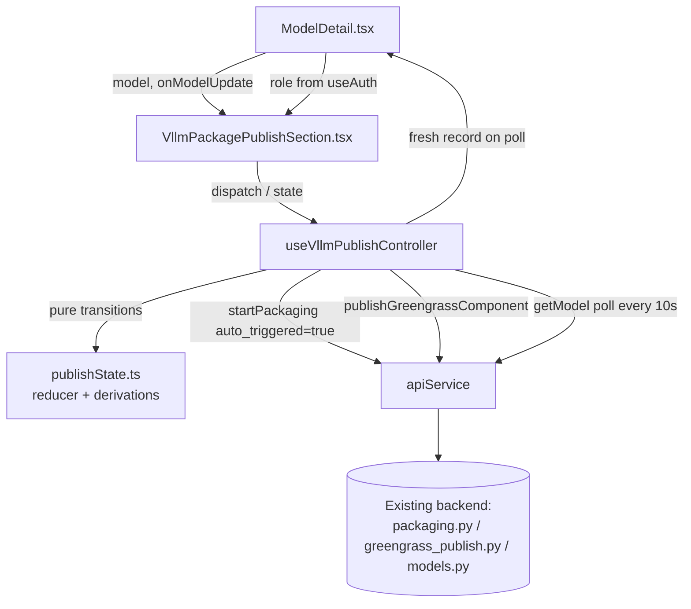

# Design Document

## Overview

This feature adds a web-GUI Package & Publish capability to the Model Detail page (`ModelDetail.tsx`) for Registered vLLM model records (source/model_type `vllm`). It is a **frontend-only** feature: it drives the existing backend contracts unchanged.

The flow the UI orchestrates:

1. The user activates the **Package_Publish_Action** on a vLLM record.
2. The frontend calls the existing `POST /api/v1/training/{id}/package` with `auto_triggered: true` (via `apiService.startPackaging(trainingId, undefined, true)`). The backend's vLLM branch (`packaging.py: is_vllm_record → package_vllm_component`) packages synchronously, writes `packaged_components`, and asynchronously invokes the Greengrass publish Lambda.
3. The publish Lambda (`greengrass_publish.py`) registers `model-vllm-{safe_model_name}` at version `N.0.0` and writes back the `published_component` map (component name, version, `supported_architectures`, runtime, `component_arns`, `published_at`) onto the record.
4. Because step 3 is asynchronous with no callback, the frontend **polls the model read operation** (`apiService.getModel(modelId)`, which surfaces `packaged_components` and `published_component` from the training-jobs record — see `models.py`) until it observes a `published_component` that is new or carries a different component version than the baseline captured at invocation time.
5. On completion, the record held in page state is replaced with the polled record, which populates the existing **Supported Architectures** section and the new published-state section.

Design constraints honored throughout:

- **No backend changes.** Only `apiService.startPackaging`, `apiService.publishGreengrassComponent`, and `apiService.getModel` are called, with only their existing request fields (Requirement 5.2). The publish-only retry mirrors the payload that `packaging.py:_trigger_component_creation` already sends (placeholder `component_name`/`component_version`, which the backend's vLLM branch overrides with the derived name and next `N.0.0`).
- **Vision records untouched.** The `trained`/`imported` → `CompilationTab` path in `ModelDetail.tsx` is not modified; the new UI renders only for vLLM records (Requirements 1.3, 5.1, 5.4, 5.5).
- **Record is the source of truth.** All displayed packaged/published state derives solely from `packaged_components` and `published_component` on the record (Requirement 4.1). The UI adds only transient session state (in-flight, polling, error banners).

### Research summary

Findings from the existing codebase that shape this design:

- `api.ts` `request()` throws `ApiError` carrying `message`, `status`, and — for simple `{error: string, ...}` envelopes — the full parsed body as `details`. The packaging/publish vLLM error responses include `failed_step` (`repository_generation`, `artifact_upload`, `record_update`, `greengrass_registration`) as a sibling of `error`, so the failing step is available at `err.details?.failed_step` with no client changes to error parsing.
- A **failed vLLM publish leaves no trace on the record**: `greengrass_publish.py` rolls back created component versions and returns a 502 without writing publish state. Since the auto-triggered publish is an async Lambda invoke, that 502 is unobservable by the frontend. Recovery is therefore: the 5-minute polling timeout message (Requirement 2.5) plus the publish-only retry action, which re-drives publish synchronously and *does* surface its error response (Requirements 3.3–3.5).
- `check_user_access(user_id, usecase_id, 'DataScientist')` gates both APIs server-side with the role hierarchy Viewer < Operator < DataScientist < UseCaseAdmin < PortalAdmin. The frontend convention for mirroring this is an exported allowed-roles list checked against `useAuth().user?.role` (see `WORKFLOW_EDIT_ROLES` in `WorkflowToolbar.tsx`).
- `CompilationTab.tsx` already polls at 15 s with `setInterval` cleared in the effect cleanup; this design uses the same timer approach with a tighter 10 s interval and an explicit deadline.
- Frontend tests use vitest + @testing-library/react + `@cloudscape-design/components/test-utils/dom`, with property tests in `*.property.test.ts` files using fast-check (`fast-check ^4.8.0` is already a dependency); pure state modules with adjacent tests are an established pattern (e.g. `code-assist/codeAssistState.ts`).

## Architecture

The feature is structured as one pure state module (fully unit/property testable), one controller hook that binds the state machine to timers and the API client, and one presentational section component mounted by `ModelDetail.tsx`.



New files (all under `edge-cv-portal/frontend/src/components/vllm-publish/`):

| File | Responsibility |
| --- | --- |
| `publishState.ts` | Pure module: session state machine (reducer), display-state derivation from the record, completion/failure predicates, role gating list, error mapping. No React, no I/O. |
| `useVllmPublishController.ts` | React hook: owns the reducer state, executes the API calls and the polling timer as effects of reducer-emitted commands, guarantees cleanup on unmount and staleness protection. |
| `VllmPackagePublishSection.tsx` | Cloudscape presentational section: action buttons, confirmation modal, progress/error/success banners, packaged & published state display. |

Touched files:

| File | Change |
| --- | --- |
| `ModelDetail.tsx` | Mount `VllmPackagePublishSection` for `model.model_type === 'vllm'` records (directly below the Supported Architectures section); pass `model` and an `onModelUpdate(model)` callback that replaces page state so all record-derived sections refresh. |
| `services/api.ts` | Add an optional `options?: { signal?: AbortSignal }` parameter to `startPackaging` and `publishGreengrassComponent`, threaded into `request()` (which already spreads `RequestInit`). Client-side only; request bodies unchanged. |

### Why a reducer + controller split

The requirements are dominated by session-lifecycle rules (single in-flight invocation, confirmation gating, baseline capture, timeout anchoring, poll-failure resilience, failure clearing on retry). Encoding these as a pure reducer over explicit events makes every rule directly property-testable without timers or network, while the thin controller hook only translates reducer *commands* (invoke packaging, invoke publish, schedule/stop polling) into effects. This mirrors the `codeAssistState.ts` pattern already in the repo.

## Components and Interfaces

### 1. `publishState.ts` — pure state machine and derivations

```typescript
// Roles allowed to package/publish, mirroring the backend's
// check_user_access(..., 'DataScientist') hierarchy gate.
export const VLLM_PACKAGE_ROLES: readonly UserRole[] = [
  'DataScientist', 'UseCaseAdmin', 'PortalAdmin',
];
export function canPackageVllm(role: UserRole | undefined | null): boolean;

// ---- Session state machine ------------------------------------------------

/** Baseline captured at invocation time: the published component_version
 *  present on the record, or null when the record had none (Req 2.1). */
export type Baseline = string | null;

export type PublishSession =
  | { kind: 'idle' }
  // A packaging or publish request is in flight (Req 1.5 / 3.7).
  | { kind: 'requesting'; action: 'package' | 'publish-retry'; baseline: Baseline }
  // Confirmation modal open for a re-publish (Req 1.7).
  | { kind: 'confirming'; baseline: Baseline }
  // Poll loop active. deadline = startedAt + POLL_TIMEOUT_MS, fixed at
  // poll start and never moved by poll failures (Req 2.5, 2.7).
  | { kind: 'polling'; baseline: Baseline; startedAt: number; deadline: number }
  // Terminal session states (record state still renders independently).
  | { kind: 'published'; component: VllmPublishedComponent }
  | { kind: 'timed-out' }                          // Req 2.5 pending message
  | { kind: 'failed'; error: SessionError };       // Req 3.1, 3.2, 3.5, 3.6

export interface SessionError {
  message: string;
  failedStep?: string;   // from ApiError.details.failed_step or a failed
                         // packaged_components entry (Req 3.1, 3.2)
  source: 'package' | 'publish-retry' | 'record';
}

export type PublishEvent =
  | { type: 'ACTIVATE'; record: Model; now: number }        // main action
  | { type: 'CONFIRM'; now: number }                        // modal confirm
  | { type: 'CANCEL_CONFIRM' }
  | { type: 'ACTIVATE_PUBLISH_RETRY'; record: Model; now: number }
  | { type: 'REQUEST_SUCCEEDED'; now: number }              // API 2xx
  | { type: 'REQUEST_FAILED'; error: SessionError }         // API error / 30s timeout
  | { type: 'POLL_RESULT'; record: Model; now: number }     // successful poll
  | { type: 'POLL_FAILED'; now: number };                   // failed poll (Req 2.7)

/** Commands the controller executes as effects of a transition. */
export type PublishCommand =
  | { type: 'INVOKE_PACKAGING' }        // startPackaging(id, undefined, true)
  | { type: 'INVOKE_PUBLISH' }          // publishGreengrassComponent placeholder payload
  | { type: 'START_POLLING' }
  | { type: 'STOP_POLLING' };

export function publishReducer(
  state: PublishSession,
  event: PublishEvent
): { state: PublishSession; commands: PublishCommand[] };
```

Key reducer rules (each maps to acceptance criteria):

- `ACTIVATE` in `idle`/`failed`/`timed-out`/`published`:
  - captures `baseline = record.published_component?.component_version ?? null` (Req 2.1);
  - if `record.published_component` exists → `confirming` and **no** invoke command (Req 1.7); otherwise → `requesting('package')` + `INVOKE_PACKAGING` (Req 1.2);
  - always clears any prior `failed` error (Req 3.8).
- `ACTIVATE`/`ACTIVATE_PUBLISH_RETRY` in `requesting`, `confirming`, or `polling` → no state change, no commands (single in-flight invocation, Req 1.5, 3.7).
- `CONFIRM` in `confirming` → `requesting('package')` + `INVOKE_PACKAGING` (Req 1.7).
- `REQUEST_SUCCEEDED` → `polling` with `startedAt = now`, `deadline = now + POLL_TIMEOUT_MS` + `START_POLLING` (Req 2.1).
- `REQUEST_FAILED` → `failed(error)` (action re-enabled by derivation; Req 3.1, 3.5, 3.6).
- `POLL_RESULT`:
  - if `isPublishComplete(baseline, record)` → `published` + `STOP_POLLING` (Req 2.3);
  - else if `recordFailure(record)` → `failed` with the recorded step/message + `STOP_POLLING` (Req 3.2);
  - else if `now >= deadline` → `timed-out` + `STOP_POLLING` (Req 2.5);
  - else stay `polling` unchanged.
- `POLL_FAILED`: if `now >= deadline` → `timed-out` + `STOP_POLLING`; else stay `polling` with the **same** `deadline` (Req 2.5, 2.7).

```typescript
// ---- Predicates and derivations --------------------------------------------

export const POLL_INTERVAL_MS = 10_000;  // ≤ 15 s (Req 2.2)
export const POLL_TIMEOUT_MS = 300_000;  // 5 min (Req 2.5)
export const REQUEST_TIMEOUT_MS = 30_000; // per-request cap (Req 3.6)

/** Completion: a published_component that is new since invocation or has a
 *  different component_version than the baseline (Req 2.3). */
export function isPublishComplete(baseline: Baseline, record: Model): boolean;

/** A packaged_components entry whose status is neither 'packaged' nor a
 *  success value → the recorded failure to surface (Req 3.2, 4.6). Returns
 *  the failing entry (target, status, error) or null. Note: a rolled-back
 *  vLLM publish writes nothing to the record, so publish failures during
 *  auto-chaining are only reachable via the timeout path. */
export function recordFailure(record: Model): SessionError | null;

/** Everything the section renders, derived from (record, role, session).
 *  Record-derived parts depend ONLY on the record (Req 4.1). */
export interface PanelState {
  visible: boolean;                 // model_type === 'vllm' only (Req 1.3, 5.4)
  action: {
    label: 'Package & Publish' | 'Re-publish Component';   // Req 1.1, 1.4
    enabled: boolean;               // false when !canPackageVllm(role) or in flight
    loading: boolean;               // requesting('package') (Req 1.5)
    permissionMessage?: string;     // Req 1.6
    republishNote?: string;         // "registers the next component version (N+1.0.0)" (Req 1.4)
    requiresConfirmation: boolean;  // published_component present (Req 1.7)
  };
  publishRetry?: {                  // only when packaged-success && !published (Req 3.3, 4.2)
    enabled: boolean;
    loading: boolean;               // requesting('publish-retry') (Req 3.7)
  };
  packagedSection?: Array<{ target: string; status: string; error?: string }>; // Req 4.1, 4.2, 4.6
  publishedSection?: {              // Req 4.1, 4.3
    componentName: string;
    componentVersion: string;
    publishedAt: number;
    componentArns: Record<string, string>;
    supportedArchitectures: string[];
  };
  progress?: { message: string };   // polling in-progress indicator (Req 2.2)
  success?: { message: string };    // packaging accepted / publish complete (Req 2.1, 2.3)
  pending?: { message: string };    // timeout message (Req 2.5)
  error?: SessionError;             // Req 3.1, 3.2, 3.5, 3.6
}

export function derivePanelState(
  record: Model,
  role: UserRole | undefined,
  session: PublishSession
): PanelState;

/** ApiError / unknown error → SessionError (message + failed_step). */
export function toSessionError(
  err: unknown,
  source: SessionError['source']
): SessionError;

/** Next re-publish version hint: major(published)+1 + '.0.0'. */
export function nextComponentVersion(current: string): string;
```

### 2. `useVllmPublishController.ts` — controller hook

```typescript
export interface VllmPublishController {
  panel: PanelState;
  activate(): void;          // ACTIVATE
  confirm(): void;           // CONFIRM
  cancelConfirm(): void;     // CANCEL_CONFIRM
  activatePublishRetry(): void;
}

export function useVllmPublishController(
  model: Model,
  role: UserRole | undefined,
  onModelUpdate: (m: Model) => void
): VllmPublishController;
```

Behavior:

- Holds `PublishSession` in a `useReducer`-style state; every dispatch runs `publishReducer` and executes returned commands.
- **`INVOKE_PACKAGING`**: `apiService.startPackaging(trainingId, undefined, true, { signal })` where `trainingId = model.training_job_id || model.model_id` (same derivation ModelDetail already uses) and `signal = AbortSignal.timeout(REQUEST_TIMEOUT_MS)`. Success → `REQUEST_SUCCEEDED`; error or abort → `REQUEST_FAILED` with `toSessionError` (an `AbortError`/`TimeoutError` maps to the "request did not complete" message, Req 3.6).
- **`INVOKE_PUBLISH`**: `apiService.publishGreengrassComponent(trainingId, placeholderName, '1.0.0', model.name, undefined, { signal })` with `placeholderName = 'model-' + safeName(model.name)` — the exact payload shape `_trigger_component_creation` sends today; the backend vLLM branch overrides name and version (`derive_vllm_component_name`, `next_vllm_component_version`), so the request contract is unchanged (Req 5.2). Same 30 s abort handling.
- **`START_POLLING`**: sets `setInterval(POLL_INTERVAL_MS)`; each tick calls `apiService.getModel(model.model_id)`, then dispatches `POLL_RESULT` with the fresh record (also invoking `onModelUpdate(record)` so the page's record-derived sections — including Supported Architectures — refresh live, Req 2.4, 4.4) or `POLL_FAILED` on error (Req 2.7). The deadline check lives in the reducer, so a burst of failed polls cannot extend it.
- **`STOP_POLLING`** and unmount cleanup: the interval id lives in a ref; the effect cleanup clears it, guaranteeing no further poll requests after unmount (Req 2.6). A monotonically increasing *session generation* counter is captured by each in-flight request and poll tick; responses whose generation no longer matches are dropped, so late responses from an abandoned session (or after unmount) can never dispatch.

### 3. `VllmPackagePublishSection.tsx` — presentational section

Renders from `PanelState` only. Layout, top to bottom inside one Cloudscape `Container` headed "Component Packaging & Publish":

1. **Banners** (Cloudscape `Alert`): `error` (type=error, shows `message` and, when present, "Failed step: {failedStep}"), `success` (type=success, dismissible), `pending` (type=warning: "Publish is still pending. Refresh the page to check again."), `progress` (type=info with a `StatusIndicator type="in-progress"`: "Publishing component… checking every 10 seconds").
2. **Action row**: the Package_Publish_Action `Button` (variant=primary, `loading`, `disabled` per `PanelState.action`) with the permission message (Req 1.6) or re-publish note (Req 1.4) beneath it as secondary text; the publish-only retry `Button` ("Publish packaged component") when `publishRetry` is present (Req 3.3).
3. **Packaged state** (`packagedSection`): small table of target / status (`StatusIndicator`) / error per entry (Req 4.1, 4.2, 4.6).
4. **Published state** (`publishedSection`): `KeyValuePairs` with component name, version, published timestamp (via the page's existing `formatTimestamp` convention) and a per-target ARN list in monospace, matching the page's Greengrass Components table style (Req 4.3).
5. **Re-publish confirmation `Modal`** (visible when session is `confirming`): warns "Re-publishing registers the next component version ({nextComponentVersion}). Continue?", Cancel → `cancelConfirm()`, primary "Re-publish" → `confirm()` (Req 1.7).

The **Supported Architectures** section already in `ModelDetail.tsx` needs no change: it renders from `model.published_component.supported_architectures` (with packaged-entry fallback), and the controller's `onModelUpdate` refreshes `model`, so badges appear on completion (Req 2.4) and the placeholder is retained when the list is empty (Req 2.8) — the existing `getSupportedArchitectures` already handles both.

### 4. `ModelDetail.tsx` integration

```tsx
{model.model_type === 'vllm' && (
  <VllmPackagePublishSection
    model={model}
    role={user?.role}
    onModelUpdate={setModel}
  />
)}
```

- `useAuth()` is added to the page to obtain `user.role` (Req 1.6). The frontend check is UX-only; the backend `check_user_access` remains authoritative, and its 403 surfaces through the normal error path.
- The existing `source === 'trained' || source === 'imported'` → `loadTrainingJob` → `CompilationTab` path is untouched (Req 1.3, 5.1, 5.5). vLLM records never enter it (source `vllm`), and non-vLLM records never mount the new section, so no vLLM polling can start for them (Req 5.4).

## Data Models

No new persisted data. The frontend consumes existing record fields already typed in `ModelDetail.tsx` / `api.ts`:

```typescript
// From the model read operation (models.py → getModel). Already present in
// the page's Model interface; extracted to a shared type for publishState.ts.
interface PackagedComponentEntry {
  target: string;                       // e.g. 'jetson-xavier-jp6'
  status: string;                       // 'packaged' | 'failed'
  component_package_s3?: string;
  supported_architectures?: string[];   // e.g. ['arm64_jp6']
  error?: string;                       // present on failed entries
}

interface VllmPublishedComponent {      // already declared in api.ts
  component_name: string;               // 'model-vllm-{safe_model_name}'
  component_version: string;            // 'N.0.0'
  supported_architectures: string[];
  runtime: string;                      // 'vllm'
  component_arns: Record<string, string>;
  published_at: number;                 // epoch ms
}
```

Request/response contracts used (unchanged):

| Call | Request body | Success response fields used | Error fields used |
| --- | --- | --- | --- |
| `startPackaging(id, undefined, true)` | `{ targets: undefined, auto_triggered: true }` | `packaged_components`, `component_creation_triggered`, `message` | `error`, `failed_step` (via `ApiError.message` / `ApiError.details.failed_step`) |
| `publishGreengrassComponent(id, 'model-{safe}', '1.0.0', name)` | `{ component_name, component_version, friendly_name, targets: undefined }` | `component_name`, `component_version`, `published_components` | `error`, `failed_step`, `retryable` |
| `getModel(modelId)` (poll) | — | `model.packaged_components`, `model.published_component`, full record for `onModelUpdate` | poll errors swallowed (Req 2.7) |

Session-state model: the `PublishSession` union defined in Components and Interfaces is the only new state, held in memory per page visit and never persisted (Req 4.1 — reload derives display purely from the record).

## Correctness Properties

*A property is a characteristic or behavior that should hold true across all valid executions of a system — essentially, a formal statement about what the system should do. Properties serve as the bridge between human-readable specifications and machine-verifiable correctness guarantees.*

### Property 1: Action gating and labeling derive from record and role

*For any* model record and user role, `derivePanelState` SHALL make the Package_Publish_Action visible if and only if the record is a vLLM record; when visible, it SHALL be enabled (absent an in-flight session) if and only if the role is in `VLLM_PACKAGE_ROLES`, SHALL carry the permission message exactly when the role is not permitted, and SHALL carry the re-publish label with the next-version note if and only if the record has a `published_component`. Non-vLLM records SHALL yield no vLLM action, no vLLM state sections, and no polling-related output.

**Validates: Requirements 1.1, 1.3, 1.4, 1.6, 5.1, 5.4**

### Property 2: Record state sections derive solely from the record

*For any* model record and any session state, the packaged-state section SHALL be present (listing each entry's target and status, including recorded failure info for failed entries) if and only if the record has at least one `packaged_components` entry; the published-state section SHALL be present (with component name, version, publish timestamp, and component ARNs) if and only if the record has a `published_component`; and the publish-only retry action SHALL be offered if and only if the record has at least one successfully packaged entry and no `published_component`. Records with neither SHALL show neither section.

**Validates: Requirements 3.3, 4.1, 4.2, 4.3, 4.5, 4.6**

### Property 3: Supported architectures rendering

*For any* published component write-back, the Supported Architectures derivation SHALL produce exactly one badge value per entry of a non-empty `supported_architectures` list, and SHALL fall back to the placeholder (while the published section still shows component name and version) when the list is empty.

**Validates: Requirements 2.4, 2.8**

### Property 4: Publish completion predicate

*For any* baseline (a component version string or absent) and any polled record, `isPublishComplete` SHALL return true if and only if the record contains a `published_component` and either the baseline was absent or the record's component version differs from the baseline. In particular, a record still carrying the same version as the baseline is never complete (re-publish detection).

**Validates: Requirements 2.1, 2.3**

### Property 5: Activation protocol — confirmation gating and single in-flight invocation

*For any* record and any sequence of activation events, the reducer SHALL emit an `INVOKE_PACKAGING` command only via `ACTIVATE` on a record without a `published_component`, or via `CONFIRM` following an `ACTIVATE` on a record with one (never directly from that `ACTIVATE`); and while a session is in `requesting`, `confirming`, or `polling`, any further `ACTIVATE` or `ACTIVATE_PUBLISH_RETRY` events SHALL emit no commands and change no state — so at most one API invocation is in flight per record at any time.

**Validates: Requirements 1.2, 1.5, 1.7, 3.7**

### Property 6: Successful invocation starts an anchored polling session with the invocation-time baseline

*For any* record and any invocation time, dispatching `REQUEST_SUCCEEDED` after an activation SHALL transition to `polling` with `baseline` equal to the record's published component version at activation time (or null if absent), `startedAt` equal to the success time, and `deadline` exactly `POLL_TIMEOUT_MS` after it, emitting `START_POLLING`.

**Validates: Requirements 2.1**

### Property 7: Poll-tick outcomes

*For any* polling session and any polled record: if the completion predicate holds, the reducer SHALL transition to `published` and stop polling; otherwise, if the record carries a failed packaged entry, it SHALL transition to `failed` carrying the recorded failing step and message and stop polling (leaving the action re-enabled); otherwise, if the tick time is at or past the deadline, it SHALL transition to `timed-out` with the pending message and stop polling; otherwise it SHALL remain `polling` with an unchanged deadline.

**Validates: Requirements 2.2, 2.3, 2.5, 3.2**

### Property 8: Poll failures are absorbed without extending the timeout

*For any* polling session and any sequence of `POLL_FAILED` and non-completing `POLL_RESULT` events, the session SHALL remain `polling` with the original deadline unchanged and no failure surfaced, until an event at or past the deadline transitions it to `timed-out`; the number and order of failed polls SHALL never alter the deadline.

**Validates: Requirements 2.5, 2.7**

### Property 9: API error mapping surfaces message and failing step and re-enables the action

*For any* API error (structured envelope with or without `failed_step`, plain error, network error, or 30-second abort) from a packaging or publish-retry invocation, `toSessionError` + `derivePanelState` SHALL yield a displayed error containing the error message (and the failing step when present, or the request-did-not-complete message for aborts/network errors) with the initiating action enabled again.

**Validates: Requirements 3.1, 3.5, 3.6**

### Property 10: Retry activation clears prior failure state

*For any* session in a `failed` state and any record, dispatching `ACTIVATE` or `ACTIVATE_PUBLISH_RETRY` SHALL produce a state carrying no error, so no failure information from the previous attempt remains displayed when new progress or result feedback begins.

**Validates: Requirements 3.8**

### Property 11: Publish-only retry resumes the standard publish session

*For any* record with a successfully packaged entry and no `published_component`, `ACTIVATE_PUBLISH_RETRY` SHALL emit exactly one `INVOKE_PUBLISH` command and enter `requesting('publish-retry')`, and a subsequent `REQUEST_SUCCEEDED` SHALL enter `polling` with a fresh `POLL_TIMEOUT_MS` deadline — identical in structure to the packaging path's session.

**Validates: Requirements 3.4**

## Error Handling

| Failure | Detection | UI behavior |
| --- | --- | --- |
| Packaging API error (e.g. `repository_generation`, `artifact_upload`, `record_update`) | `ApiError` from `startPackaging`; `details.failed_step` | Error alert with message + "Failed step: …"; Package_Publish_Action re-enabled (Req 3.1) |
| Publish-retry API error (e.g. `greengrass_registration`, 400 validation) | `ApiError` from `publishGreengrassComponent` | Error alert with message (+ step when present); retry action re-enabled (Req 3.5) |
| 403 insufficient permissions | `ApiError.status === 403` | Same error path; message shown verbatim. Normally prevented by the role-gated disabled state (Req 1.6) |
| No response in 30 s / network failure | `AbortSignal.timeout(30_000)` abort or fetch rejection | "The request did not complete. Check your connection and try again."; initiating action re-enabled (Req 3.6). Stale-generation guard drops any late success |
| Individual poll failure | `getModel` rejection during polling | Swallowed; next tick proceeds; deadline unchanged (Req 2.7) |
| Failed packaged entry observed (on poll or on page load) | `recordFailure(record)` | Stop polling (if active); show recorded step + message; actions re-enabled (Req 3.2, 4.6) |
| Publish never lands (async publish failed and rolled back — record shows no trace) | 5-minute deadline expiry | "Publish is still pending. Refresh the page to check again." (Req 2.5). The publish-only retry then appears from record state (packaged, not published) and re-drives publish synchronously, surfacing its real error (Req 3.3–3.5) |
| Unmount mid-session | Effect cleanup + generation counter | Interval cleared; no further polls; late responses dropped (Req 2.6) |

Requirement 5.3 (backend data equivalence) requires no handling: the frontend sends the same request the CLI/curl path sends, so the backend necessarily produces identically shaped data; no frontend code can affect it.

## Testing Strategy

Stack: **vitest** + **@testing-library/react** + `@cloudscape-design/components/test-utils/dom` for component tests; **fast-check** (already a dependency) for property tests. Tests live next to the code in `src/components/vllm-publish/`, following the repo's `*.test.tsx` / `*.property.test.ts` naming.

### Property-based tests

Each correctness property above is implemented as a **single fast-check property test** against the pure `publishState.ts` module (Properties 1–11 need no React, no timers, no network — generators produce random records, roles, baselines, event sequences, and error shapes). Configuration:

- Minimum **100 iterations** per property (`fc.assert(..., { numRuns: 100 })`).
- Each test is tagged with a doc comment referencing its property:
  `**Feature: vllm-package-publish-gui, Property {N}: {property title}**` and `**Validates: Requirements …**`.
- Generators cover the edge cases called out in the requirements: empty and non-empty `supported_architectures` (Req 2.8), absent vs. present baselines (first publish vs. re-publish), mixed packaged-entry statuses, error payloads with and without `failed_step`, and event sequences with arbitrary interleavings of `POLL_FAILED`/`POLL_RESULT`.

Suggested files: `publishState.gating.property.test.ts` (Properties 1–3), `publishState.session.property.test.ts` (Properties 4–8, 10, 11), `publishState.errors.property.test.ts` (Property 9).

### Example-based unit and component tests (`VllmPackagePublishSection.test.tsx`, `useVllmPublishController.test.tsx`)

Example tests cover the interaction and timer behavior that the pure reducer cannot:

- **Exact API payloads** (Req 1.2, 3.4, 5.2): mock `apiService`; activating the action calls `startPackaging(trainingId, undefined, true)` exactly once; the publish-only retry calls `publishGreengrassComponent(trainingId, 'model-{safe}', '1.0.0', name)` exactly once; no other endpoints are hit.
- **Polling schedule** (Req 2.1, 2.2): with `vi.useFakeTimers()`, after a mocked packaging success the first `getModel` poll fires within 15 s and subsequent polls at the 10 s interval.
- **Unmount cleanup** (Req 2.6): unmount during polling; advancing timers issues zero further `getModel` calls.
- **30-second request timeout** (Req 3.6): a never-resolving `startPackaging` mock plus timer advance surfaces the request-did-not-complete error and re-enables the button.
- **Confirmation modal flow** (Req 1.7): record with `published_component` → activation opens the modal, Cancel invokes nothing, Confirm invokes packaging once.
- **Live record refresh** (Req 2.3, 2.4, 4.4): completion poll result calls `onModelUpdate`; rendering `ModelDetail`'s architecture derivation with the new record shows the badges.
- **Backward-compatibility regression** (Req 1.3, 5.1, 5.4, 5.5): rendering the page with a `trained`/`imported` record shows CompilationTab and no vLLM section; a vLLM record shows the section and never mounts CompilationTab; existing `CompilationTab` behavior is otherwise covered by its current tests and is not modified.

> **Amendment note** (see `.kiro/specs/onnx-compile-error-diagnostics/`): that
> spec changes `CompilationTab`'s **status classification and error rendering
> ONLY** (case-insensitive status matching, an explicit `ERROR` arm, and a
> widened "Compilation Errors" diagnostic filter). The package/publish controls,
> their request contracts, the 15 s polling, the version derivation and
> validation, and the `trained`/`imported` → `CompilationTab` routing are all
> untouched, so the "not modified" claim above continues to hold for everything
> this feature depends on.

### Out of scope

Requirement 5.3 concerns backend output equivalence with no backend change in this feature; it is covered by the existing vllm-triton-inference backend tests and needs no new frontend test.
