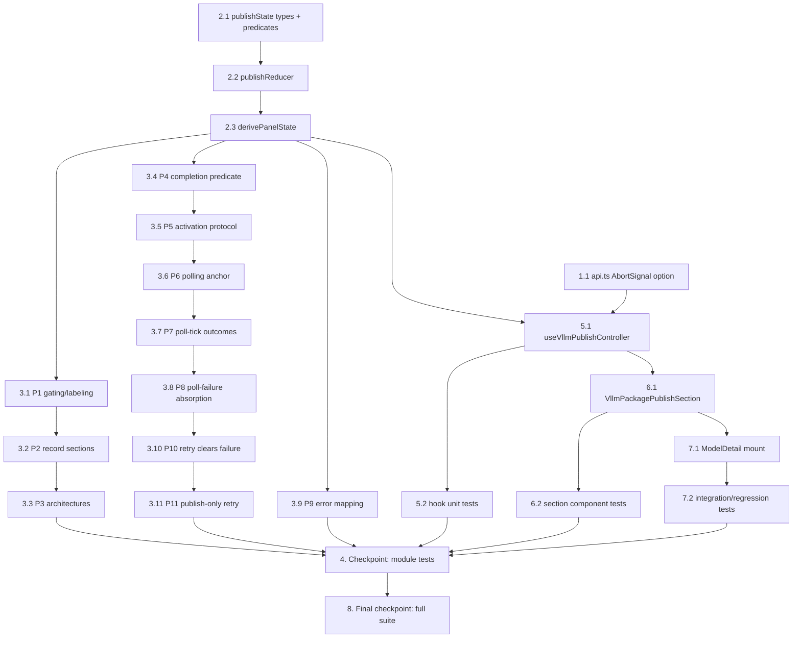

# Implementation Plan: vLLM Package & Publish GUI

## Overview

Frontend-only implementation in `edge-cv-portal/frontend`, built bottom-up: first the small API-client change (optional `AbortSignal` threading), then the pure state module `publishState.ts` (reducer, panel-state derivation, predicates, role gating, error mapping) which carries all eleven correctness properties, then the controller hook (`useVllmPublishController.ts`) that binds the reducer to the API client and polling timer, then the Cloudscape section component, and finally the `ModelDetail.tsx` mount that wires everything to the page for `model_type === 'vllm'` records.

All property-based tests target the pure `publishState.ts` module with fast-check (`numRuns >= 100`, each tagged `**Feature: vllm-package-publish-gui, Property {N}: {title}**`), split across the three files the design suggests: `publishState.gating.property.test.ts` (P1–P3), `publishState.session.property.test.ts` (P4–P8, P10, P11), and `publishState.errors.property.test.ts` (P9). Example-based vitest/RTL tests cover the timer, payload, and integration behavior the pure reducer cannot.

Test command: `npx vitest run` from `edge-cv-portal/frontend`. The full pre-existing frontend suite (825 tests) must stay green throughout — no existing test may be modified.

## Tasks

- [x] 1. Foundations: API client abort-signal support
  - [x] 1.1 Add optional `{ signal?: AbortSignal }` options to `startPackaging` and `publishGreengrassComponent` in `services/api.ts`
    - Thread the signal into `request()` (which already spreads `RequestInit`); request bodies and all other call sites unchanged; client-side only — no new request fields
    - _Requirements: 3.6, 5.2_

- [x] 2. Pure state module `publishState.ts`
  - [x] 2.1 Implement types, constants, role gating, predicates, and error mapping
    - Create `src/components/vllm-publish/publishState.ts` with the shared `PackagedComponentEntry` type, `VLLM_PACKAGE_ROLES` + `canPackageVllm`, `POLL_INTERVAL_MS` (10 s), `POLL_TIMEOUT_MS` (5 min), `REQUEST_TIMEOUT_MS` (30 s), `isPublishComplete(baseline, record)`, `recordFailure(record)`, `toSessionError(err, source)` (mapping `ApiError.details.failed_step` and abort/network errors to the request-did-not-complete message), and `nextComponentVersion(current)`
    - _Requirements: 1.4, 1.6, 2.1, 2.3, 3.1, 3.2, 3.6, 4.6_

  - [x] 2.2 Implement the `publishReducer` session state machine
    - `PublishSession` union (`idle`/`requesting`/`confirming`/`polling`/`published`/`timed-out`/`failed`), `PublishEvent` and `PublishCommand` types, and the reducer rules: baseline capture and confirmation gating on `ACTIVATE`, single in-flight rejection in `requesting`/`confirming`/`polling`, `CONFIRM` → `INVOKE_PACKAGING`, `REQUEST_SUCCEEDED` → anchored `polling` (`deadline = now + POLL_TIMEOUT_MS`), `REQUEST_FAILED` → `failed`, `POLL_RESULT` completion/record-failure/deadline branches, `POLL_FAILED` absorbed without moving the deadline, failure state cleared on any retry activation
    - _Requirements: 1.2, 1.5, 1.7, 2.1, 2.3, 2.5, 2.7, 3.2, 3.4, 3.7, 3.8_

  - [x] 2.3 Implement `derivePanelState`
    - Derive the full `PanelState` from `(record, role, session)`: visibility only for `model_type === 'vllm'`, action label/enabled/loading/permission-message/re-publish-note/confirmation flag, publish-only retry presence (packaged-success && no `published_component`), packaged and published record sections derived solely from the record, and progress/success/pending/error banner payloads
    - _Requirements: 1.1, 1.3, 1.4, 1.6, 2.2, 2.5, 2.8, 3.3, 4.1, 4.2, 4.3, 4.5, 4.6, 5.1, 5.4_

- [x] 3. Property-based tests for `publishState.ts`
  - [x] 3.1 Write property test for action gating and labeling
    - In `publishState.gating.property.test.ts`
    - **Property 1: Action gating and labeling derive from record and role**
    - **Validates: Requirements 1.1, 1.3, 1.4, 1.6, 5.1, 5.4**

  - [x] 3.2 Write property test for record-derived state sections
    - In `publishState.gating.property.test.ts`
    - **Property 2: Record state sections derive solely from the record**
    - **Validates: Requirements 3.3, 4.1, 4.2, 4.3, 4.5, 4.6**

  - [x] 3.3 Write property test for supported architectures rendering
    - In `publishState.gating.property.test.ts`; generators must cover empty and non-empty `supported_architectures`
    - **Property 3: Supported architectures rendering**
    - **Validates: Requirements 2.4, 2.8**

  - [x] 3.4 Write property test for the publish completion predicate
    - In `publishState.session.property.test.ts`; generators cover absent vs. present baselines (first publish vs. re-publish)
    - **Property 4: Publish completion predicate**
    - **Validates: Requirements 2.1, 2.3**

  - [x] 3.5 Write property test for the activation protocol
    - In `publishState.session.property.test.ts`; arbitrary activation-event sequences — at most one `INVOKE_PACKAGING`, confirmation gating for records with a `published_component`, no state change or commands while in flight
    - **Property 5: Activation protocol — confirmation gating and single in-flight invocation**
    - **Validates: Requirements 1.2, 1.5, 1.7, 3.7**

  - [x] 3.6 Write property test for polling session anchoring
    - In `publishState.session.property.test.ts`
    - **Property 6: Successful invocation starts an anchored polling session with the invocation-time baseline**
    - **Validates: Requirements 2.1**

  - [x] 3.7 Write property test for poll-tick outcomes
    - In `publishState.session.property.test.ts`; completion / recorded-failure / deadline / continue branches
    - **Property 7: Poll-tick outcomes**
    - **Validates: Requirements 2.2, 2.3, 2.5, 3.2**

  - [x] 3.8 Write property test for poll-failure absorption
    - In `publishState.session.property.test.ts`; arbitrary interleavings of `POLL_FAILED` and non-completing `POLL_RESULT` events never move the deadline
    - **Property 8: Poll failures are absorbed without extending the timeout**
    - **Validates: Requirements 2.5, 2.7**

  - [x] 3.9 Write property test for API error mapping
    - In `publishState.errors.property.test.ts`; generators cover structured envelopes with and without `failed_step`, plain errors, network errors, and 30-second aborts
    - **Property 9: API error mapping surfaces message and failing step and re-enables the action**
    - **Validates: Requirements 3.1, 3.5, 3.6**

  - [x] 3.10 Write property test for retry clearing failure state
    - In `publishState.session.property.test.ts`
    - **Property 10: Retry activation clears prior failure state**
    - **Validates: Requirements 3.8**

  - [x] 3.11 Write property test for the publish-only retry session
    - In `publishState.session.property.test.ts`
    - **Property 11: Publish-only retry resumes the standard publish session**
    - **Validates: Requirements 3.4**

- [x] 4. Checkpoint — state module and property tests
  - Ensure all tests pass (`npx vitest run` from `edge-cv-portal/frontend`), ask the user if questions arise.

- [x] 5. Controller hook `useVllmPublishController.ts`
  - [x] 5.1 Implement the controller hook
    - Create `src/components/vllm-publish/useVllmPublishController.ts`: reducer state + command execution; `INVOKE_PACKAGING` → `apiService.startPackaging(trainingId, undefined, true, { signal: AbortSignal.timeout(REQUEST_TIMEOUT_MS) })` with `trainingId = model.training_job_id || model.model_id`; `INVOKE_PUBLISH` → `apiService.publishGreengrassComponent(trainingId, 'model-' + safeName(model.name), '1.0.0', model.name, undefined, { signal })` (the exact `_trigger_component_creation` payload shape); `START_POLLING` → `setInterval(POLL_INTERVAL_MS)` calling `getModel(model.model_id)`, dispatching `POLL_RESULT` + `onModelUpdate(record)` or `POLL_FAILED`; `STOP_POLLING` + effect-cleanup clearing of the interval ref; session generation counter dropping stale responses after abandonment or unmount
    - _Requirements: 1.2, 2.1, 2.2, 2.4, 2.6, 2.7, 3.4, 3.6, 4.4, 5.2_

  - [x] 5.2 Write unit tests for the controller hook
    - `useVllmPublishController.test.tsx` with mocked `apiService` and `vi.useFakeTimers()`: exact API payloads called exactly once and no other endpoints hit; first poll within 15 s of success and subsequent polls at the 10 s interval; unmount during polling issues zero further `getModel` calls; never-resolving `startPackaging` + 30 s timer advance surfaces the request-did-not-complete error and re-enables the action
    - _Requirements: 1.2, 2.1, 2.2, 2.6, 3.4, 3.6, 5.2_

- [x] 6. Presentational section `VllmPackagePublishSection.tsx`
  - [x] 6.1 Implement the Cloudscape section component
    - Create `src/components/vllm-publish/VllmPackagePublishSection.tsx` rendering from `PanelState` only, inside a `Container` headed "Component Packaging & Publish": error/success/pending/progress `Alert` banners (error shows "Failed step: {failedStep}" when present); action row with the Package_Publish_Action `Button` (loading/disabled per panel state, permission message or re-publish note as secondary text) and the "Publish packaged component" retry `Button`; packaged-state table (target / `StatusIndicator` status / error); published-state `KeyValuePairs` (component name, version, timestamp via the page's `formatTimestamp` convention, per-target ARNs in monospace); re-publish confirmation `Modal` with `nextComponentVersion` warning, Cancel → `cancelConfirm()`, Re-publish → `confirm()`
    - _Requirements: 1.1, 1.4, 1.5, 1.6, 1.7, 2.2, 2.5, 3.1, 3.3, 4.2, 4.3, 4.6_

  - [x] 6.2 Write component tests for the section
    - `VllmPackagePublishSection.test.tsx` with `@cloudscape-design/components/test-utils/dom`: confirmation modal flow (record with `published_component` → activation opens modal, Cancel invokes nothing, Confirm invokes packaging once); loading/disabled button states; banner rendering for each panel-state variant
    - _Requirements: 1.5, 1.6, 1.7, 2.5, 3.1_

- [x] 7. `ModelDetail.tsx` integration and wiring
  - [x] 7.1 Mount the section on the model detail page
    - In `ModelDetail.tsx`: render `<VllmPackagePublishSection model={model} role={user?.role} onModelUpdate={setModel} />` for `model.model_type === 'vllm'` directly below the Supported Architectures section; add `useAuth()` for the role; leave the `trained`/`imported` → `CompilationTab` path and the existing `getSupportedArchitectures` derivation untouched
    - _Requirements: 1.3, 2.3, 2.4, 4.4, 5.1, 5.4, 5.5_

  - [x] 7.2 Write integration and backward-compatibility regression tests
    - Live record refresh: completion poll result calls `onModelUpdate` and the page's architecture derivation with the new record shows badges (placeholder retained when the list is empty); vision-record regression: `trained`/`imported` records show `CompilationTab` and no vLLM section, no vLLM polling starts; vLLM records show the section and never mount `CompilationTab`
    - _Requirements: 1.3, 2.3, 2.4, 2.8, 4.4, 5.1, 5.4, 5.5_

- [x] 8. Final checkpoint — full frontend suite
  - Ensure all tests pass: `npx vitest run` from `edge-cv-portal/frontend` — all new vllm-publish tests plus the entire pre-existing suite (825 tests) green with zero modified existing tests. Ask the user if questions arise.

## Task Dependency Graph



```json
{
  "waves": [
    {
      "wave": 1,
      "tasks": ["1.1", "2.1"],
      "description": "Independent foundations: the api.ts signal option and the publishState types/predicates touch different files"
    },
    {
      "wave": 2,
      "tasks": ["2.2"],
      "description": "Reducer builds on the types and predicates in the same publishState.ts file"
    },
    {
      "wave": 3,
      "tasks": ["2.3"],
      "description": "derivePanelState completes publishState.ts"
    },
    {
      "wave": 4,
      "tasks": ["3.1", "3.4", "3.9", "5.1"],
      "description": "First property test per test file (gating, session, errors) plus the controller hook — four distinct files"
    },
    {
      "wave": 5,
      "tasks": ["3.2", "3.5", "5.2", "6.1"],
      "description": "Second gating and session properties, hook unit tests, and the section component"
    },
    {
      "wave": 6,
      "tasks": ["3.3", "3.6", "6.2", "7.1"],
      "description": "Third gating and session properties, section component tests, and the ModelDetail mount"
    },
    {
      "wave": 7,
      "tasks": ["3.7", "7.2"],
      "description": "Poll-tick property and the integration/regression tests"
    },
    {
      "wave": 8,
      "tasks": ["3.8"],
      "description": "Poll-failure absorption property (session file serialization)"
    },
    {
      "wave": 9,
      "tasks": ["3.10"],
      "description": "Retry-clears-failure property (session file serialization)"
    },
    {
      "wave": 10,
      "tasks": ["3.11"],
      "description": "Publish-only retry property completes the session property file"
    },
    {
      "wave": 11,
      "tasks": ["4"],
      "description": "Checkpoint: all vllm-publish module, property, hook, component, and integration tests pass"
    },
    {
      "wave": 12,
      "tasks": ["8"],
      "description": "Final checkpoint: full frontend suite (new tests + 825 pre-existing tests) green"
    }
  ]
}
```

## Notes

- Tasks marked with `*` are optional test tasks and can be skipped for a faster MVP; all eleven design correctness properties map one-to-one to property-test sub-tasks 3.1–3.11
- Property tests sharing a file (`publishState.session.property.test.ts` holds P4–P8, P10, P11; `publishState.gating.property.test.ts` holds P1–P3) are serialized across waves to avoid write conflicts; tests in different files run in parallel
- Every property test uses fast-check with `fc.assert(..., { numRuns: 100 })` minimum and a doc comment tag `**Feature: vllm-package-publish-gui, Property {N}: {title}**` / `**Validates: Requirements …**`
- Frontend-only feature: no backend, infrastructure, or request-contract changes; `api.ts` gains only a client-side `AbortSignal` option (Requirement 5.2)
- Requirement 5.3 (backend data equivalence) needs no task — the frontend sends the same requests the CLI path sends; it is covered by existing vllm-triton-inference backend tests
- The existing Supported Architectures section in `ModelDetail.tsx` is not modified; badges appear via `onModelUpdate` refreshing the page's `model` state (Requirements 2.4, 2.8)
- Test command: `npx vitest run` from `edge-cv-portal/frontend`; no existing test file may be modified
