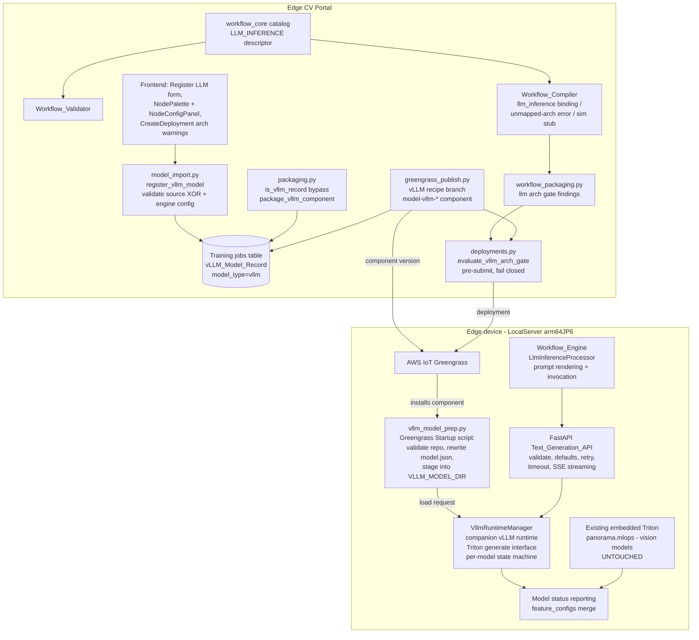
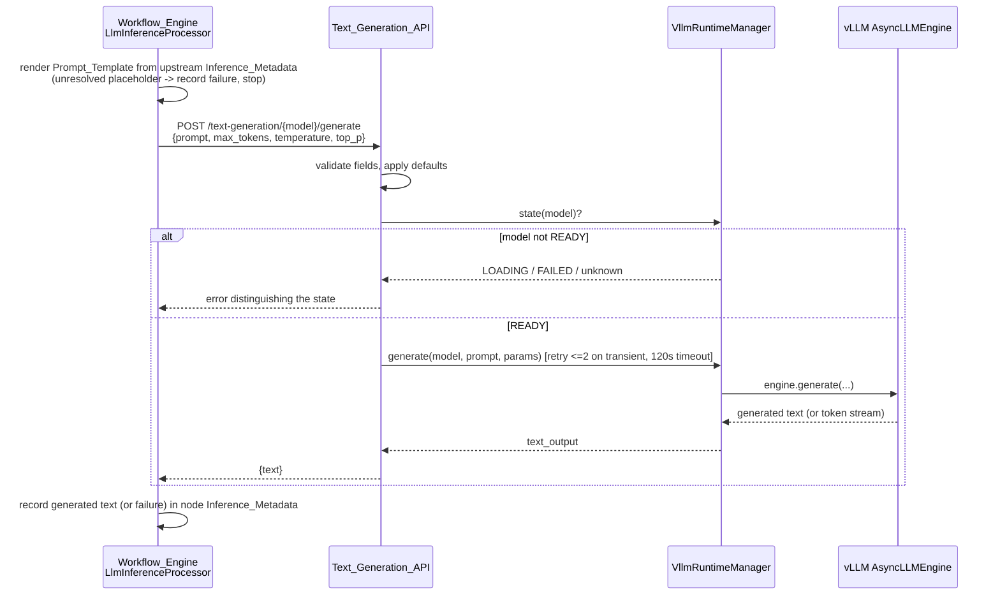

# Design Document: vLLM Triton Inference

## Overview

This feature carries an LLM from portal registration to on-device text generation by mirroring, stage for stage, the existing BYOM model path:

- **Register** — a new registration operation creates a vLLM_Model_Record in the Model_Registry (the existing training-jobs table) from exactly one source: a Hugging_Face_Model_ID or an S3_Model_Artifact. No labeling, no training: the record is publish-eligible immediately, exactly like an imported BYOM model.
- **Publish** — the Model_Packager generates a Triton_vLLM_Repository (`{model_name}/1/model.json` + `{model_name}/config.pbtxt` with `backend: "vllm"`, per the [Triton vLLM backend layout](https://github.com/triton-inference-server/vllm_backend)), zips it, uploads it, and registers a Greengrass component version following the existing `model-*` component conventions — the same shape as the ONNX-import bypass in `packaging.py`, which already demonstrated "one architecture-scoped artifact, no Neo compilation".
- **Deploy** — the Deployment_Service gains a vLLM architecture gate that is a structural twin of `evaluate_plugin_arch_gate` in `deployments.py`: a pure function over `{device: recorded arch}` and the component's supported-architecture set, exact-name matching, fail-closed on missing archs, evaluated pre-submit.
- **Serve** — on JetPack 6 devices the LocalServer image gains a companion vLLM runtime (`VllmRuntimeManager`) that watches a dedicated vLLM model repository directory, loads each staged Triton_vLLM_Repository with a vLLM engine, and serves the Triton *generate*-extension interface. A new FastAPI Text_Generation_API fronts it with validation, defaults, retries, timeout, and streaming.
- **Compose** — the Node_Type_Catalog gains an `llm_inference` inference-category node (executor-binding realization, modeled on `bedrock_inference`), the Workflow_Compiler/Component_Packager gate it per architecture, and the Workflow_Engine gains an `LlmInferenceProcessor` (modeled on `BedrockInferenceProcessor`) that renders the Prompt_Template from upstream Inference_Metadata and calls the Text_Generation_API.

### Key findings from investigation

- **The BYOM precedent is the ONNX bypass, not the Neo path.** `packaging.py`'s `is_onnx_import` / `package_onnx_component` shows the exact pattern this feature needs: a record-type predicate routes packaging around Neo compilation, one artifact is built and uploaded, `packaged_components` entries are written per target, and `_trigger_component_creation` chains into `greengrass_publish.py`. The vLLM path adds a sibling `is_vllm_record` bypass.
- **Component conventions are already codified.** `greengrass_publish.py` requires `model-` name prefix, `x.0.0` versions, resolves the LocalServer dependency per target (`jetson-xavier-jp6 → aws.edgeml.dda.LocalServer.arm64JP6`), and generates a recipe whose Startup script waits for the LocalServer container to seed `/aws_dda` before invoking `model_convertor.py`. The vLLM recipe reuses this seed-wait gate verbatim and invokes a new `vllm_model_prep.py` instead.
- **The deployment gate pattern is pure and property-tested.** `evaluate_plugin_arch_gate(component_manifests, device_archs)` is a pure dict-in/dict-out function: exact arch-name matching, no fallback, `None` arch fails closed, complete offending list returned. The vLLM gate copies this shape so the decision logic is property-testable without AWS (see `test_property_plugin_deployment_gates.py`).
- **The on-device Triton is NOT a general Triton server.** `TritonEdgeClient` wraps `panorama.mlops.create_triton_inference_server(model_dir, installation_dir)` — an embedded, proprietary Triton build installed from `edgemlsdk/triton-core.deb` + `triton-python-backend.deb` into `/opt/tritonserver`, scanning `/aws_dda/dda_triton/triton_model_repo`. Every vision model is a Python-backend template (`lfv_model_template.py`) staged by `model_convertor.py`. This embedded runtime cannot realistically host the vLLM backend (see the runtime-strategy decision below).
- **The executor-binding node pattern is proven.** `bedrock_inference` shows a hardware-dependent inference node realized as `executor_binding` on device architectures with a sim stub, whose `BedrockInferenceProcessor` runs post-pipeline and merges results into run metadata before output bindings evaluate. `llm_inference` follows the same lifecycle.
- **The compiler already errors on unmapped architectures** (`test_compiler_unmapped_arch_properties.py`): a node type with no `GstMapping` for the requested arch produces a compile error naming the node and arch and no document. Giving `llm_inference` mappings only for vLLM-capable architectures makes Requirement 6.8 fall out of existing compiler behavior.
- **Model selection UI plumbing exists.** `NodeConfigPanel` renders `model_ref` parameters as a select populated from the models API filtered by Use_Case; `list_models` already returns `model_type` and `source` per record, so filtering options by model type is a frontend-side filter, not a new API.
- **Triton vLLM contract** (from the [NVIDIA Quick-Deploy vLLM tutorial](https://docs.nvidia.com/deeplearning/triton-inference-server/user-guide/docs/tutorials/Quick_Deploy/vLLM/README.html) and the [vllm_backend samples](https://github.com/triton-inference-server/vllm_backend/tree/main/samples)): the repository is `{model}/1/model.json` (a JSON object of vLLM `AsyncEngineArgs` — `model`, `gpu_memory_utilization`, `max_model_len`, `tensor_parallel_size`, `dtype`, `enforce_eager`, …) plus `{model}/config.pbtxt` declaring `backend: "vllm"`; inference goes through the generate extension: `POST /v2/models/{model}/generate` with `{"text_input": ..., "parameters": {"stream": false, "temperature": ..., "top_p": ..., "max_tokens": ...}}` returning `{"text_output": ...}`, with `generate_stream` for SSE streaming.

### Platform decision (explicit)

| Platform | Base | Decision | Rationale |
|---|---|---|---|
| **JetPack 6 (`arm64_jp6`)** | l4t-jetpack r36.3.0, Ubuntu 22.04, CUDA 12.2, DDA Python 3.11 | **Required — implemented** | vLLM builds exist for the r36.x/CUDA 12.x Jetson generation: the Jetson AI Lab / `jetson-containers` ecosystem publishes vLLM wheels and containers for JetPack 6 (see the [jetson-containers vLLM package](https://github.com/dusty-nv/jetson-containers) and NVIDIA developer-forum guidance on building vLLM for r36.x). A pinned aarch64 wheel compatible with the image's CUDA and Python is installed at image build time. |
| **JetPack 5 (`arm64_jp5`)** | Ubuntu 20.04, CUDA 11.4, Python 3.8 | **Conditional best-effort — feature-flagged, NOT implemented by default** | No known vLLM build exists for this stack: vLLM's compiled kernels require CUDA ≥ 11.8 and current releases require Python ≥ 3.9/3.10, while JetPack 5 tops out at CUDA 11.4 with a Python 3.8 system interpreter; neither NVIDIA nor `jetson-containers` publishes a JP5 vLLM. The design therefore makes every JP5 touchpoint conditional on a single flag (`JP5_VLLM_ENABLED`, default `false`): the catalog mapping, the packaging supported-arch set, the deployment gate, and a `Dockerfile.jp5` build-arg hook (`VLLM_ENABLE`, default `0`) that adds nothing when off. If a viable JP5 vLLM build ever materializes, enabling it is a flag flip plus a provisioning recipe — no redesign. With the flag off, the JP5 image build is byte-identical in behavior to today. |
| **JetPack 4 (`arm64_jp4`)** | — | **Excluded — deployment-gated** | Out of scope per requirements. The gate rejects any vLLM deployment targeting a jp4 device with a JetPack-4-specific message. The JP4 image, recipe, and code paths are untouched. |

## Architecture



Text generation flow on the device:



### Key Design Decisions

| Decision | Choice | Rationale |
|---|---|---|
| **How the Triton vLLM runtime is provided on JP6** | A **companion runtime process inside the existing LocalServer container** (`VllmRuntimeManager`): a Python service using the vLLM engine directly, consuming the exact Triton_vLLM_Repository layout and exposing the Triton generate-extension HTTP interface (`/v2/models/{m}/generate`, `/v2/models/{m}/generate_stream`, `/v2/models/{m}/ready`, `/v2/repository/index`) on a loopback port. | Three options were assessed. **(a) Add the vLLM backend to the existing embedded Triton** (`panorama.mlops` + `triton-core.deb`): rejected — that Triton is an old proprietary embedded build whose backend/python-backend versions cannot be assumed compatible with the `vllm_backend` (which needs decoupled-transaction support and a vLLM-matching python backend), and any change to it risks the entire vision-model path (Requirements 4.3, 8.x forbid that risk). **(b) NVIDIA's Triton+vLLM container as a second container**: rejected — LocalServer is a single Greengrass-managed container; adding a second container changes the deployment/ops model, doubles the GPU-memory coordination problem, and NVIDIA's Jetson Triton-vLLM containers target newer JetPack point releases than our r36.3.0 base. **(c) Companion in-container process**: chosen — it preserves the existing image function untouched (the embedded Triton never sees vLLM repositories), needs only the vLLM wheel at build time, and by implementing the *same repository layout and generate interface* as the real Triton vLLM backend, the packaging contract and client code carry over unchanged if the platform later moves to an official Triton vLLM container. **Tradeoff acknowledged**: we own a thin generate-endpoint implementation (~the surface of `vllm_backend/src/model.py`'s request handling) instead of getting it from NVIDIA; in exchange we take zero risk to the existing Triton and stay independent of NVIDIA's Jetson container release cadence. |
| **Separate vLLM model repository directory** | `VLLM_MODEL_DIR = /aws_dda/dda_triton/vllm_model_repo`, distinct from the existing `TRITON_MODEL_DIR` | The embedded Triton scans `TRITON_MODEL_DIR`; dropping a `backend: "vllm"` repository there would make it attempt (and fail) to load an unknown backend, polluting vision-model status. A sibling directory keeps the two runtimes fully isolated — the single strongest backward-compatibility guarantee in the design (Requirements 4.3, 8.8). |
| **Where vLLM_Model_Records live** | The existing training-jobs table, `model_type: 'vllm'`, `source: 'vllm'` | Exactly how BYOM imports work (`source: 'imported'`). `list_models` already surfaces `model_type`/`source` per record, so Requirement 1.8's type indicator is free, and publish/packaging lookups reuse `get_training_job_details`. No new table. |
| **vLLM component name convention** | `model-vllm-{safe_model_name}`, version `N.0.0` | Satisfies the existing `model-` prefix validation while giving the Deployment_Service a recognizable prefix (mirroring how `dda.plugin.*` identifies Plugin_Components) to trigger the vLLM arch gate. The backing record is resolved through a `component_name` GSI on the training-jobs table; unresolvable records fail closed, matching the plugin-gate rule. |
| **S3-artifact model reference resolution** | Portal writes `model.json` with `"model": "./weights"` (a repository-relative path); the component recipe declares the S3_Model_Artifact as a second (Unarchive) artifact; `vllm_model_prep.py` rewrites `"model"` to the absolute device-local decompressed weights path before staging | `model.json` is generated cloud-side but the artifact path exists only after Greengrass unpacks it on the device; a relative sentinel plus a device-side rewrite (Requirement 4.5) keeps the cloud artifact deterministic and the rewrite a pure, property-testable transformation. |
| **LLM_Inference_Node realization** | Executor binding `llm_inference` (no GStreamer element), input port `InferenceMeta`, output port `InferenceMeta` | The node consumes upstream inference metadata (for placeholder substitution) and produces metadata — no video processing. This mirrors `inference_filter`/`bedrock_inference`'s executor-level pattern and requires zero GStreamer/plugin work. Port type `InferenceMeta` means every existing node emitting inference metadata (model_inference, bedrock_inference, custom_python, inference_filter, conditional) can feed it under the existing compatibility rules (Requirement 6.4). |
| **Architecture gating in the compiler** | `LLM_INFERENCE.mappings` contains entries only for vLLM-capable architectures (jp6, jp5-when-flagged) plus the sim stub | The compiler's existing unmapped-architecture error (node + arch, no document) implements Requirement 6.8 with no new compiler code path. |
| **Simulation stub** | Sim mapping = executor binding `sim_llm_inference` that injects the configured simulated inference outcome and never invokes any model | `llm_inference` is executor-level with no video stream, so the `sim_inference_<nodeId>` *identity element* form used by video-fed inference nodes does not apply; the executor-binding stub is the executor-level analogue of the same convention (configured outcome injected, hardware never touched — Requirement 6.9), like the `recording_*` stubs for hardware outputs. |
| **top_p lower bound** | New `min_exclusive` constraint key in the shared parameter-constraint vocabulary | Requirements demand top_p > 0.0 and ≤ 1.0; the existing `min`/`max` keys are inclusive. A `min_exclusive` key is a small, additive extension to the shared validator/predicate (portal validator, frontend inline validation, catalog wellformedness tests) rather than a lossy `min: 0.000001` hack. |
| **JP5 conditionality** | One module-level flag `JP5_VLLM_ENABLED = False` in `workflow_core.catalog.models` (mirrored as a build/env flag on packaging and the JP5 Dockerfile) | Every JP5 touchpoint derives from this flag: catalog mapping presence, packaging supported-arch set, deployment gate acceptance. Flipping it on cannot affect JP6 behavior, and leaving it off leaves JP5 byte-identical to today. |
| **Text_Generation_API placement** | New FastAPI router `endpoints/text_generation.py` in the existing LocalServer app | Same registration pattern as every other device API (`endpoints/*.py` included by `app.py`); the workflow engine and any device application share one implementation of validation/defaults/retry/timeout (Requirement 5). |

## Components and Interfaces

### 1. Portal — vLLM model registration (`model_import.py`)

New routes on the existing ModelImport Lambda (same bundle, same handler dispatch style):

- `POST /api/v1/models/vllm` — register a vLLM_Model_Record
- `GET /api/v1/models/vllm/engine-spec` — the documented engine settings, defaults, and accepted ranges (the vLLM analogue of `get_model_format_spec`)

Request body:

```json
{
  "usecase_id": "…",
  "model_name": "plant-qa-llm",
  "model_version": "1.0",
  "huggingface_model_id": "facebook/opt-125m",     // XOR
  "s3_model_artifact": "s3://bucket/path/llm.tar.gz", // XOR
  "engine_configuration": { "gpu_memory_utilization": 0.5, "max_model_len": 2048, ... },  // optional, partial
  "description": "…"
}
```

Validation pipeline (pure functions, property-tested; handler wraps them):

```python
def validate_vllm_registration(body: Dict) -> List[Dict]:
    """Complete list of validation findings; [] means valid.
    - exactly one of huggingface_model_id / s3_model_artifact (1.1, 1.6, 1.9)
    - huggingface_model_id matches HF_MODEL_ID_RE when present (1.11)
    - s3_model_artifact is an s3:// URI ending in .tar.gz when present
    - every supplied engine setting is a known key within its accepted
      range (1.10) — unknown keys rejected (fail closed)
    Each finding carries {field, value, reason}."""

HF_MODEL_ID_RE = r'^[A-Za-z0-9](?:[A-Za-z0-9._-]*)/[A-Za-z0-9._-]+$'

def resolve_engine_configuration(supplied: Dict) -> Dict:
    """Supplied values overlaid on ENGINE_DEFAULTS; the result contains
    every defined setting (1.2, 1.3)."""
```

Access control: `check_user_access(user_id, usecase_id, 'DataScientist')`, matching `import_model`. S3-artifact readability is verified with `head_object` through `get_usecase_client('s3', usecase)` before any write (1.7). Any validation failure returns 400 and performs **no** `put_item` (1.5). Success writes the record (see Data Models), logs an audit event (`register_vllm_model`), and returns `201 {training_id, publish_eligible: true, labeling_steps: 0, training_steps: 0}` (1.4).

`list_models` needs no change: vLLM records surface with `model_type: 'vllm'`, `source: 'vllm'` (1.8); the frontend renders the type badge.

### 2. Portal — packaging (`packaging.py`)

A vLLM bypass alongside the ONNX bypass, keyed by a pure predicate:

```python
def is_vllm_record(training_job: Dict) -> bool:
    return training_job.get('source') == 'vllm' or \
           str(training_job.get('model_type', '')).lower() == 'vllm'
```

`package_components` dispatches to `package_vllm_component` when the predicate holds — vision records (trained, imported, ONNX) are untouched (8.2).

```python
def generate_vllm_repository(record: Dict) -> Dict[str, str]:
    """Pure: vLLM_Model_Record -> {relative_path: file_content}.
    Emits exactly:
      {model_name}/1/model.json   — the record's complete resolved
                                    vLLM_Engine_Configuration, with "model"
                                    set to the HF ID (HF source) or the
                                    repository-relative './weights'
                                    sentinel (S3 source)  (2.1-2.3)
      {model_name}/config.pbtxt   — 'backend: "vllm"' plus the decoupled
                                    model transaction policy stanza the
                                    vllm_backend samples use
    Raises VllmPackagingError on any serialization failure (2.8)."""

def vllm_supported_architectures() -> List[str]:
    archs = ['arm64_jp6']
    if JP5_VLLM_ENABLED:
        archs.append('arm64_jp5')
    return archs            # never contains arm64_jp4 (2.5)
```

`package_vllm_component` writes the generated tree into a temp dir, zips it, uploads `model_artifacts/model-{uuid}/…zip` to the Use_Case bucket (same key scheme as the other packagers), and records `packaged_components` entries — one per supported target (`jetson-xavier-jp6`, plus `-jp5` when flagged), each carrying `supported_architectures`. Ordering guarantees atomicity: generation → upload → DynamoDB update; a failure at any step reports the failing artifact/step and leaves the record's `packaged_components`/published state unchanged, so publish is retryable (2.6, 2.8). Auto-trigger into component creation reuses `_trigger_component_creation`.

### 3. Portal — component publish (`greengrass_publish.py`)

The publish handler gains a vLLM branch (selected by `is_vllm_record` on the training job):

- **Name/version**: `model-vllm-{safe_model_name}` (passes the existing `model-` validation; the `-vllm-` infix is the deployment-side discriminator), version `N.0.0` where `N` = 1 + the highest previously published `N` for this record (2.4).
- **Recipe** (`generate_vllm_component_recipe`, pure): mirrors `generate_component_recipe` — HARD dependency on the target's LocalServer variant via `resolve_local_server_component`, the same `/aws_dda` seed-wait Startup gate, then:

```bash
python3 /aws_dda/vllm_model_prep.py \
  --unarchived_repo_path {artifacts:decompressedPath}/{repo_zip_stem}/ \
  --weights_path {artifacts:decompressedPath}/{weights_stem}/ \   # S3-source only
  --model_name {model_name} --component_name {component_name}
```

  Shutdown runs `vllm_model_prep.py --cleanup`, unstaging the model and requesting unload. For S3-sourced records the recipe declares the S3_Model_Artifact as a second Unarchive artifact (2.2). Nothing in the lifecycle restarts LocalServer (2.7).
- **Metadata**: the component's `supported_architectures` (from `vllm_supported_architectures()`) and `runtime: 'vllm'` are written back onto the record's `published_component` map and into the component recipe's `ComponentConfiguration.DefaultConfiguration` (informational). On success the record is marked `published` with the component name/version (2.9); on any Greengrass failure no partial state is written (2.6).

### 4. Portal — deployment gating (`deployments.py`)

Structural twin of the plugin gates, added to the same pre-submit pass:

```python
def evaluate_vllm_arch_gate(component_manifests, device_archs):
    """Pure. component_manifests: {vllm component name:
        {'version': v, 'architectures': [archs]}}
    device_archs: {thing name: recorded arch or None}
    Exact-name matching, no fallback; None fails closed (3.3, 3.6).
    Returns [] or one entry per (component, device) miss:
      {component, version, device, deviceArch, supported, reason}
    reason is 'JP4_UNSUPPORTED' ('JetPack 4 does not support vLLM
    inference') when deviceArch == 'arm64_jp4', else 'ARCH_UNSUPPORTED'
    (3.4, 3.5)."""
```

Activation (8.5, 8.6): the gate is evaluated iff the requested component set contains a `model-vllm-*` component **or** a workflow component whose version item records `llm_inference` content. For `model-vllm-*` components the supported set is loaded from the backing record via a new `component_name-index` GSI on the training-jobs table (unresolvable → fail closed, like `load_plugin_record`). For workflow components, the Component_Packager already records the architectures it produced artifacts for on the workflow version item (plus a new `has_llm_inference` discriminator, written the same way the camera-binding discriminator is); the gate uses that recorded arch set (3.3). Deployments containing neither are untouched — the gate contributes zero findings and pre-feature validation applies verbatim, jp4 included (8.5).

On any violation the handler returns `409 VLLM_ARCH_UNSUPPORTED` with the complete offending list and submits nothing (3.4).

### 5. Shared catalog — `LLM_INFERENCE` descriptor (`workflow_core/catalog/nodes.py`)

```python
VLLM_ARCHITECTURES = (ARCH_ARM64_JP6,) + \
    ((ARCH_ARM64_JP5,) if JP5_VLLM_ENABLED else ())

LLM_INFERENCE = NodeTypeDescriptor(
    type_id="llm_inference",
    category=CATEGORY_INFERENCE,
    display_name="LLM Inference",
    inputs=[PortDescriptor("in", PORT_TYPE_INFERENCE_META)],
    outputs=[PortDescriptor("out", PORT_TYPE_INFERENCE_META)],
    parameters=[
        ParameterDescriptor("modelName", "model_ref", required=True, default=None,
                            constraints={"min_length": 1},
                            description="Registered vLLM model to invoke."),
        ParameterDescriptor("prompt_template", "string", required=True, default=None,
                            constraints={"min_length": 1},
                            description="Prompt sent to the model. {field} "
                                        "placeholders are replaced with values "
                                        "from the upstream inference metadata "
                                        "at execution time.",
                            examples=["Summarize this inspection result: "
                                      "anomalous={is_anomalous}, "
                                      "confidence={confidence}"]),
        ParameterDescriptor("max_tokens", "int", required=False, default=256,
                            constraints={"min": 1}),
        ParameterDescriptor("temperature", "float", required=False, default=0.7,
                            constraints={"min": 0.0, "max": 2.0}),
        ParameterDescriptor("top_p", "float", required=False, default=1.0,
                            constraints={"min_exclusive": 0.0, "max": 1.0}),
    ],
    mappings=[
        GstMapping(arch=arch, executor_binding="llm_inference")
        for arch in VLLM_ARCHITECTURES
    ] + [
        GstMapping(arch=ARCH_SIM, executor_binding="sim_llm_inference"),
    ],
    hardware_dependent=True,
)
```

Appended to the catalog list (additive — 8.1/8.3) and vendored to `src/backend/workflow_engine/vendor/workflow_core` like every other catalog change. `x86_64`, `x86_64_nvidia`, and `arm64_jp4` have **no mapping**, so the existing compiler unmapped-arch error implements 6.8, and the existing validator's generic structural/parameter checks (min_length, bounds, model_ref resolution) implement 6.5/6.6. The validator and the frontend constraint predicate both learn the `min_exclusive` key. Model-reference resolution (6.12) rides the same validator pass that resolves `model_inference.modelName`, extended to check the record's `model_type` matches the node family (a `vllm`-typed record for `llm_inference`, non-`vllm` for `model_inference`).

The simulation stub: the compiler emits an executor binding `sim_llm_inference` carrying the node id; the test harness treats it like the recording/injection stubs — the configured simulated inference outcome is injected as the node's metadata, no model invoked (6.9).

### 6. Portal — workflow packaging (`workflow_packaging.py`)

A pure gate alongside `custom_plugin_gate_findings`:

```python
def llm_arch_gate_findings(definition: Dict, requested_archs: List[str]) -> List[Dict]:
    """One finding per (llm_inference node, requested arch not in
    VLLM_ARCHITECTURES): {code: 'V6_LLM_ARCH_UNSUPPORTED', nodeId, arch}.
    Empty when the workflow has no llm_inference node (8.1)."""
```

Findings reject the packaging request (`409`, complete list, no component version registered — 7.2). On success the compiled per-arch documents already contain the node's `llm_inference` executor binding with `{modelName, prompt_template, max_tokens, temperature, top_p}` (7.1) — the compiler resolves parameter defaults exactly as for other nodes. The packager also writes `has_llm_inference: true` and the packaged arch list onto the workflow version item for the deployment gate (Section 4).

### 7. Portal frontend

- **Models page**: a "Register LLM" action opening a form (source radio: Hugging Face ID / S3 artifact — the two inputs are mutually exclusive in the UI, matching the API's XOR; engine settings as an optional expandable section with the documented defaults pre-filled). vLLM records render a `LLM (vLLM)` type badge in the model list (1.8) and their detail view shows `supported_architectures` (3.8).
- **Workflow Designer**: `llm_inference` appears in the inference palette group automatically (palette renders from the catalog). `NodeConfigPanel`'s `model_ref` select gains a per-node-type filter: `llm_inference` shows only `model_type === 'vllm'` records; `model_inference` excludes them (6.2, and keeps the vision node's list pre-feature — 8.2/8.3). An empty vLLM list renders the select empty with "No vLLM models are registered for this use case" (6.11).
- **CreateDeployment**: when the selection contains a `model-vllm-*` component (or an LLM workflow), each selected device is checked client-side with the same pure predicate as the backend gate (shared shape, TS twin of `evaluate_vllm_arch_gate`); incompatible devices render a warning listing the device's recorded architecture (or its absence) and the component's supported set before submit (3.9). The backend gate remains authoritative.

### 8. Device — JP6 image build (`Dockerfile.jp6`)

```dockerfile
# ── vLLM engine for the companion Triton_vLLM_Runtime ──────────────────
# Pinned aarch64 wheel built for the JetPack 6 / CUDA 12.x generation
# (Jetson AI Lab index), installed into the DDA python (3.11). Build-arg
# gated so CI variants can produce a vLLM-free image; the runtime
# capability probe (import vllm) governs behavior either way.
ARG VLLM_ENABLE=1
ARG VLLM_SPEC="vllm==<pinned>"
ARG VLLM_INDEX_URL="https://pypi.jetson-ai-lab.dev/jp6/..."
RUN if [ "$VLLM_ENABLE" = "1" ]; then \
        pip install --no-cache-dir --index-url ${VLLM_INDEX_URL} ${VLLM_SPEC}; \
    fi
```

This is an **additive layer**: no existing package pin, Triton deb, or CUDA staging step changes, preserving the vision stack byte-for-byte (4.3). `Dockerfile.jp5` gains the same block with `VLLM_ENABLE=0` default (the JP5 hook — 4.2 conditional). The exact pinned wheel/index is fixed at implementation time against the r36.3.0/CUDA 12.2/Python 3.11 image; if no prebuilt wheel matches, the fallback is a build-stage source compile in the Dockerfile (long but hermetic) — either way behind the same build arg.

At startup `app.py` probes capability (`importlib.util.find_spec("vllm")`); only when present does it start the `VllmRuntimeManager`. Images without vLLM (jp4, jp5-default, x86 variants) run exactly the pre-feature startup sequence.

### 9. Device — companion runtime (`src/backend/vllm_runtime/`)

```python
class VllmRuntimeManager:
    """Owns every vLLM model on the device.

    - watch(VLLM_MODEL_DIR): a load request names a staged
      Triton_vLLM_Repository; the manager parses config.pbtxt (must
      declare backend "vllm") and model.json, builds AsyncEngineArgs,
      and creates an AsyncLLMEngine per model (4.1).
    - per-model state machine: STAGED -> LOADING -> READY | FAILED
      (failure reason retained). Failures are isolated: one model's
      load/serve error never touches another engine (4.6, 8.9).
    - generate(model, prompt, sampling_params) -> text
      generate_stream(model, ...) -> async token iterator
    - state(model) -> READY|LOADING|FAILED(reason)|UNKNOWN
    - unload(model): shuts the engine down, frees GPU memory.
    """
```

A thin HTTP server (loopback only, `VLLM_RUNTIME_PORT`, served by the manager) exposes the Triton generate-extension contract — `POST /v2/models/{m}/generate`, `POST /v2/models/{m}/generate_stream` (SSE), `GET /v2/models/{m}/ready`, `GET /v2/repository/index` — so the Text_Generation_API invokes vLLM through the same interface the real Triton vLLM backend would offer (5.2), keeping the runtime swappable. Load/unload requests arrive over the same server (`/v2/repository/models/{m}/load|unload`), mirroring Triton's model-control extension; `vllm_model_prep.py` calls them after staging (4.8), using the existing `model_autostart_utils.wait_for_server` backoff to tolerate LocalServer still booting.

Status integration (4.6, 4.7, 4.10): `get_features_triton` (`feature_configs_utils.py`) is extended to merge the manager's model list — each vLLM model reported as `type: "VllmModel"` with status mapped `LOADING→LOADING`, `READY→READY`, `FAILED→FAILED` — so the existing device model-status mechanisms (feature-config API, shadow sync) carry vLLM states with no new channel. The manager pushes state transitions synchronously (no polling), so READY propagates well within the 30-second bound.

### 10. Device — model preparation (`vllm_model_prep.py`)

Seeded to `/aws_dda` by `cp_model_conversion_files` (added to `files_to_copy_to_aws_dda`, exactly like `model_convertor.py`), invoked by the component recipe's Startup script:

1. **Validate** the unarchived repository: exactly `{model_name}/1/model.json` + `{model_name}/config.pbtxt`, `config.pbtxt` declares `backend: "vllm"`, `model.json` parses. Any defect → exit non-zero with the defect named (the component goes BROKEN, matching how `model_convertor.py` failures surface).
2. **Rewrite** (S3-sourced only): replace `model.json`'s `"model": "./weights"` sentinel with the absolute `--weights_path`; verify the path exists and is readable **before** staging — if not, report the model FAILED (model name + unresolved path, via the runtime's status file/endpoint), stage nothing, and exit non-zero without ever issuing a load request (4.5, 4.9). Other installed models are separate component lifecycles and are untouched.
3. **Stage** the repository directory into `VLLM_MODEL_DIR/{model_name}` atomically (write to a temp sibling, rename) — no LocalServer restart (4.4).
4. **Request load** via the runtime's model-control endpoint (4.8). The manager reports LOADING immediately, then READY/FAILED (4.6, 4.7, 4.10).

`--cleanup` unloads the model and removes `VLLM_MODEL_DIR/{model_name}` (component Shutdown), mirroring `convert_model_cleanup.py`.

### 11. Device — Text_Generation_API (`endpoints/text_generation.py`)

FastAPI router registered by `app.py` beside the existing routers; available regardless of workflow deployment (device applications may call it directly).

```
POST /api/text-generation/{model_name}/generate         (non-streaming)
POST /api/text-generation/{model_name}/generate-stream  (SSE streaming)
GET  /api/text-generation/models                        (name + state list)
```

Request model (Pydantic): `{prompt: str, max_tokens?: int, temperature?: float, top_p?: float, stream?: bool}`. Pure request-normalization core, shared by both endpoints and property-tested:

```python
GENERATION_DEFAULTS = {"max_tokens": 256, "temperature": 0.7, "top_p": 1.0}

def normalize_generation_request(model_name, body, model_max_len) -> Union[Normalized, List[Finding]]:
    """Findings (each naming the field and reason) when: prompt empty/
    missing, model_name empty/missing, max_tokens < 1 or > model_max_len,
    temperature outside [0.0, 2.0], top_p outside (0.0, 1.0] (5.1, 5.9).
    Otherwise the effective request: supplied values overlaid on
    GENERATION_DEFAULTS (5.8)."""
```

Validation failures return `422` with the complete finding list, never touching the runtime (5.9). For valid requests the handler consults the runtime state first: non-READY returns `409` with `{model_name, state: 'loading'|'failed'|'unknown', reason?}` (5.5). READY requests invoke `generate` with:

- **Retry**: transient errors (connection refused/reset, runtime-flagged retryable) retried up to `TEXT_GEN_RETRY_LIMIT` (default 2); non-transient errors and exhausted retries return `502 {model_name, reason}` (5.6, 5.7).
- **Timeout**: `TEXT_GEN_TIMEOUT_SECONDS` (default 120) wall-clock over the whole non-streaming call; expiry returns `504 {model_name, timeout_seconds}` (5.11).
- **Streaming**: SSE events `{"token": ...}` forwarded in generation order as produced, terminal `{"done": true}`; an error mid-stream stops delivery and emits one `{"error": {reason}}` event — no retry, no retraction (5.3, 5.4). Streaming requests get no automatic retry (tokens may already be delivered).

Each request is handled independently on the async event loop; per-request state is function-local, so one request's failure cannot alter another's response (5.10).

### 12. Device — workflow engine (`workflow_engine/output_bindings.py`, `runtime.py`)

`LlmInferenceProcessor`, a sibling of `BedrockInferenceProcessor` with the same lifecycle (invoked by the WorkflowExecutor after a successful pipeline run — and after the Bedrock processor, so LLM prompts can reference Bedrock-produced fields — and before output bindings evaluate):

```python
PLACEHOLDER_RE = re.compile(r'\{([A-Za-z_][A-Za-z0-9_.]*)\}')

def render_prompt(template: str, metadata: Dict) -> str:
    """Strict substitution: every {placeholder} replaced by
    str(metadata[name]) (dotted names resolve nested keys); literal text
    preserved; '{{'/'}}' escape a literal brace. Raises
    UnresolvedPlaceholderError(name) on the first missing key (7.3, 7.5)."""

class LlmInferenceProcessor:
    def bindings(self, document): ...   # executorBindings with binding == 'llm_inference'
    def process(self, document, tag_values, ...) -> Dict:
        # per binding: render_prompt -> Text_Generation_API (local HTTP,
        # bound parameters) -> merge into metadata under the node's output:
        #   metadata['llm'][nodeId] = {'generated_text': ...}          (7.4)
        # on UnresolvedPlaceholderError: NO API call; record
        #   {'error': 'unresolved placeholder {name}'}                 (7.5)
        # on API error/timeout: record {'error': reason}               (7.6)
        # A binding failure is recorded, not raised: remaining bindings
        # and the run's independent nodes continue (7.6); the merged
        # metadata (text or error) reaches downstream filters,
        # conditionals, outputs, and custom Python through the existing
        # metadata flow (7.7).
```

The invoker is injectable (like the Bedrock invoker) so tests run without HTTP. The `sim_llm_inference` binding is recognized by the sandbox harness only; the device runtime treats it as unknown-binding no-op (it never appears in device documents).

## Data Models

### vLLM_Model_Record (training-jobs table item)

```json
{
  "training_id": "uuid",
  "usecase_id": "…",
  "model_name": "plant-qa-llm",
  "model_version": "1.0",
  "model_type": "vllm",
  "source": "vllm",
  "status": "Completed",
  "publish_eligible": true,
  "model_source": {
    "huggingface_model_id": "facebook/opt-125m"
    // XOR: "s3_model_artifact": "s3://bucket/path/llm.tar.gz"
  },
  "engine_configuration": {
    "dtype": "auto",
    "gpu_memory_utilization": 0.5,
    "max_model_len": 2048,
    "tensor_parallel_size": 1,
    "enforce_eager": true
  },
  "packaged_components": [
    {"target": "jetson-xavier-jp6", "component_package_s3": "s3://…zip",
     "supported_architectures": ["arm64_jp6"], "status": "packaged"}
  ],
  "published_component": {
    "component_name": "model-vllm-plant-qa-llm",
    "component_version": "1.0.0",
    "supported_architectures": ["arm64_jp6"],
    "runtime": "vllm"
  },
  "created_by": "…", "created_at": 0, "updated_at": 0
}
```

New GSI: `component_name-index` on `published_component.component_name` (materialized as a top-level `component_name` attribute at publish time) for the deployment gate lookup.

### vLLM_Engine_Configuration — settings, defaults, ranges

| Setting | Default | Accepted range | model.json key |
|---|---|---|---|
| `dtype` | `"auto"` | `auto\|float16\|bfloat16\|float32` | `dtype` |
| `gpu_memory_utilization` | `0.5` | `(0.0, 1.0]` | `gpu_memory_utilization` |
| `max_model_len` | `2048` | integer ≥ 1 | `max_model_len` |
| `tensor_parallel_size` | `1` | integer ≥ 1 | `tensor_parallel_size` |
| `enforce_eager` | `true` | boolean | `enforce_eager` |
| `model` | — (derived from the source) | — | `model` |

Unknown supplied keys are rejected (fail closed — 1.10); the stored/serialized configuration always contains every row above (1.2, 2.1). `gpu_memory_utilization` defaults conservatively (0.5) because the GPU is shared with the vision Triton (8.8/8.9).

### Triton_vLLM_Repository (packaged artifact content)

```
{model_name}/
├── 1/
│   └── model.json      # the complete engine configuration
└── config.pbtxt        # backend: "vllm"  (+ decoupled transaction policy)
```

### Compiled llm_inference binding (per-arch pipeline document)

```json
{
  "binding": "llm_inference",
  "nodeId": "n4",
  "parameters": {
    "modelName": "plant-qa-llm",
    "prompt_template": "Describe: anomalous={is_anomalous}",
    "max_tokens": 256, "temperature": 0.7, "top_p": 1.0
  }
}
```

### Runtime model state machine (device)

`STAGED → LOADING → READY | FAILED(reason)`; `unload` from any state → removed. `UNKNOWN` is the response for names never staged. State transitions feed the feature-config status merge; FAILED retains the backend error for 4.6/5.5.

## Correctness Properties

*A property is a characteristic or behavior that should hold true across all valid executions of a system — essentially, a formal statement about what the system should do. Properties serve as the bridge between human-readable specifications and machine-verifiable correctness guarantees.*

The properties below target the pure decision/transformation functions the design deliberately factors out (validators, generators, gates, renderers, state machines with injected fakes). UI rendering, real AWS calls, and on-hardware behavior are covered by example/integration tests in the Testing Strategy instead.

### Property 1: Registration validation exactness and atomicity

*For any* registration request payload, `validate_vllm_registration` returns no findings if and only if the payload names exactly one source (Hugging_Face_Model_ID XOR S3_Model_Artifact), any supplied Hugging_Face_Model_ID is well-formed, and every supplied engine setting is a known key within its accepted range; every finding names the offending field and value (missing source, both sources, malformed ID, out-of-range setting); and when findings exist the handler performs no record write and marks nothing publish-eligible.

**Validates: Requirements 1.1, 1.5, 1.6, 1.9, 1.10, 1.11**

### Property 2: Engine configuration defaults overlay

*For any* valid partial engine configuration, `resolve_engine_configuration` returns a configuration containing every defined setting, where each supplied setting keeps its supplied value and each omitted setting equals its documented default; and the record built from a valid request stores model type `vllm`, the given source reference, and this complete configuration.

**Validates: Requirements 1.2, 1.3**

### Property 3: Model listing discrimination

*For any* mixed set of vision and vLLM model records in a Use_Case, the model listing includes every vLLM record, and a record carries the `vllm` model type indicator if and only if it is a vLLM_Model_Record.

**Validates: Requirements 1.8**

### Property 4: Repository generation round trip

*For any* vLLM_Model_Record, `generate_vllm_repository` emits exactly `{model_name}/1/model.json` and `{model_name}/config.pbtxt`; the config.pbtxt declares `backend: "vllm"`; parsing model.json yields every setting of the record's resolved engine configuration with equal values; and the `model` reference equals the Hugging_Face_Model_ID for HF-sourced records and the repository-relative weights sentinel for S3-sourced records.

**Validates: Requirements 2.1, 2.2, 2.3**

### Property 5: Component naming and version monotonicity

*For any* model name and any history of prior published versions, the derived component name is `model-vllm-{safe_name}` matching the existing `model-` convention, and the derived next version is a valid `N.0.0` strictly greater than every version in the history.

**Validates: Requirements 2.4**

### Property 6: Supported-architecture set shape

*For any* value of the JP5 feature flag, `vllm_supported_architectures()` contains `arm64_jp6`, never contains `arm64_jp4`, and contains `arm64_jp5` if and only if the flag is enabled.

**Validates: Requirements 2.5, 3.1, 3.2**

### Property 7: Publish failure atomicity

*For any* injected failure point in the vLLM publish sequence (repository generation, serialization, artifact upload, Greengrass registration), the operation reports a failure identifying the failing step, registers no component version, performs no steps past the failure, and leaves the record's packaged/published state unchanged.

**Validates: Requirements 2.6, 2.8**

### Property 8: Architecture gate exactness

*For any* map of vLLM component manifests to supported-architecture sets and any map of target devices to recorded architectures (including `None`), `evaluate_vllm_arch_gate` returns an empty list if and only if every device's architecture is a member of every component's supported set by exact name; otherwise the returned entries are exactly the (component, device) pairs whose architecture is missing or `None`, each carrying the device, its architecture, and the supported set, with `arm64_jp4` misses carrying the JetPack-4-does-not-support-vLLM reason.

**Validates: Requirements 3.3, 3.4, 3.5, 3.6, 3.7, 3.9**

### Property 9: Gate activation

*For any* deployment component set and device-architecture map, the vLLM architecture gate contributes findings only when the set contains a vLLM_Model_Component or a workflow component recorded as containing an LLM_Inference_Node; when it contains neither, the gate returns no findings for every device-architecture map, including maps containing `arm64_jp4`.

**Validates: Requirements 8.5, 8.6**

### Property 10: Staging and load-request gating

*For any* generated Triton_vLLM_Repository and weights layout, device model preparation stages the repository into the vLLM model directory with content identical to the source and issues exactly one load request — and for S3-sourced models it first rewrites only the `model` field of model.json to the resolved local weights path, leaving every other key unchanged; when the weights path does not exist, preparation issues no load request, stages nothing, and reports the model failed identifying the model name and the unresolved path.

**Validates: Requirements 4.4, 4.5, 4.8, 4.9**

### Property 11: Load-failure isolation

*For any* set of models managed by the runtime and any failing subset (including out-of-memory-shaped backend errors), each failing model transitions to FAILED retaining the backend reason, and the state and serving behavior of every non-failing model is unchanged.

**Validates: Requirements 4.6, 8.9**

### Property 12: Generation request validation and normalization

*For any* text-generation request, `normalize_generation_request` returns findings if and only if the prompt is empty/missing, the model name is empty/missing, or a supplied parameter is outside its range (max_tokens < 1 or > the model's max_model_len, temperature outside [0.0, 2.0], top_p outside (0.0, 1.0]); the finding set names exactly the invalid fields; no runtime invocation occurs when findings exist; and for valid requests the effective parameters equal the supplied values overlaid on the documented defaults for exactly the omitted parameters.

**Validates: Requirements 5.1, 5.8, 5.9**

### Property 13: Generation round trip with bounded retry

*For any* valid request against a READY model whose runtime yields n transient failures before succeeding with text t under retry limit r: when n ≤ r the response contains exactly t and the runtime was invoked n+1 times; when n > r (or the failure is non-transient) the response is an error containing the model name and the backend reason and the runtime was invoked min(n, r)+1 times.

**Validates: Requirements 5.2, 5.6, 5.7**

### Property 14: Streaming order preservation and error prefix

*For any* token sequence produced by the runtime, the streaming response delivers exactly that sequence in order followed by an end-of-stream signal; and for any injected failure after k tokens, the response delivers exactly the first k tokens followed by a single in-stream error indication carrying the failure reason, with no retry invocation and no retraction.

**Validates: Requirements 5.3, 5.4**

### Property 15: Not-ready rejection

*For any* model name and runtime state in {LOADING, FAILED, UNKNOWN}, a generation request returns an error identifying the model name and the category corresponding to that state (loading / failed to load / unknown), and the generate interface is never invoked.

**Validates: Requirements 5.5**

### Property 16: Model option filtering

*For any* set of Use_Case model records, the LLM_Inference_Node model selection options are exactly the records with model type `vllm` (empty when none exist), and the existing vision inference node's options contain no `vllm`-typed record.

**Validates: Requirements 6.2, 6.11**

### Property 17: Validator finding exactness

*For any* workflow node of type llm_inference with generated parameter values and any registry snapshot, the validator reports a finding if and only if the prompt template is empty, no model is selected, a generation parameter is outside its declared bounds, or the selected model does not resolve to a `vllm`-typed record in the snapshot — and each finding identifies the node, the offending parameter, and the reason, with no findings for fully valid configurations.

**Validates: Requirements 6.5, 6.6, 6.12**

### Property 18: Port compatibility acceptance

*For any* catalog node type, a connection from that type's output port to the LLM_Inference_Node's input port validates successfully if and only if the output port type is accepted by the input port type under the existing compatibility rules and declared coercions.

**Validates: Requirements 6.4**

### Property 19: Per-architecture compilation

*For any* validated workflow containing an LLM_Inference_Node: compiling for an architecture without vLLM support reports an error identifying the node and that architecture and produces no pipeline document; compiling for a supported architecture produces a document whose llm_inference executor binding carries exactly the node's bound model name, prompt template, and generation parameters (defaults applied for omitted ones); and compiling for simulation produces the stub binding with no binding that invokes a vLLM model.

**Validates: Requirements 6.8, 6.9, 7.1**

### Property 20: Workflow packaging architecture gate

*For any* workflow definition and requested architecture set, `llm_arch_gate_findings` is non-empty if and only if the workflow contains an LLM_Inference_Node and the requested set contains an architecture without vLLM support; the findings identify the node and every unsupported requested architecture; and when findings exist no workflow component version is registered.

**Validates: Requirements 7.2**

### Property 21: Prompt rendering exactness

*For any* prompt template composed of literal text and placeholders and any upstream Inference_Metadata: when the metadata covers every placeholder, `render_prompt` returns the template with each placeholder replaced by its metadata value and all literal text preserved, and the Text_Generation_API is invoked with the rendered prompt and the bound parameters; when any placeholder is uncovered, the node execution is recorded as failed identifying an unresolved placeholder and the Text_Generation_API is not invoked.

**Validates: Requirements 7.3, 7.5**

### Property 22: Node output metadata recording and failure containment

*For any* set of llm_inference bindings and any per-binding outcome (generated text, API error, or timeout), the processor's returned run metadata records each node's outcome (text or failure reason) under that node's output before output bindings evaluate, and a failing binding does not alter the recorded outcome of any other binding or terminate processing of the remaining bindings.

**Validates: Requirements 7.4, 7.6, 7.7**

### Property 23: Additive catalog identity

*For any* workflow definition built exclusively from pre-existing node types, validation findings and the compiled per-architecture pipeline documents are identical whether or not the LLM_Inference_Node descriptor is present in the catalog.

**Validates: Requirements 8.1, 8.4**

### Property 24: vLLM dispatch predicate

*For any* training-job record, `is_vllm_record` returns true if and only if the record is marked with the vLLM model type or source, so every non-vLLM record (trained, imported PyTorch, imported ONNX) is dispatched through its pre-existing publish and packaging path with no vLLM-specific validation applied.

**Validates: Requirements 8.2**

## Error Handling

### Portal

| Failure | Behavior |
|---|---|
| Registration validation failure (source XOR, malformed HF ID, engine range, unknown key) | `400` with the complete finding list `{field, value, reason}`; no record written, nothing publish-eligible (1.5) |
| S3 artifact unreadable from the Use_Case account | `400` naming the S3 URI and the access failure (1.7); no record written |
| Repository generation / serialization failure | `VllmPackagingError`; no upload, no component registration, record state unchanged (2.8) |
| Artifact upload / Greengrass registration failure | `500` identifying the failing artifact or step; no partial component version; record stays pre-publish so publish is retryable (2.6) |
| Deployment gate violation | `409 VLLM_ARCH_UNSUPPORTED` with every (component, device) miss — device, recorded arch (or absence), supported set, jp4-specific reason; nothing submitted (3.4, 3.5, 3.6) |
| Unresolvable backing record for a `model-vllm-*` component | Fail closed: treated as unsupported for every device (plugin-gate rule) |
| Workflow packaging with unsupported arch | `409` listing the node and each unsupported arch; no component version (7.2) |
| Validation errors on an LLM node | Existing `validation_guard` blocks compile/package until resolved (6.7) |

### Device

| Failure | Behavior |
|---|---|
| Malformed staged repository | `vllm_model_prep.py` exits non-zero naming the defect; component BROKEN; no load request; LocalServer unaffected |
| Unresolvable weights path (S3-sourced) | No staging, no load request; model reported FAILED with name + path; other models' preparation continues (4.9) |
| Engine load/serve error (incl. GPU OOM) | Model FAILED with the backend reason, logged with the model name; every other loaded model keeps serving (4.6, 8.9) |
| Request validation failure | `422` naming each invalid/missing field; runtime never invoked (5.9) |
| Model not READY | `409` distinguishing loading / failed (+reason) / unknown; generation not invoked (5.5) |
| Transient inference error | Retried up to 2 (configurable); then `502 {model, reason}` (5.6, 5.7) |
| Non-streaming timeout (120 s default) | `504 {model, timeout}`; the wait is abandoned (5.11) |
| Mid-stream error | Delivery stops; one in-stream error event; no retry/retraction (5.4) |
| Unresolved prompt placeholder | Node failure recorded naming the placeholder; no API call; run continues per existing per-node error handling (7.5) |
| Text_Generation_API error/timeout during a run | Failure recorded in the node's Inference_Metadata; independent nodes unaffected (7.6) |

## Testing Strategy

The dual approach used across this repo's specs: **property-based tests** (Hypothesis on the Python side, fast-check for the frontend predicate twins) verify the universal properties above; **example-based unit tests** cover concrete handler flows, UI states, and specific branches; **integration/hardware tests** cover what only a device can prove.

**Property tests** — one test per Correctness Property, minimum 100 iterations, each tagged:
`# Feature: vllm-triton-inference, Property {N}: {property title}`

- Portal properties (1–9, 16–20, 23–24) live beside their peers: registration/packaging/publish in `edge-cv-portal/backend/tests/` (mocked boto3, the failure-injection style of `test_workflow_packaging_atomicity.py`), gate properties following `test_property_plugin_deployment_gates.py`, catalog/validator/compiler properties in `edge-cv-portal/backend/layers/workflow_core/tests/` reusing the existing workflow generators (`tests/generators.py`) extended with llm_inference nodes.
- Device properties (10–15, 21–22) live in the backend test tree with an injected fake engine/invoker (the `BedrockInferenceProcessor` test pattern): the runtime manager is exercised with a fake `AsyncLLMEngine`, the Text_Generation_API through FastAPI's test client, prep staging over tmp-path filesystems.

**Example-based unit tests**: registration success response shape (1.4); S3 access-denied mapping (1.7); publish success state transition (2.9); recipe content — seed-wait gate, prep invocation, S3 artifact declaration, no restart (2.7); descriptor content assertions (6.1, 6.3, 6.10) riding the existing catalog wellformedness suite; validation-guard blocking (6.7); LOADING observation during a slow fake load (4.7); load-request sequencing (4.8); concurrent-request isolation (5.10); timeout branch with a tiny configured timeout (5.11); frontend — register form XOR behavior, model-type badge, empty vLLM option state (6.11), supported-arch display (3.8), deployment incompatibility indicator rendering (3.9), palette/config-panel snapshots.

**Backward-compatibility regression**: the entire existing test suite must pass unchanged — in particular the catalog content/wellformedness tests, compiler properties, packaging/deployment gate tests, and `test_workflow_generation.py`; Property 23 additionally proves compile-output identity for LLM-free workflows.

**Integration / hardware tests** (not property-based; 1–3 examples each):
- JP6 device: deploy a small HF model (e.g. `facebook/opt-125m`-class), assert READY status propagation, a generate round trip, and a streaming session (4.1, 4.10, 5.2, 5.3).
- JP6 device: coexistence — one vision model + one vLLM model loaded, both serving (8.8).
- JP6 image regression: the existing vision-model device suite on the new image (4.3).
- JP4 device: unchanged vision deployment behavior (8.7).
- Cloud: one end-to-end register → publish → deploy-rejection (jp4 target) → deploy-success (jp6 target) flow against a test account (2.4-registration, 3.x wiring).

**PBT library and configuration**: Hypothesis (already in use across `edge-cv-portal/backend` and `workflow_core`) with `@settings(max_examples=100)` minimum; fast-check for the TypeScript gate-predicate twin. No property-testing machinery is hand-rolled.

## Amendment (vllm-multi-arch-publish-conflict)

Amended by `.kiro/specs/vllm-multi-arch-publish-conflict/` (branch `spec/jetpack7-support`), which split vLLM publishing into per-JetPack components with suffixed names (e.g. `model-vllm-{safe}-jetson-xavier-jp6` / `-jp7`):

- `evaluate_vllm_arch_gate`, the 409 `VLLM_ARCH_UNSUPPORTED` contract, the fail-closed rules (null device arch, empty supported set), and the JP4 `JP4_UNSUPPORTED` reason are all unchanged.
- Only the *source* of a `model-vllm-*` component's supported architecture set changed: it now comes from a per-component entry (each suffixed component advertises exactly its own architecture), while the record-wide set is retained for legacy unsuffixed components.
