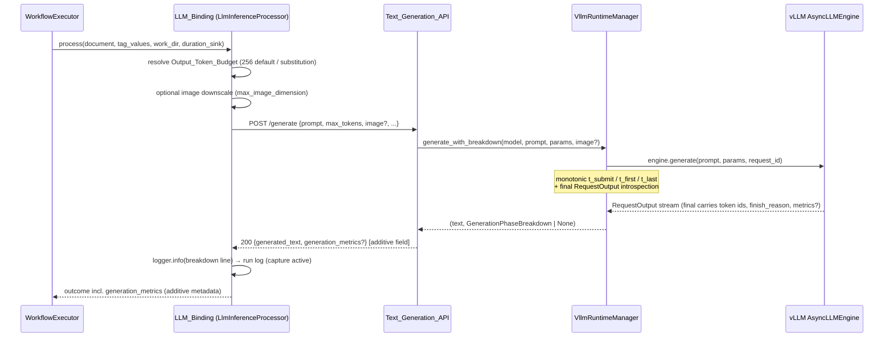
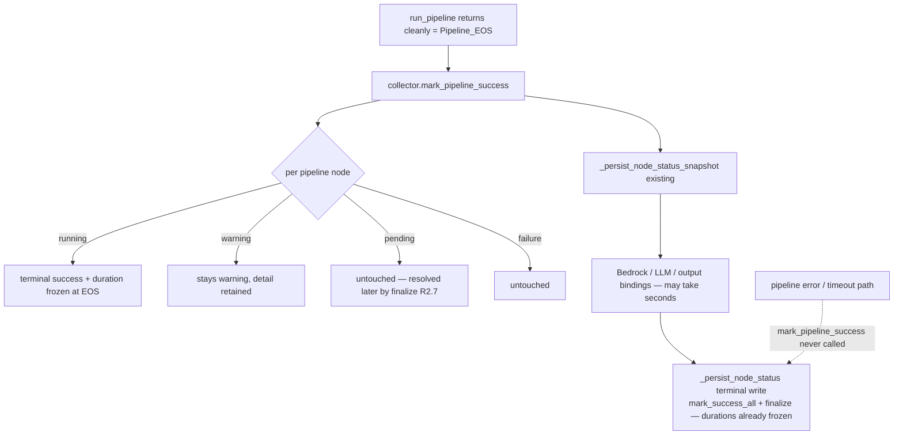

# Design Document

## Overview

Deployed-workflow runs with a vLLM inference node spend >99% of their ~17.5 s in the
`llm_inference_1` Generation_Call (execution 9c98f4b7: pipeline ~30 ms, orchestration
~100 ms, generation 17.43 s). This feature is measurement-first: it instruments the
generation call with a per-request Generation_Phase_Breakdown (queueing / prefill /
decode + token counts), fixes the Pipeline_Node timing artifact that shows ~17.5 s on
folder_source/capture nodes, and then applies levers to the measured bottleneck —
output token budget, prompt-prefix caching, multimodal image size — each gated by
on-device evidence. Model-level options (quantized/smaller variants) are guidance and
measurement only. The deliverables are code changes in `src/backend` plus two
measurement artifacts: a Latency_Report (spec artifact) and Model_Variant_Guidance
(on-device documentation).

### Research summary (verified in this codebase)

- **Generate path**: `vllm_runtime/manager.py` `VllmRuntimeManager._request` does the
  READY-check, builds the engine prompt (text-only string, or multimodal dict via
  `_build_multimodal_prompt`), constructs `SamplingParams` through an injectable
  factory, and iterates `engine.generate(engine_prompt, params, request_id)`. Both the
  engine and sampling-params factories are injectable, so a fake engine can drive
  every instrumentation path host-side with no GPU.
- **Per-request metrics**: vLLM `RequestOutput` exposes `prompt_token_ids`,
  `outputs[0].token_ids`, `outputs[0].finish_reason` on both V0 and V1 engine
  frontends. The richer `output.metrics` (`RequestMetrics` with `arrival_time`,
  `first_scheduled_time`, `first_token_time`, `finished_time`) is populated by the V0
  frontend but is `None` on the V1 engine (which JP7 uses). The breakdown must
  therefore be layered: engine metrics when present, manager-side monotonic
  timestamps otherwise, with honest `unavailable` marking (Requirement 1.4 permits).
- **Engine args passthrough**: `vllm_runtime/repository.py` `parse_repository` returns
  the `1/model.json` object **unfiltered**, and `_default_engine_factory` feeds it
  straight into `AsyncEngineArgs(**args)`. `enable_prefix_caching: true` in a model
  component's model.json therefore already reaches the engine — Requirement 4 needs
  only the load-time log line, the preflight/documentation work, and device evidence.
- **max_tokens today**: the LLM_Binding (`workflow_engine/output_bindings.py`
  `_default_llm_invoker`) forwards `max_tokens`/`temperature`/`top_p` only when
  non-None; the Text_Generation_API (`endpoints/text_generation.py`) already applies
  `GENERATION_DEFAULTS = {"max_tokens": 256, ...}` to omitted parameters and rejects
  invalid values with 422 findings. So the API's 256 default **is** pre-feature
  behavior for all callers (Requirement 3.7 is satisfied by not touching the API);
  what changes is the LLM_Binding, which must make the budget explicit, substitute 256
  for invalid values with a run-log notice instead of letting the request 422, and
  report truncation.
- **Pipeline-node timing**: `WorkflowExecutor.execute` runs the pipeline synchronously
  (`manager.run_pipeline(...)` returns at Pipeline_EOS), then runs Bedrock → LLM →
  output-binding blocks, and only marks nodes terminal at run end
  (`mark_success_all` inside `_persist_node_status`). `NodeStatusCollector`
  distinguishes pipeline nodes (non-None values of the element `name_map`) from
  binding nodes (seeded via `extra_node_ids`), and a mid-run
  `_persist_node_status_snapshot` already executes right after `run_pipeline`
  returns — the natural spot to mark pipeline nodes terminal at EOS.
- **Catalog**: the `llm_inference` node descriptor lives in
  `edge-cv-portal/backend/layers/workflow_core/python/workflow_core/catalog/nodes.py`
  with a byte-identical vendored mirror at
  `src/backend/workflow_engine/vendor/workflow_core/catalog/nodes.py` (mirror
  discipline pinned by tests). Adding the image-downscaling node parameter touches
  both plus any catalog goldens.
- **Test stack**: pytest + hypothesis under `test/backend-test/` (`vllm_runtime/`,
  `text_generation/`, `workflow_engine/` precedents), runnable host-side with
  `PYTHONPATH=src/backend:test/backend-test`.

### Design principles

1. **Measure first, honestly**: every phase value is a real monotonic-clock
   measurement; anything the engine does not expose is marked `unavailable`, never
   estimated (R1.4), and an all-zero breakdown is treated as instrumentation error
   (R1.6).
2. **Additive and contained**: no existing API field, status value, error type, or
   generate semantic changes (R9.1, R9.2, R2.4). Every new mechanism is wrapped in
   the same best-effort containment discipline the collector and bindings already use.
3. **Device evidence is the deliverable**: R4.2, R6, R7, R8 and the ≤10 ms
   instrumentation-overhead gate (R1.7) are verified on jetson-thor1 (JP7) and
   recorded in the Latency_Report / Model_Variant_Guidance, not inferred from host
   tests.

## Architecture

### Generation_Phase_Breakdown data flow



### Pipeline_EOS terminal marking



Failure paths are untouched: `mark_pipeline_success` is invoked only on the
clean-return path of `run_pipeline`, before the Bedrock/LLM/output blocks; every
existing failure handler returns before that call site, so `finalize`'s existing
rules (failure attribution, unattributed-failure `warning`) apply byte-identically
(R2.3).

### Optimization levers and where they act

| Lever | Phase targeted | Mechanism | Requirement |
|---|---|---|---|
| Output_Token_Budget (256 default) | decode | LLM_Binding always sends explicit `max_tokens` | R3 |
| Prefix_Caching | prefill (repeat runs) | model.json `enable_prefix_caching` passthrough (already works) + load log + measurement | R4 |
| Image downscaling (`max_image_dimension`) | prefill (image tokens) | LLM_Binding downscales captured frames pre-request | R5 |
| Fixed-cost audit | non-generation overhead | evidence-only: READY reuse already implemented; measured ≤500 ms gate | R6 |
| Model variants | decode rate | measurement + packaging guidance only | R7 |

## Components and Interfaces

### 1. `vllm_runtime/generation_metrics.py` (new module)

Pure, engine-agnostic breakdown construction — property-testable without vLLM.

```python
@dataclass(frozen=True)
class GenerationPhaseBreakdown:
    queueing_ms: Optional[int]      # None = unavailable
    prefill_ms: Optional[int]       # None = unavailable
    decode_ms: Optional[int]        # None = unavailable
    prompt_tokens: Optional[int]    # None = unavailable
    output_tokens: Optional[int]    # None = unavailable
    image_tokens: Optional[int]     # None = unavailable (only when applicable)
    image_tokens_applicable: bool   # False = request carried no image (R1.1 "n/a")
    truncated: Optional[bool]       # finish_reason == "length"; None = unavailable
    prefill_includes_queueing: bool # True on the fallback (manager-clock) path

    def to_payload(self) -> Dict[str, Any]: ...   # JSON for generation_metrics
    def to_log_line(self, node_id, model_name) -> str: ...  # run-log emission (R1.2)
```

Builder function:

```python
def build_breakdown(
    *, t_submit: float, t_first: Optional[float], t_last: Optional[float],
    final_output: Any, image_supplied: bool,
    image_placeholder_token_id: Optional[int],
) -> GenerationPhaseBreakdown
```

- **Phase sources, layered**:
  - If `final_output.metrics` exposes usable `arrival_time`, `first_scheduled_time`,
    `first_token_time`, `finished_time` (V0 frontend; vLLM records these with
    `time.monotonic()`): `queueing = first_scheduled − arrival`,
    `prefill = first_token − first_scheduled`, `decode = finished − first_token`.
  - Otherwise (V1: `metrics is None`): manager-side monotonic timestamps captured in
    `_request` — `queueing_ms = None` (unavailable), `prefill_ms = t_first − t_submit`
    with `prefill_includes_queueing = True` (a genuine measurement of
    submission-to-first-token, labeled as such — never an estimate),
    `decode_ms = t_last − t_first`.
  - Each duration is `max(0, round(seconds * 1000))`; an unreadable or negative
    source marks that field unavailable.
- **All-zero guard (R1.6)**: if queueing, prefill and decode are all present and all
  zero, all three phase fields are replaced with `None` (unavailable).
- **Token counts**: `prompt_tokens = len(final_output.prompt_token_ids)`,
  `output_tokens = len(final_output.outputs[0].token_ids)`, both best-effort.
  `image_tokens` (R5.1): when the request carried an image, count occurrences of the
  model's image placeholder token id in `prompt_token_ids`; the placeholder id is
  read best-effort from the loaded model's hf_config (`image_token_id`, exposed by
  the Qwen2-VL/Qwen2.5-VL/Qwen3-VL family) — unreadable ⇒ `image_tokens = None`
  (unavailable). No image ⇒ `image_tokens_applicable = False` and the serialized/log
  form says `n/a` (R1.1, R5.5).
- **Truncation**: `truncated = (finish_reason == "length")`; unreadable
  finish_reason ⇒ `None`.
- `to_payload()` / `to_log_line()` render `None` as the string `"unavailable"` and a
  non-applicable image count as `"n/a"` — unavailable/not-applicable fields are
  always present, never silently dropped (R1.2).

### 2. `VllmRuntimeManager` — instrumented generate (additive)

- `_request` captures three monotonic timestamps (`t_submit` before
  `engine.generate`, `t_first` at the first yielded output, `t_last` at the last)
  and retains the final `RequestOutput`. All capture code sits inside
  `try/except` shells so a failure records nothing and never disturbs the yield
  stream (R1.5). Overhead is a handful of `time.monotonic()` calls and attribute
  reads per request — the ≤10 ms bound (R1.7) is verified on device by the
  median-of-5 comparison procedure in the Testing Strategy.
- New public method, additive beside `generate` (whose signature and semantics are
  untouched — R9.1):

```python
async def generate_with_breakdown(
    self, model_name, prompt, sampling_params=None, image=None,
    reference_image=None, system_prompt=None,
) -> Tuple[str, Optional[GenerationPhaseBreakdown]]
```

  `generate` delegates to it and discards the breakdown, so both share one code
  path and deterministic-sampling results are identical by construction.
  `None` breakdown = capture failed or produced nothing usable; the text is
  returned regardless (R1.5).
- Image placeholder token id: a small best-effort reader over the loaded engine's
  model config (same `_safe_attr` discipline as `_default_kv_margin_reader`),
  cached per `_ManagedModel` like the `multimodal` flag.
- **Prefix-caching load log (R4.1, R4.6)**: in the load-success path, when
  `engine_args.get("enable_prefix_caching")` is truthy, write one INFO line to the
  backend application log naming the model and stating Prefix_Caching is active.
  Falsy/absent: no line, no behavior change (passthrough already exists).
  A load failure with `enable_prefix_caching` set flows through the existing
  preflight/FAILED path, which already logs model + classified reason at ERROR —
  that ERROR line is the R4.5 fallback notification; the design adds an assertion
  of it to the test plan rather than a new mechanism.

### 3. `endpoints/text_generation.py` — additive response field

- The non-streaming `generate_text` handler invokes
  `runtime.generate_with_breakdown(...)` when the runtime exposes it
  (`getattr` check — injected fakes without the method keep working and simply
  produce no metrics), else `runtime.generate(...)` exactly as today.
- When a breakdown is captured, the 200 response gains one **additive** field:
  `"generation_metrics": breakdown.to_payload()`. Every existing field
  (`model_name`, `generated_text`, conditional `image_used`) is untouched (R9.2).
  Requests served without a breakdown return the pre-feature body byte-identically.
- No change to request validation, defaults, retry, timeout, streaming, or error
  mappings. In particular `GENERATION_DEFAULTS` stays as-is: non-LLM_Binding callers
  omitting `max_tokens` keep the pre-feature 256 default the API already applied
  (R3.7 — no default is *injected* by this feature; the pre-feature behavior is
  preserved unchanged).

### 4. `workflow_engine/output_bindings.py` — LLM_Binding changes

**Output_Token_Budget resolution (R3.1, R3.3, R3.4)** — new pure helper:

```python
DEFAULT_OUTPUT_TOKEN_BUDGET = 256

def resolve_output_token_budget(raw: Any) -> Tuple[int, Optional[str]]:
    """(budget, substitution_notice). Valid = an integral number >= 1
    (bool excluded; integral floats accepted as their int value) -> (value, None).
    Absent (None) -> (256, None). Anything else (non-numeric, non-positive,
    non-integral) -> (256, notice naming the rejected value)."""
```

`_run_one` resolves the budget from `parameters.get("max_tokens")` before invocation
and always places the resolved integer into the request parameters, so the POST body
carries an explicit `max_tokens` on every LLM_Binding call. A substitution notice is
logged at WARNING (run-log capture is active during binding processing), including
the rejected value (R3.3). Net behavior change: a previously-invalid configured
value no longer 422s the node — it generates with the documented default.

**Generation-metrics return path (R1.2)** — `_default_llm_invoker` gains a
keyword-only `metrics_sink: Optional[Callable[[dict], None]] = None`. On a 200 it
calls `metrics_sink(payload.get("generation_metrics"))` (contained). `_run_one`
passes `metrics_sink` only when the (possibly injected) invoker accepts the keyword
— the existing `_accepts_keyword` pattern — so pre-feature injected fakes keep
working unchanged. With a captured metrics dict, `_run_one`:

1. emits one INFO run-log line via the breakdown's formatted form — all fields,
   `unavailable`/`n/a` included, and the truncation statement exactly when the
   metrics report `truncated: true` (R3.5, R3.6);
2. merges the dict into the node outcome as `outcome["generation_metrics"]`
   (additive metadata under `llm[nodeId]`, feeding the run view and the
   Latency_Report's per-run evidence).

Both steps are contained: a failure in either logs at debug and leaves the node
outcome and run state exactly as a metrics-less run (R1.5, R2.6-style discipline).

**Image downscaling (R5.3–R5.8)** — new pure helper plus wiring:

```python
def resolve_max_image_dimension(raw: Any) -> Tuple[Optional[int], Optional[str]]:
    """(max_dim, invalid_notice). Absent/None -> (None, None) [unconfigured,
    silent]. Integral number >= 1 -> (value, None). Anything else -> (None,
    notice)  [treated as unconfigured + run-log warning, R5.8]."""

def downscale_image_bytes(data: bytes, max_dim: int) -> bytes:
    """Pillow: if longer edge > max_dim, resize so the longer edge == max_dim,
    aspect preserved (LANCZOS), re-encode JPEG; else return data unchanged
    (never upscale, R5.7). Raises on decode/encode failure — the caller
    contains it."""
```

In `_run_one`, after each captured frame is read and before base64 encoding, when a
`max_image_dimension` resolves to a positive value the bytes pass through
`downscale_image_bytes`; a raised failure logs a run-log WARNING naming the node and
failure and sends the **original** bytes (R5.4). The same treatment applies to both
the `in` frame and the optional `reference` frame — both are captured images the
request sends, and both contribute image tokens to prefill (design decision;
R5.3's rule is applied per captured image). When the option is unconfigured the
code path is skipped entirely — the encoded bytes and request body are
byte-identical to pre-feature (R5.6). No image ⇒ no downscaling attempt (R5.5).
Pillow is already a backend dependency (the manager decodes images with it).

### 5. `workflow_engine/node_status.py` — `mark_pipeline_success`

`NodeStatusCollector.__init__` additionally records
`self._pipeline_node_ids = {nid for nid in name_map.values() if nid is not None}`
(binding nodes seeded via `extra_node_ids` are, by construction, not in it).

```python
def mark_pipeline_success(self) -> None:
    """Pipeline_EOS terminal marking (R2.1). For exactly the pipeline nodes
    (name_map-derived): running -> success via _set_status (freezing the
    lifecycle duration at EOS, R2.2); warning retained; failure retained;
    pending untouched (R2.7). Binding nodes untouched (R2.4). Fully
    contained (R2.6)."""
```

The transition uses the existing `_set_status` single-write path, so duration
capture, first-terminal-wins semantics, and serialization (`status` / `detail` /
`durationMs`) are byte-identical to today's `mark_success_all` mechanics (R2.4).
Final-map parity (R2.5) holds by construction: `running → success` at EOS is the
same terminal status `mark_success_all` would have assigned at run end, warnings
survive both paths identically, and `finalize` still resolves everything else.

### 6. `workflow_engine/pipeline_executor.py` — call site

Immediately after `run_pipeline` returns cleanly (both the frame-feed and plain
invocations), before the existing mid-run snapshot:

```python
if collector is not None:
    collector.mark_pipeline_success()   # contained internally (R2.6)
self._persist_node_status_snapshot(session, execution, collector)  # existing
```

This is synchronous straight-line code executed within microseconds of
`run_pipeline`'s return — the observable transition-to-terminal latency after
Pipeline_EOS is bounded far below the 100 ms budget (R2.1), verified on device.
No other executor path changes; the terminal `_persist_node_status` (with
`mark_success_all` + `finalize`) remains the authoritative last write.

### 7. Catalog: `max_image_dimension` node parameter

Added to the `llm_inference` `NodeTypeDescriptor` in the portal catalog
(`edge-cv-portal/backend/layers/workflow_core/python/workflow_core/catalog/nodes.py`)
and the byte-identical vendored mirror
(`src/backend/workflow_engine/vendor/workflow_core/catalog/nodes.py`):

```python
ParameterDescriptor("max_image_dimension", "int", required=False, default=None,
                    constraints={"min": 1},
                    description="Optional maximum pixel dimension for the longer "
                                "edge of captured frames sent to the model. Larger "
                                "frames are downscaled (aspect preserved) before "
                                "inference to cut image-token prefill cost; smaller "
                                "frames are never upscaled. Empty sends frames "
                                "unmodified.")
```

The compiler already copies node parameters into the executor binding's
`parameters`, so no compiler change is needed. While editing the descriptor, the
`max_tokens` description is extended to state the 256-token default's latency
effect and the verdict-style 20–30-token guidance (R3.8, alongside the docs file
below). Mirror discipline applies: both copies change identically in one commit,
and any catalog golden baselines are rebaselined per the established procedure.

### 8. Documentation and measurement artifacts

- **`docs/vllm-latency.md`** (new): the on-device documentation home for
  R3.8 (Output_Token_Budget default, latency effect, verdict-style guidance) and
  the Model_Variant_Guidance (R4.3 prefix-caching enablement + measured
  first/repeat prefill, R5.2 resolution-vs-prefill table, R7 variant
  measurements, packaging steps with Engine_Arguments, verbatim outputs, memory
  tradeoffs and failure outcomes).
- **`.kiro/specs/vllm-workflow-latency-optimization/latency-report.md`** (new,
  spec artifact): the Latency_Report — baseline (execution 9c98f4b7, ~17.5 s /
  17.43 s), first-run and median-of-3 steady-state after optimizations,
  single-variable per-optimization attribution (or declared combined
  measurements, R8.5), residual decode-rate floor as a function of output
  tokens, sub-second identification per configuration, non-generation overhead
  decomposition with the ≤500 ms gate (R6.3, R6.4), and execution-id
  traceability for every stated value (R8.6). Filled during device verification.

## Data Models

### GenerationPhaseBreakdown (in-process dataclass)

Defined in section "Components and Interfaces" above. Invariants:

- every `*_ms` field is `None` or a non-negative `int` (milliseconds, monotonic
  source — R1.3);
- `image_tokens_applicable is False` ⟺ the request carried no image; in that case
  `image_tokens` is ignored and serialized as `"n/a"`;
- never all-zero across queueing/prefill/decode (the builder converts that case to
  all-unavailable, R1.6);
- `prefill_includes_queueing` is `True` only on the fallback path where
  `queueing_ms is None`.

### `generation_metrics` JSON (additive API response field and run metadata)

```json
{
  "queueing_ms": 12,                 // int | "unavailable"
  "prefill_ms": 842,                 // int | "unavailable"
  "decode_ms": 16571,                // int | "unavailable"
  "prefill_includes_queueing": false,
  "prompt_tokens": 1180,             // int | "unavailable"
  "output_tokens": 256,              // int | "unavailable"
  "image_tokens": 1024,              // int | "unavailable" | "n/a"
  "truncated": true                  // bool | "unavailable"
}
```

Appears only in the non-streaming generate 200 response and in the node outcome
under `llm[nodeId].generation_metrics`; all pre-existing fields in both structures
are unchanged (R9.2).

### Run-log emission line (R1.2, R3.5)

One INFO line per LLM_Binding Generation_Call, e.g.:

```
LLM generation breakdown (node llm_inference_1, model qwen3-vl-8b): queueing 12 ms,
prefill 842 ms, decode 16571 ms, prompt tokens 1180, image tokens 1024, output
tokens 256; output truncated at the output token budget (256)
```

Unavailable fields render as `unavailable`, non-applicable image tokens as `n/a`;
the truncation clause appears exactly when `truncated` is `true` (R3.5, R3.6).

### Node status map (unchanged shape)

`{nodeId: {status, detail?, durationMs?}}` — no new fields, no new status values
(R2.4). Only *when* pipeline nodes reach their terminal status (and hence their
`durationMs` values) changes.

### Node parameter

`max_image_dimension: int | null` on the `llm_inference` node; compiled into the
executor binding's `parameters` untouched. Absent/null = unconfigured.

### Engine arguments (unchanged shape)

`enable_prefix_caching: bool` in `model.json` — already a valid `AsyncEngineArgs`
key flowing through the unfiltered passthrough; this feature adds no parsing.

## Correctness Properties

*A property is a characteristic or behavior that should hold true across all valid
executions of a system — essentially, a formal statement about what the system
should do. Properties serve as the bridge between human-readable specifications and
machine-verifiable correctness guarantees.*

The measurement/documentation criteria (1.7, 3.2, 4.2–4.4, 5.2, all of R6–R8, 9.3–9.5)
are device-run or process obligations, not host-computable properties; they are
covered by the device measurement procedures in the Testing Strategy.

### Property 1: Breakdown well-formedness and measurement honesty

*For any* completed Generation_Call driven through a fake engine — with or without
engine-level metrics, with or without image data, including all-zero timings and
partially unreadable outputs — the recorded Generation_Phase_Breakdown SHALL have
every phase field either a non-negative integer of milliseconds or marked
unavailable; SHALL mark every metric the engine did not expose as unavailable
(never an estimated value); SHALL never report all phases as zero simultaneously
(that case becomes all-unavailable); SHALL report prompt and output token counts
matching the final output's token id lists; SHALL report the image token count
equal to the number of image placeholder token ids in the prompt when an image was
supplied and the placeholder id is readable; and SHALL mark the image token count
not applicable exactly when the request carried no image data.

**Validates: Requirements 1.1, 1.3, 1.4, 1.6, 5.1, 5.5**

### Property 2: Generation semantics preserved under instrumentation

*For any* request against a deterministic fake engine, and *for any* injected
failure in breakdown capture or emission (including none), the instrumented
generate path SHALL return exactly the generated text the pre-feature path
returns, SHALL raise exactly the same error types (ModelUnavailableError,
GenerationError) on the existing failure paths, and SHALL never let a
measurement error escape to the caller.

**Validates: Requirements 1.5, 9.1**

### Property 3: Run-log breakdown emission with iff-truncation

*For any* generation_metrics payload delivered by the invoker to the
LLM_Binding, the processor SHALL emit exactly one run-log line containing every
breakdown field — rendering unavailable fields as "unavailable" and a
non-applicable image token count as "n/a" — and that line SHALL state that the
output was truncated at the Output_Token_Budget if and only if the payload
reports truncation.

**Validates: Requirements 1.2, 3.5, 3.6**

### Property 4: Pipeline_EOS terminal marking is scoped and parity-preserving

*For any* collector state (random element name_map, extra binding node ids, and
status history), `mark_pipeline_success` SHALL transition exactly the
name_map-derived Pipeline_Nodes currently in `running` to `success`, SHALL retain
`warning` (with detail) and `failure`, SHALL leave `pending` Pipeline_Nodes and
all binding nodes untouched, SHALL keep the serialized map within the existing
`{status, detail?, durationMs?}` shape and five-status vocabulary; and *for any*
full run lifecycle (success or failure path), the final terminal status of every
node SHALL equal the final terminal status the pre-feature lifecycle produces,
with all serialized durations non-negative integers.

**Validates: Requirements 2.1, 2.3, 2.4, 2.5, 2.7**

### Property 5: Node_Execution_Time frozen at Pipeline_EOS

*For any* Pipeline_Node marked terminal by `mark_pipeline_success` and *for any*
subsequent sequence of terminal markings (`mark_success_all`, `finalize`,
`mark_failure` on other nodes), the node's recorded duration SHALL remain the
value frozen at the EOS transition — later run activity never increases it.

**Validates: Requirements 2.2**

### Property 6: EOS marking containment

*For any* internal fault injected into the EOS transition path,
`mark_pipeline_success` SHALL not raise, and the subsequent run lifecycle
(snapshots, binding processing, terminal persistence) SHALL proceed to the same
run outcome as a fault-free run.

**Validates: Requirements 2.6**

### Property 7: Output_Token_Budget resolution is total and explicit

*For any* configured `max_tokens` value — a valid integral number ≥ 1, absent, or
invalid (non-numeric, non-positive, boolean, non-integral) — the LLM_Binding
SHALL send a request whose `max_tokens` equals the configured value when valid
and exactly 256 otherwise, and SHALL log a substitution notice naming the
rejected value if and only if the configured value was present and invalid.

**Validates: Requirements 3.1, 3.3, 3.4**

### Property 8: Prefix_Caching passthrough and load-time logging

*For any* engine-arguments mapping, the manager SHALL hand the mapping to the
engine factory unchanged (key-for-key, value-for-value), and SHALL write the
prefix-caching load log entry naming the model if and only if
`enable_prefix_caching` is truthy in the mapping — falsy or absent constructs
the engine with pre-feature behavior and no such log entry.

**Validates: Requirements 4.1, 4.6**

### Property 9: Downscaling geometry (iff around the threshold)

*For any* decodable captured image and *for any* configured maximum pixel
dimension ≥ 1: when the image's longer edge exceeds the maximum, the bytes sent
SHALL decode to an image whose longer edge equals the maximum with the aspect
ratio preserved (within 1-pixel rounding); when the longer edge is less than or
equal to the maximum, the bytes sent SHALL be byte-identical to the captured
bytes (never upscaled).

**Validates: Requirements 5.3, 5.7**

### Property 10: Downscaling configuration and failure containment

*For any* captured image bytes: an unconfigured downscaling option SHALL send
the bytes byte-identical to pre-feature behavior with no warning; an invalid
configured value (non-positive or non-numeric) SHALL send the bytes unmodified
and emit exactly one run-log warning naming the invalid value; and a failing
downscale operation SHALL send the original bytes, emit a run-log warning naming
the failure, and produce a node outcome of the same shape and terminal effect as
a run without the failure.

**Validates: Requirements 5.4, 5.6, 5.8**

### Property 11: API additivity

*For any* valid generate request driven through the endpoint with a fake
runtime, the response SHALL contain every pre-feature field (`model_name`,
`generated_text`, and `image_used` exactly per its existing conditional rule)
with values identical to the pre-feature handler's, and SHALL differ at most by
the additional `generation_metrics` field.

**Validates: Requirements 9.2**

### Property 12: Failure isolation preserved under optimization

*For any* set of loaded fake models and *for any* generation failure injected
into one model's engine, the failure SHALL surface through the existing error
types with the failing model named, and every other loaded model SHALL remain
READY and continue serving Generation_Calls successfully.

**Validates: Requirements 9.6**

## Error Handling

| Failure | Handling | Requirement |
|---|---|---|
| Breakdown capture raises (introspection, arithmetic) | Contained inside `_request` / `build_breakdown`; `generate` returns text, `generate_with_breakdown` returns `(text, None)`; debug log only | 1.5 |
| Engine exposes no/partial metrics (V1 `metrics=None`) | Fallback to manager monotonic timestamps; `queueing_ms` unavailable, `prefill_includes_queueing=true`; never estimated | 1.4 |
| All-zero phase readings | Treated as instrumentation error → phases marked unavailable | 1.6 |
| Run-log emission or `metrics_sink` raises | Contained in the binding (`_emit`-style try/except, debug log); node outcome unchanged | 1.5 |
| `mark_pipeline_success` internal error | Contained (collector best-effort discipline); run proceeds, terminal persistence unchanged | 2.6 |
| Pipeline error/timeout (no EOS) | `mark_pipeline_success` never invoked; existing failure/finalize rules apply byte-identically | 2.3 |
| Invalid configured `max_tokens` | Budget = 256, WARNING with rejected value into the run log; request proceeds (no more 422 node error for this case) | 3.3 |
| Prefix-caching load failure (incl. preflight refusal) | Existing FAILED-with-classified-reason path; the existing ERROR log line is the fallback notification | 4.4, 4.5 |
| Image downscale failure (decode/resize/encode) | Original bytes sent; run-log WARNING naming node and failure; same terminal state | 5.4 |
| Invalid `max_image_dimension` | Treated as unconfigured; bytes unmodified; run-log WARNING naming the value | 5.8 |
| Generation failure with optimizations enabled | Existing `GenerationError`/`ModelUnavailableError` paths; failing model isolated, others READY | 9.6 |

No new error types, status codes, or status values are introduced anywhere.

## Testing Strategy

### Dual approach

- **Property-based tests (hypothesis)** implement the twelve correctness
  properties above — one hypothesis test per property, minimum 100 examples
  (`@settings(max_examples=100)` or higher), each tagged with a comment:
  `# Feature: vllm-workflow-latency-optimization, Property N: <property title>`.
  New test packages: `test/backend-test/vllm_latency/` (breakdown, manager
  instrumentation, endpoint additivity, budget/downscale helpers, collector EOS
  marking), following the existing fake-engine patterns in
  `test/backend-test/vllm_runtime/` and the collector/executor patterns in
  `test/backend-test/workflow_engine/`. Host run:
  `PYTHONPATH=src/backend:test/backend-test` with the `/tmp/kiro-test-venv`
  interpreter.
- **Example-based unit tests** for the narrow branches: AC 3.7 (endpoint request
  path untouched for direct callers), AC 4.5 (ERROR log on a prefix-caching load
  failure), the catalog mirror byte-identity of the new `max_image_dimension`
  parameter, and the run-log line format examples.

### Property test infrastructure notes

- Fake engines: reuse the injectable `engine_factory` /
  `sampling_params_factory` seams; fakes yield scripted `RequestOutput`-shaped
  objects (`prompt_token_ids`, `outputs[0].token_ids`, `outputs[0].finish_reason`,
  optional `metrics` with monotonic-consistent timestamps) so every breakdown
  branch (V0 metrics, V1 fallback, unreadable, all-zero) is generator-reachable.
- Collector properties drive random lifecycles (bus signals, EOS marking, failure
  paths) against both the featured and a reference pre-feature transition
  sequence for the parity assertions of Properties 4 and 5.
- Image properties generate real PIL images (hypothesis-chosen dimensions within
  sane bounds, e.g. 1–512 px pre-scale) and assert geometry on the decoded output;
  byte-identity branches compare the exact base64 payloads captured by an injected
  invoker.

### Non-regression

- The full backend suite must pass with zero failures/errors and no weakened or
  deleted assertions (R9.3). If any preservation-tracked file is touched, its
  golden baseline is updated through the documented maintenance path in the same
  commit (per `.kiro/steering/builds.md`); catalog goldens are rebaselined when
  the `llm_inference` descriptor changes, with the portal/vendored mirror updated
  byte-identically in one commit.
- Deterministic-identity (Property 2) doubles as the R9.1 regression pin.

### Device measurement procedures (jetson-thor1, JP7 — the target device)

These produce the evidence the code cannot: each is a scripted, repeatable
procedure whose results land in the Latency_Report
(`.kiro/specs/vllm-workflow-latency-optimization/latency-report.md`) and
Model_Variant_Guidance (`docs/vllm-latency.md`) with execution ids (R8.6).

1. **Instrumentation overhead (R1.7)**: ≥5 identical Generation_Calls with
   instrumentation vs. the same without (feature toggled by deploying the
   pre-feature build or a capture kill-switch patch); compare median e2e latency;
   pass at ≤10 ms delta.
2. **EOS timing (R2.1)**: run the baseline workflow; confirm pipeline nodes reach
   terminal status with durations ~30 ms (not ~17.5 s) and that the node-status
   endpoint serves them while the LLM binding is still running.
3. **Budget effect (R3, R8.2)**: same workflow, `max_tokens` 256 vs. unbounded
   baseline vs. 30 (verdict-style); single-variable comparison from breakdowns.
4. **Prefix caching (R4.2, R8.2)**: enable `enable_prefix_caching` in the model
   component's model.json; two consecutive runs sharing a ≥100-token prefix;
   compare first/repeat prefill from breakdowns; record memory preflight outcome.
5. **Image scaling (R5.2, R8.2)**: ≥2 resolutions differing ≥2x in pixel count via
   `max_image_dimension`; record image tokens and prefill per resolution.
6. **Fixed costs and overhead (R6)**: consecutive runs on a READY model; assert no
   load/construction log lines; compute non-generation overhead = e2e − Generation
   _Call from per-node timing; gate ≤500 ms or attribute the excess.
7. **Variants (R7)**: package ≥1 quantized/smaller variant (e.g. an AWQ or smaller
   Qwen-VL build) with identical workflow/prompt/image/budget; record decode rate,
   e2e latency, verbatim outputs, or the load/preflight failure outcome.
8. **Report (R8)**: baseline vs. optimized first-run and median-of-3 steady state;
   residual decode-rate floor; sub-second identification per configuration.

### Hardware verification gate (R9.4)

The vLLM-path changes (manager, endpoint, LLM binding) are exercisable only on
vLLM-capable architectures and are verified on jetson-thor1 (JP7) end-to-end to a
successful terminal run state with sustained backend health. The collector/executor
EOS change runs on every architecture; it is additionally verified on a JP6 device
(the other actively deployed arch with available hardware) by running a workflow end
to end — no cross-architecture assumptions. Verification runs, devices, and
outcomes are recorded with the commits per the gate.
