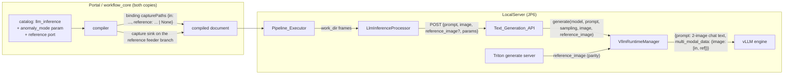

# Design Document

## Overview

The heavy lifting for VLM/Bedrock parity already landed in two prior features (verified in the tree):

- **edge-vlm-image-inference** wired the `in` frame end to end: compiler capture plan for `llm_inference` bindings (`BINDING_LLM_INFERENCE` joins `_bedrock_capture_plan`, non-opaque), processor frame attachment (`capturePaths["in"]` → base64 → invoker), Text_Generation_API `image` field, Triton server `image` field, and the Runtime_Manager's single-image multimodal prompt (`_build_multimodal_prompt`).
- **vlm-parity-run-results** (task 1, implemented) gave `LlmInferenceProcessor._run_one` the anomaly-mode contract: truthy `anomaly_mode` appends `BEDROCK_JSON_INSTRUCTION` to the rendered prompt, parses with `parse_bedrock_answer`, merges `{is_anomalous, confidence}` flat (in `process()`); unparseable answers record `{'error', 'generated_text'}` without raising.

What is actually missing, and what this feature adds, in data-flow order:

1. **Catalog** (`workflow_core/catalog/nodes.py`, both copies): `LLM_INFERENCE` gains the `anomaly_mode` bool parameter (default **False** — matching the executor's already-shipped `bool(_coerce(...))` default, unlike Bedrock's default True; existing llm workflows stay freeform without repackage) and the `reference` VideoFrames input port. `prompt_template`'s description gains the anomaly-mode note.
2. **Compiler**: no new logic. `_bedrock_capture_plan` iterates `descriptor.inputs` generically, so the new `reference` port gets a capture path (or `None` when unfed) automatically; feeder sharing and the single-sink-per-feeder rule already hold across both binding kinds. Verified at `compiler.py` lines 736–742 (port loop) and 406–407 (llm ids in the plan call).
3. **Executor** (`src/backend/workflow_engine/output_bindings.py`): `LlmInferenceProcessor._run_one` reads `capturePaths["reference"]` with Bedrock's optional-reference semantics (missing/`None`/unreadable → warn + single-image; never a node error) and passes a second base64 image to the invoker; `_default_llm_invoker` gains `reference_b64` and adds `"reference_image"` to the POST body when set.
4. **Text_Generation_API** (`src/backend/endpoints/text_generation.py`): `normalize_generation_request` validates an optional `reference_image` with exactly the `image` rules (reusing the same validation helper), rejects `reference_image`-without-`image`, and forwards `reference_image_bytes` to the runtime.
5. **Runtime_Manager** (`src/backend/vllm_runtime/manager.py`): `generate`/`generate_stream`/`_request` gain `reference_image`; `_build_multimodal_prompt` builds a two-image chat message (labeled "Input image" / "Reference image", input first) with `multi_modal_data: {"image": [pil_in, pil_ref]}`; engine construction defaults `limit_mm_per_prompt={"image": 2}` when model.json doesn't set it. `server.py`'s `GenerateRequest` gains `reference_image` for schema parity.
6. **Frontend**: nothing type-specific. The designer renders input handles from the catalog (`BuilderNodeComponent` — the bedrock reference-handle test proves the generic path) and bool parameters as checkboxes (`NodeConfigPanel` — bedrock's `anomaly_mode` renders today). The portal catalog deploy lights both up.

### Key design decisions

- **`anomaly_mode` defaults False** (Bedrock defaults True). The executor already ships `bool(_coerce(parameters.get("anomaly_mode")))` — absent → freeform — and the vlm-parity-run-results design chose False deliberately: llm is a text node first, and existing packaged workflows must keep behavior without repackage (Requirement 7.1). The catalog default must match the executor default.
- **Optional reference, Bedrock semantics.** A fed-but-unreadable `in` frame is a contained node error (that's the edge-vlm-image-inference contract — answering without the inspected image is the bug). A missing/unreadable **reference** is a logged warning + single-image inference, exactly like `BedrockInferenceProcessor` (Requirement 4.2). The two ports deliberately have different failure semantics, same as Bedrock.
- **`reference_image` as a sibling field, not an images list.** Both HTTP surfaces stay flat-JSON and additive: absent field ⇒ byte-identical request/normalization (Requirements 4.3, 5.3, 7.5). A list-shaped `images` field would break the shipped `image` contract for no benefit — the node has exactly two ports.
- **Reference requires a primary image (5.4).** The executor can never produce reference-without-input (the `in` port errors first), so the API-level rejection is pure boundary hygiene with one unambiguous rule, mirroring the "input first, reference second" ordering the prompt builder relies on.
- **Two-image prompt with text labels.** Bedrock labels its content blocks ("Input image:", "Reference image:"); the vLLM chat message mirrors that so prompts written for Bedrock port over: `[{text "Input image:"}, {image}, {text "Reference image:"}, {image}, {text prompt}]`, `multi_modal_data["image"]` a two-element list (vLLM's standard multi-image form). The Qwen-VL literal fallback gains a two-pad variant.
- **`limit_mm_per_prompt` defaulted, not forced.** vLLM's default caps images-per-prompt at 1; without the bump a two-image request fails at the engine. The default is applied only when model.json doesn't set the key (Requirement 6.6) — an explicit operator value wins. Harmless for text-only models (the arg is a standard `EngineArgs` field).

## Architecture



Post-run sequencing is unchanged: pipeline run → capture sinks persist frames → Bedrock processor → LLM processor → output bindings. Only the llm binding's inputs and the generate request contents grow.

## Components and Interfaces

### 1. Catalog (`edge-cv-portal/backend/layers/workflow_core/python/workflow_core/catalog/nodes.py` + vendored copy)

`LLM_INFERENCE` changes:

- `inputs=[PortDescriptor("in", PORT_TYPE_VIDEO_FRAMES), PortDescriptor("reference", PORT_TYPE_VIDEO_FRAMES)]` (Requirement 2.1). The validator has no required-input-port rule for inference nodes (verified: only CATEGORY_INPUT's `activation` is required-connected), so the port is optional exactly like Bedrock's (2.2).
- New `ParameterDescriptor("anomaly_mode", "bool", required=False, default=False, ...)` — description adapted from Bedrock's, with the llm-specific notes: default unchecked (freeform, today's behavior), text recorded at `llm.{nodeId}.generated_text`, verdict-parse failures recorded as the node's error without failing the run (1.1).
- `prompt_template` description extended with the anomaly-mode auto-append note (1.2).
- Comment block updated to describe the two-frame capture semantics (mirroring Bedrock's comment).

Catalog-content test maintenance: `EXPECTED_TYPE_IDS` is unchanged (no new type). `catalog_baseline.json` records the pre-change catalog for the preservation suite — follow the documented baseline maintenance path (regenerate after the intentional change; the diff must show only the `llm_inference` additions). After editing, re-vendor with `src/backend/workflow_engine/vendor/re_vendor.sh` and verify `diff` cleanliness (7.4).

### 2. Compiler (`workflow_core/compiler/compiler.py`, both copies)

**No code change expected.** The capture plan iterates `descriptor.inputs` per consuming node (`for port in descriptor.inputs: feeders = _frame_feeders(...)`), so the new port yields `capturePaths["reference"]` = shared feeder path or `None` (3.1, 3.2); `path_for(feeder)` already shares one sink/file per feeder across bedrock and llm consumers (3.3); the sim mapping (`sim_llm_inference`) bypasses the capture plan (3.4). The compiler tests must prove all of this against the updated descriptor; if any assumption fails, the fix lands here (both copies, byte-in-sync).

### 3. Executor (`src/backend/workflow_engine/output_bindings.py`)

`LlmInferenceProcessor._run_one`, after the existing `in`-frame block:

```python
reference_b64: Optional[str] = None
reference_path = capture_paths.get("reference")
if not reference_path:
    # unfed port / pre-feature package: single-image inference (4.2)
    ...log at debug/warning like Bedrock...
else:
    resolve {work_dir}; open/read/base64 → reference_b64
    except OSError: log warning, proceed single-image (4.2)  # never a node error
```

Invocation: when either image is present the invoker is called with the extended arity; the no-image call keeps today's three-argument form so pre-feature injected test invokers stay working (the shipped pattern):

```python
if image_b64 is not None and reference_b64 is not None:
    text = self._invoker(model_name, prompt, parameters, image_b64, reference_b64)
elif image_b64 is not None:
    text = self._invoker(model_name, prompt, parameters, image_b64)
else:
    text = self._invoker(model_name, prompt, parameters)
```

`_default_llm_invoker(model_name, prompt, parameters, image_b64=None, reference_b64=None)`: adds `"reference_image": reference_b64` to the POST body when set (4.3). The 409-loading poll loop, timeout, and error shape are untouched. Note: a reference without an `in` image cannot occur (the `in` error path returns before the reference is read), matching the API's 5.4 rule.

Anomaly-mode handling, prompt rendering, verdict parsing, and containment are untouched — the reference only adds an argument (4.4). Requirement 1.3 is satisfied by the existing implementation once the catalog exposes the parameter.

### 4. Text_Generation_API (`src/backend/endpoints/text_generation.py`)

- Extract the existing inline `image` validation into a helper `_validate_image_field(body, field_name, findings) -> Optional[bytes]` and apply it to both `image` and `reference_image` (5.1) — one rule set, two fields.
- After field validation: `if reference_image_bytes is not None and image_bytes is None: findings.append({"field": "reference_image", "reason": "reference_image requires an image"})` (5.4).
- `effective["reference_image_bytes"]` set only when valid (5.2); absent field leaves normalization byte-identical (5.3, 7.5).
- `generate_text` / `generate_text_stream`: pass `reference_image=effective.get("reference_image_bytes")` to the runtime only when present (keyword arg — fakes without the parameter keep working for reference-less tests, the shipped `image` pattern).
- `image_used` reporting is unchanged (it already answers "did the model consume image input").

### 5. vLLM runtime (`src/backend/vllm_runtime/manager.py`, `server.py`, `repository.py` or `manager.load`)

- `generate(..., image=None, reference_image=None)`, `generate_stream(...)`, `_request(...)`: threading only.
- `_request` prompt selection (extends the shipped trichotomy):
  - no `image` → bare prompt string (6.3; `reference_image` cannot arrive alone — API rejects it — but defensively treat image-less as text-only).
  - `image` + multimodal → `_build_multimodal_prompt(model_name, prompt, image, reference_image)` (6.1, 6.2).
  - `image` + not multimodal → warning + bare prompt (6.4, existing path).
- `_build_multimodal_prompt(model_name, prompt, image_bytes, reference_bytes=None)`:
  - Decode each present image with the existing PIL block; a reference decode failure raises the same `GenerationError` shape naming the reference (6.5).
  - Single image → message and return value byte-identical to today (6.2).
  - Two images → `content = [{"type": "text", "text": "Input image:"}, {"type": "image"}, {"type": "text", "text": "Reference image:"}, {"type": "image"}, {"type": "text", "text": prompt}]`; `multi_modal_data: {"image": [pil_in, pil_ref]}` (6.1). Qwen-VL literal fallback: a two-pad variant (`<|vision_start|><|image_pad|><|vision_end|>` twice, with the labels).
- Engine construction (in `load()` where `engine_args` are assembled, before `_engine_factory`): `engine_args.setdefault("limit_mm_per_prompt", {"image": 2})` (6.6). Placed in the manager (not `repository.py`) so `parse_repository` stays a pure model.json reader and an explicit model.json value naturally wins.
- `server.py`: `GenerateRequest` gains `reference_image: Optional[str] = None`; both endpoints decode via the existing `_decoded_image` helper and pass `reference_image=` through (5.5).

### 6. Frontend (`edge-cv-portal/frontend/src/pages/workflows/`)

No code change. `BuilderNodeComponent` renders input handles from the catalog descriptor (the bedrock two-input test covers the generic path — 2.3) and `NodeConfigPanel` renders bool parameters as checkboxes (bedrock's `anomaly_mode` proves it). A frontend test asserting the llm node's two handles is added for regression only.

## Data Models

### Compiled llm_inference binding (per-arch document, after this feature)

```json
{
  "nodeId": "vlm1",
  "binding": "llm_inference",
  "parameters": {"modelName": "qwen2-vl-2b", "prompt_template": "Compare...", "anomaly_mode": true},
  "capturePaths": {
    "in": "{work_dir}/bedrock_frame_cam1.jpg",
    "reference": "{work_dir}/bedrock_frame_folder1.jpg"
  }
}
```

`capturePaths.reference` shapes: `{work_dir}`-rooted path (fed), `None` (unfed), key absent (pre-feature package) — all three handled by the processor.

### Text_Generation_API generate request (extended)

```json
{
  "prompt": "Compare the input image to the reference image...",
  "max_tokens": 256,
  "image": "<base64 JPEG>",
  "reference_image": "<base64 JPEG, optional>"
}
```

### Triton generate-extension request (extended)

```json
{"text_input": "...", "parameters": {"max_tokens": 256}, "image": "<b64>", "reference_image": "<b64, optional>"}
```

### vLLM engine prompt (two-image)

```python
{"prompt": "<chat-templated text: 'Input image:' <pad> 'Reference image:' <pad> prompt>",
 "multi_modal_data": {"image": [<PIL input>, <PIL reference>]}}
```

## Correctness Properties

*A property is a characteristic or behavior that should hold true across all valid executions of a system — essentially, a formal statement about what the system should do. Properties serve as the bridge between human-readable specifications and machine-verifiable correctness guarantees.*

### Property 1: Reference capture plan completeness

*For any* valid workflow definition containing `llm_inference` nodes, compiling for a vLLM-capable architecture SHALL emit `capturePaths` on every `llm_inference` binding such that the `reference` entry is a `{work_dir}`-rooted path if and only if the node's `reference` port is (transitively) fed by a GStreamer video source and `None` otherwise; every emitted path is persisted by a capture sink chain on the feeding branch; and when one feeder serves multiple ports of `llm_inference` and/or `bedrock_inference` nodes the document contains exactly one capture sink chain for that feeder, shared by every consuming binding's paths.

**Validates: Requirements 3.1, 3.2, 3.3**

### Property 2: Validator accepts optional reference

*For any* valid workflow definition containing an `llm_inference` node whose `reference` port is unconnected, validation SHALL produce no finding attributable to the unconnected port.

**Validates: Requirements 2.2**

### Property 3: Compilation non-interference

*For any* valid workflow definition whose `llm_inference` nodes connect only the `in` port (or that contains no `llm_inference` node at all), the compiled per-architecture documents — segments, capture plans, `capturePaths["in"]`, bedrock bindings, and the simulation document — SHALL be identical to pre-feature compilation, except that `llm_inference` bindings additionally carry `capturePaths["reference"] = None`.

**Validates: Requirements 3.4, 7.2, 7.3**

### Property 4: Processor reference-attachment trichotomy and invariance

*For any* `llm_inference` binding and any of the three reference shapes — (a) `capturePaths["reference"]` a path whose resolved file is readable, (b) `reference` mapped to `None`/key absent, (c) `reference` a path whose resolved file is missing or unreadable — the processor SHALL invoke the injected invoker exactly once, with (a) the reference file's bytes base64-encoded as the fifth argument, and (b, c) an invocation identical to pre-feature behavior (no fifth argument, no node error for (c)); and in all three shapes the rendered prompt, anomaly-mode instruction appending, verdict parsing/flat-merge, and error containment SHALL be identical.

**Validates: Requirements 1.3, 4.1, 4.2, 4.4, 7.1**

### Property 5: Invoker request-body additivity

*For any* model name, prompt, generation parameters, and optional image/reference base64 payloads, the default invoker's POST body SHALL contain `reference_image` exactly when a reference payload was supplied (equal to it), and bodies for invocations without a reference SHALL be byte-identical to pre-feature bodies.

**Validates: Requirements 4.3**

### Property 6: reference_image validation exactness

*For any* generate request body, normalization SHALL produce findings naming `reference_image` if and only if the body's `reference_image` is not a string, not valid base64, decodes to zero bytes, decodes beyond the configured maximum, or is supplied without a valid `image`; when the field is absent the normalized result SHALL be identical to pre-feature normalization of the same body; and when findings exist the runtime is never invoked.

**Validates: Requirements 5.1, 5.3, 5.4, 7.5**

### Property 7: Reference bytes round-trip to the runtime

*For any* valid generate request carrying `image` and `reference_image`, the bytes forwarded to the runtime's generate invocation SHALL equal the base64-decodings of the respective fields, alongside the same prompt and sampling parameters the request would produce without them.

**Validates: Requirements 5.2**

### Property 8: Runtime prompt-construction cases

*For any* prompt, optional image bytes, and optional reference bytes, the Runtime_Manager's engine invocation SHALL be: the bare prompt string when no image is supplied; the pre-feature single-image prompt dict when only an image is supplied to a Multimodal_Model; a prompt dict whose text places the input-image content before the reference-image content and whose `multi_modal_data["image"]` lists the decoded input then reference images when both are supplied to a Multimodal_Model; and the bare prompt string with a logged warning when images are supplied to a non-multimodal model. Undecodable reference bytes SHALL raise `GenerationError` before the engine is invoked.

**Validates: Requirements 6.1, 6.2, 6.3, 6.4, 6.5**

## Error Handling

| Failure | Where | Behavior |
|---|---|---|
| `reference` unfed / key absent (old package) | Processor | Warning log, single-image inference — never a node error (4.2) |
| `reference` fed but frame unreadable | Processor | Warning log, single-image inference (Bedrock semantics, 4.2) |
| `in` fed but frame unreadable | Processor | UNCHANGED: contained node error, invoker never called (edge-vlm-image-inference contract) |
| Invalid/oversized `reference_image` base64 | Text_Generation_API | 422 finding naming `reference_image`; runtime never invoked (5.1) |
| `reference_image` without `image` | Text_Generation_API | 422 finding; runtime never invoked (5.4) |
| Reference bytes not decodable as an image | Runtime_Manager | `GenerationError` naming the reference decode; engine never invoked; API maps to 502 as today (6.5) |
| Images for a text-only model | Runtime_Manager | UNCHANGED degradation: warning, text-only generation, `image_used: false` (6.4) |
| Anomaly-mode answer unparseable | Processor | UNCHANGED: `{'error': <reason+excerpt>, 'generated_text': text}` recorded, never raised (1.3) |
| Engine failure during two-image generate | Runtime_Manager | Existing `GenerationError` path; other models untouched |

No new error channels: every failure rides an existing surfacing mechanism (per-node metadata error records, 422 findings, `GenerationError` → 502).

## Testing Strategy

The repo's standard dual approach: Hypothesis property tests (`test_property_*.py` / property-suite naming, ≥100 iterations, each tagged `**Feature: vlm-anomaly-reference-parity, Property {number}: {title}**`) plus focused unit tests for concrete flows.

- **Catalog** (Requirements 1.1, 1.2, 2.1, 7.4): example-based content assertions in `edge-cv-portal/backend/layers/workflow_core/tests/test_catalog_content.py` style (parameter presence/default/description keywords, port list); `catalog_baseline.json` regenerated per the documented maintenance path; a `diff` byte-identity check between the two catalog copies rides the re-vendor task.
- **Compiler / validator** (Properties 1, 2, 3): Hypothesis over generated workflow definitions in the workflow_core test suite, reusing the existing definition generators from the bedrock/llm capture-plan property suites. Non-interference (Property 3) is formulated the way prior additive-identity suites do: compile representative definitions and assert the only delta is the `reference: None` entry.
- **Processor** (Properties 4, 5): `test/backend-test/workflow_engine/` beside the existing llm inference tests — injected invoker capturing arity/arguments, tmp work dirs with real JPEG bytes, unreadable-file cases.
- **Text_Generation_API** (Properties 6, 7): `normalize_generation_request` is pure — direct Hypothesis tests; endpoint flow tests with a fake runtime via the existing dependency-override pattern. Triton server parity (5.5) as example-based endpoint tests.
- **Runtime_Manager** (Property 8): the suite's existing fake-engine pattern capturing the prompt argument; multimodal detection stubs; PIL images generated in-memory. `limit_mm_per_prompt` defaulting (6.6) as example-based tests (explicit model.json value honored; absent → defaulted).
- **Frontend** (2.3): one example-based vitest asserting the llm node renders `in` + `reference` handles (regression on the generic path).
- **Not property-based**: designer UX, actual model output quality, GPU execution, portal deploy mechanics. On-hardware: extend the JP6 harness with a 1–2 example smoke check (two-image generate returns text; anomaly-mode workflow produces a verdict) — integration, not PBT.
