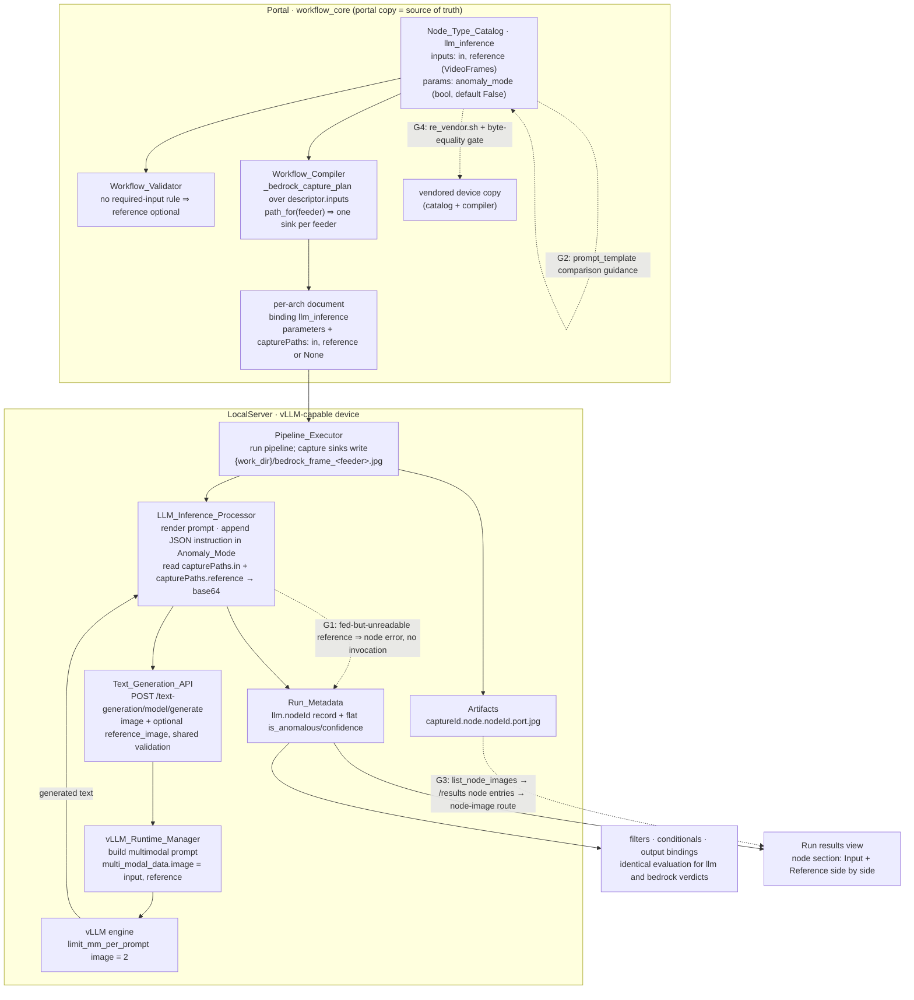

# Design Document

## Overview

This feature brings the `llm_inference` node (VLM/LLM Inference) to functional parity with
`bedrock_inference`: the `anomaly_mode` checkbox in the designer catalog, and an optional
`reference` VideoFrames input port carried end to end — catalog → compiler Frame_Capture_Plan
→ LLM_Inference_Processor → Text_Generation_API → vLLM multimodal generation with two images.

**Current-state audit (verified in this working tree, branch lineage tip
`spec/source-image-picker-pagination`).** Most of the pipeline this spec describes is already
in the tree — it landed in prior features (`edge-vlm-image-inference` for the single-image
path, `vlm-parity-run-results` for the executor's anomaly contract, `vlm-anomaly-reference-parity`
for the catalog additions and the reference plumbing, commit `086c251`). This design is
therefore **audit-first**: it records what is already satisfied and precisely which
acceptance criteria are still open, so implementation closes real gaps instead of
re-landing shipped code. Each row below was checked against the source, not assumed.

| Requirement | Current state | Work in this feature |
|---|---|---|
| 1.1 `anomaly_mode` in the catalog | **Satisfied.** `LLM_INFERENCE` carries `ParameterDescriptor("anomaly_mode", "bool", required=False, default=False, ...)` with a Bedrock-equivalent description | Lock with catalog-content + baseline tests |
| 1.2 designer checkbox | **Satisfied.** Bool parameters render generically (Bedrock proves the path) | Regression test only |
| 1.3 compiler carries the parameter | **Satisfied.** Compiler copies node `parameters` onto the binding verbatim | Property test |
| 1.4–1.6 executor anomaly/freeform contract | **Satisfied.** `LlmInferenceProcessor._run_one` appends `BEDROCK_JSON_INSTRUCTION`, parses with `parse_bedrock_answer`, `process()` merges `is_anomalous`/`confidence` flat; unparseable → `{'error', 'generated_text'}`, never raised | Property tests |
| 1.7 `prompt_template` anomaly note | **Satisfied.** Description already states both modes | Content test |
| 2.1 `reference` port | **Satisfied.** `inputs=[in, reference]`, both VideoFrames, `reference` second | Content test |
| 2.2–2.3 validator optionality/compatibility | **Satisfied by construction.** No check requires inference-node input ports (only `CATEGORY_INPUT`'s `activation`, V9); port typing is uniform | Parity property tests |
| 2.4–2.6 Frame_Capture_Plan for `reference` | **Satisfied.** `_bedrock_capture_plan` loops `descriptor.inputs` generically; `path_for(feeder)` memoizes one path per feeder shared across all consumers | **No compiler code change**; properties pin the invariants |
| 3.1, 3.3–3.4 reference attachment + request field | **Satisfied.** Processor reads `capturePaths["reference"]`, base64-encodes, 5-arg invoker; `_default_llm_invoker` adds `reference_image` only when set | Property tests |
| **3.2 fed-but-unreadable reference** | **NOT satisfied — behavior conflict.** Shipped code logs a warning and degrades to single-image (`test_llm_reference_attachment.py::test_unreadable_reference_is_never_a_node_error`). Req 3.2 demands a contained node error and no invocation | **Gap G1: tighten the unreadable-reference path** |
| 3.5, 3.8 API validation | **Satisfied.** `_validate_image_field` applied to both fields; `reference_image`-without-`image` rejected; absent field ⇒ pre-feature normalization | Property tests |
| 3.6–3.7 two-image prompt / degradation | **Satisfied.** `_build_multimodal_prompt` labels Input/Reference (input first), `multi_modal_data["image"] = [in, ref]`, two-pad literal fallback, `limit_mm_per_prompt` defaulted to `{"image": 2}`; non-multimodal degrades text-only with a warning | Property tests |
| **4.1 comparison guidance on `prompt_template`** | **NOT satisfied.** The description covers anomaly/freeform but never mentions the `reference` port, and `examples` carries no comparison prompt | **Gap G2: descriptor description + example (both copies)** |
| 4.2 verdict merge shape parity | **Satisfied.** Same flat keys + nested record; differs from Bedrock only in the never-raise containment contract | Cross-node-type equality property |
| **4.3 run results shows both sent images** | **PARTIALLY satisfied.** `_persist_node_frames` writes `{capture_id}.node.{nodeId}.{port}.jpg` for both binding kinds and all ports, but nothing **lists, serves, or renders** them: `/results` returns only `{kind: "output"}`, there is no node-image route, and `RunResults.tsx` has no node section (`vlm-parity-run-results` tasks 4–5 are unchecked) | **Gap G3: port-generic node-image listing, serving, and rendering** |
| 5.1–5.2 dual-copy byte equality | **Currently true** (verified by `diff`), but unguarded by a test | **Gap G4: byte-equality test + documented re-vendor mechanism** |
| 6.1–6.6 preservation | Behaviors currently hold; only partially pinned by tests | Preservation properties in the repo's established pattern |

So the implementation surface is small and precise: **G1** (executor error semantics for a
fed-but-unreadable reference), **G2** (catalog description/example, both copies), **G3**
(node-image surfacing, port-generic), **G4** (dual-copy byte-equality guard), plus the
property/preservation suites that turn the "already satisfied" rows into enforced contracts.

### Key design decisions

1. **Audit-first, no re-implementation.** Where the shipped code already meets a criterion,
   this design adds a test that pins the contract instead of rewriting the code. The value
   this feature adds beyond the shipped bits is the *guarantee* — properties over the capture
   plan, the merge shape, the dual copies, and the preservation set.
2. **`anomaly_mode` default stays `False`** on `llm_inference` while Bedrock defaults `True`.
   The executor treats absent as freeform (`bool(_coerce(...))`), so a `True` catalog default
   would silently flip already-packaged workflows on repackage. Requirement 6.1 forces this
   choice; the descriptor description names the difference.
3. **Fed-but-unreadable `reference` becomes a contained node error (G1), deliberately
   diverging from Bedrock.** Requirement 3.2 is explicit: name the node, the port and the
   path, invoke no model, continue other bindings. The rationale is intent-based: an *unfed*
   port (3.3) means the author asked for single-image inference, while a *fed* port whose
   frame is unreadable means the author asked for a comparison the device failed to deliver —
   answering anyway produces a confident verdict about an image the model never saw. The two
   ports keep different semantics for the *unfed* case (`in` unfed is also an error; `reference`
   unfed is fine), but share fail-closed semantics for the *fed-but-broken* case.
   **This changes shipped behavior**: `test_llm_reference_attachment.py::test_unreadable_reference_is_never_a_node_error`
   and the `vlm-anomaly-reference-parity` design's Requirement 4.2 encode the opposite rule.
   Implementation must retarget that test and record the supersession. (The alternative —
   amend Requirement 3.2 to Bedrock's degrade-to-single-image semantics — is a one-line
   requirements change and zero code; flagged for the requirements-clarification loop.)
4. **`reference_image` stays a sibling flat field, never an `images` list.** Both HTTP
   surfaces remain additive: absent field ⇒ byte-identical request and normalization
   (Requirements 3.8, 6.5). The node has exactly two ports, so a list buys nothing and would
   break the shipped `image` contract.
5. **Ordering is a data invariant, not a convention.** `multi_modal_data["image"]` is the
   list `[input, reference]` and the prompt text carries exactly `len(images)` image
   placeholders — enforced on both the chat-template path (one `{"type": "image"}` content
   block per image) and the Qwen-VL literal fallback (one `<|vision_start|><|image_pad|><|vision_end|>`
   per image). A property asserts count equality rather than trusting the template.
6. **Zero new compiler logic; the invariants are proven instead.** `_bedrock_capture_plan`
   iterates `descriptor.inputs`, so `reference` is planned by the same code that plans `in`,
   and `path_for(feeder)` memoizes per feeder — which *is* the exactly-one-sink-per-feeder
   rule (Requirement 2.6). Because a "no change needed" claim is only as good as its test,
   the capture-plan property is the load-bearing artifact here.
7. **Dual copies: one source of truth plus a byte-equality gate.** The portal copy is
   authoritative; the device copy is produced by `src/backend/workflow_engine/vendor/re_vendor.sh`
   (rsync mirror, `__pycache__` excluded) and never hand-edited. A test hashes every vendored
   `workflow_core/**/*.py` against its portal original, so drift fails CI rather than
   surfacing as a designer/device disagreement (Requirements 5.1, 5.2).
8. **Node-image surfacing is port-generic (G3).** Listing keys on the `.node.{nodeId}.{port}.`
   filename pattern with no node-type or port-name allow-list, so `bedrock_inference` and
   `llm_inference` present identically (Requirement 4.3) and a future third port needs no
   change. No new persistence code — the frames are already on disk.

## Glossary

Terms are reused verbatim from `requirements.md`:

- **LLM_Inference_Node**: The `llm_inference` node type in the Node_Type_Catalog (display name
  "VLM/LLM Inference") that invokes an on-device vLLM model, compiled to the `llm_inference`
  executor binding on vLLM-capable architectures.
- **Bedrock_Inference_Node**: The `bedrock_inference` node type — the reference behavior for
  this feature: `in` + `reference` VideoFrames ports, `anomaly_mode` checkbox, anomaly/freeform
  executor handling.
- **Node_Type_Catalog**: The shared node type descriptor catalog. Two copies must stay
  byte-identical: the portal copy
  (`edge-cv-portal/backend/layers/workflow_core/python/workflow_core/catalog/nodes.py`) and the
  vendored device copy (`src/backend/workflow_engine/vendor/workflow_core/catalog/nodes.py`).
- **Workflow_Compiler**: The workflow_core compiler (`workflow_core/compiler/compiler.py`,
  portal copy plus vendored device copy) that compiles workflow definitions into
  per-architecture pipeline documents with executor bindings.
- **Frame_Capture_Plan**: The compiler mechanism that terminates a frame-consuming binding's
  feeding branch in a synthetic capture sink chain (`videoconvert → jpegenc → multifilesink`)
  and emits `capturePaths` (port name → `{work_dir}`-rooted JPEG path, or `None` for an unfed
  port) on the binding.
- **LLM_Inference_Processor**: The device-side `LlmInferenceProcessor` in
  `src/backend/workflow_engine/output_bindings.py` that runs `llm_inference` bindings after a
  pipeline run and merges each node's outcome into the run metadata under
  `metadata['llm'][nodeId]`.
- **Anomaly_Mode**: The mode in which the executor appends the canonical JSON instruction
  (`BEDROCK_JSON_INSTRUCTION`) to the rendered prompt, parses the model's answer with the
  shared verdict parser, and merges {is_anomalous, confidence} flat into the run metadata to
  drive downstream filters, conditionals, and outputs.
- **Freeform_Mode**: The mode in which the rendered prompt is sent as-is (no appended
  instruction) and the raw model text is recorded as `generated_text` in the node's metadata
  record with no JSON parsing.
- **Verdict**: The parsed {is_anomalous, confidence} pair produced by the shared
  `parse_bedrock_answer` parser from an Anomaly_Mode answer.
- **Reference_Image**: The optional second frame, captured from the LLM_Inference_Node's
  `reference` input port, that the model compares the inspected `in` frame against per the
  configured prompt.
- **Text_Generation_API**: The device-local endpoints in
  `src/backend/endpoints/text_generation.py` (`POST /text-generation/{model_name}/generate`
  and `/generate-stream`) fronting the vLLM runtime; already accepts an optional base64
  `image` field for the `in` frame.
- **vLLM_Runtime_Manager**: The device-side `VllmRuntimeManager` in
  `src/backend/vllm_runtime/manager.py` that builds the vLLM engine prompt — bare string for
  text-only, or a multimodal prompt dict with `multi_modal_data` when an image accompanies a
  multimodal-capable model.
- **Multimodal_Model**: A loaded vLLM model whose model configuration declares image input
  capability (e.g. Qwen2-VL / Qwen2.5-VL architectures), as detected by the
  vLLM_Runtime_Manager's existing capability check.
- **Workflow_Validator**: The portal subsystem that validates workflow definitions against the
  Node_Type_Catalog port and parameter rules.
- **Run_Metadata**: The per-run inference metadata dictionary that inference-node outcomes
  merge into and that downstream filters, conditionals, output bindings, and the run results
  view consume.

## Architecture

End-to-end Reference_Image flow. Solid edges are shipped and verified; dashed edges are the
gaps this feature closes (G1–G4).



Run sequencing is unchanged: pipeline run → capture sinks persist frames → Bedrock processor →
LLM processor → node-frame persistence → output bindings → metadata JSON persistence.

## Components and Interfaces

### 1. Node_Type_Catalog (`workflow_core/catalog/nodes.py`, portal copy + vendored copy)

Already present on `LLM_INFERENCE`: the `reference` VideoFrames port declared after `in`
(Requirement 2.1) and `anomaly_mode` (`bool`, `required=False`, `default=False`) with a
description covering both modes and naming the `llm.{nodeId}.generated_text` recording
location (Requirements 1.1, 1.7).

**G2 — the only descriptor edit.** `prompt_template`'s `description` gains a sentence stating
that a connected `reference` port sends the reference image with the prompt for comparison, and
`examples` gains a comparison prompt consistent with `BEDROCK_DEFAULT_PROMPT`
("Compare the input image to the reference image; is_anomalous is true when the input
meaningfully differs from the reference.") so a workflow can move between the two node types
without prompt rework (Requirement 4.1). No parameter is added, renamed, or retyped, so
existing definitions keep validating unchanged (Requirement 6.2).

Maintenance: edit the portal copy, run `src/backend/workflow_engine/vendor/re_vendor.sh`,
regenerate `edge-cv-portal/backend/layers/workflow_core/tests/catalog_baseline.json` per the
documented baseline path, and confirm the regenerated baseline diff shows **only** the
`llm_inference` `prompt_template` description/examples change.

### 2. Workflow_Validator (`workflow_core/validator/checks.py`)

No change. Verified: the only required-connection rule is V9 (`CATEGORY_INPUT` nodes'
`activation` port); no check demands connections on inference-node inputs, and port-type
compatibility is evaluated from descriptor port types uniformly. Hence `reference` is optional
and VideoFrames-compatible on `llm_inference` exactly as on `bedrock_inference`
(Requirements 2.2, 2.3). Properties assert finding-set parity between the two node types
rather than restating the rule.

### 3. Workflow_Compiler (`workflow_core/compiler/compiler.py`, both copies)

No change. The mechanism, as verified:

- `capture_node_ids` includes every node whose mapping's `executor_binding` is
  `bedrock_inference` or `llm_inference`; the simulation mapping is `sim_llm_inference`, so sim
  documents never enter the plan (Requirement 6.6).
- `_bedrock_capture_plan` iterates `descriptor.inputs` per consuming node and calls
  `_frame_feeders(graph, node_id, port.name, ...)`, which walks upstream through executor-level
  nodes and stops at GStreamer producers and opaque nodes. `ports[port.name] = path_for(feeders[0])
  if feeders else None` — the fed/unfed dichotomy of Requirements 2.4 and 2.5.
- `path_for(feeder_id)` memoizes `{work_dir}/bedrock_frame_<sanitized-feeder>.jpg` per feeder
  (name collisions get a numeric suffix), so a feeder serving several ports and/or several
  consuming nodes of either binding kind yields **one** entry in `feeder_captures` — and
  `_build_segments` appends exactly one `_capture_chain(path)` per `feeder_captures` entry.
  That memoization *is* Requirement 2.6.
- `llm_inference` stays non-opaque: frames continue downstream past the capture fan-out
  (unlike `bedrock_inference`), which is why the plan's tee/fan-out branch must remain intact
  for llm feeders.

Because the requirement is "extend the plan", the deliverable here is proof, not code: the
capture-plan property (Property 2) and the non-interference property (Property 10). Should a
property falsify the claim, the fix lands in the portal copy and is re-vendored — never
hand-edited on the device side (Requirement 5.2).

### 4. LLM_Inference_Processor (`src/backend/workflow_engine/output_bindings.py`)

Shipped and unchanged: prompt rendering with strict placeholder substitution; `anomaly_mode`
coercion (`bool(_coerce(...))`, absent ⇒ freeform); single append of `BEDROCK_JSON_INSTRUCTION`
to the *rendered* prompt; `in` frame attachment with a contained node error when the fed frame
is unreadable; verdict parsing with `{'error', 'generated_text'}` on failure; `process()`
merging `metadata['llm'][nodeId]` plus flat `is_anomalous`/`confidence`
(Requirements 1.3–1.6, 3.1, 3.3, 4.2, 6.1).

**G1 — reference failure semantics.** The reference block becomes a three-way case analysis
with the middle branch tightened:

```
reference_path = capture_paths.get("reference")
if not reference_path:                 # unfed port / pre-feature package
    log at warning; reference_b64 = None      # single-image inference (3.3)
else:
    resolve {work_dir}; read; base64 → reference_b64      # (3.1)
    on OSError:
        log error naming node, port, resolved path
        return {"error": "LLM inference node '<id>' could not read the captured
                 'reference' frame from <path>: <reason>"}   # (3.2)
```

The error return happens **before** any invoker call, mirroring the shape and wording of the
existing `in`-frame error so the two ports produce structurally identical records; `process()`
stores it under `metadata['llm'][nodeId]` and continues with the remaining bindings
(Requirement 3.2's containment clause). No exception crosses the processor boundary — the llm
never-raise contract is untouched.

Invoker arity is unchanged and deliberately staged so pre-feature injected invokers keep
working: 5 args when both frames are present, 4 with only `in`, 3 with neither
(Requirements 3.3, 6.1). `_default_llm_invoker` adds `"reference_image"` to the POST body only
when a reference payload was supplied (Requirement 3.4), leaving reference-less bodies byte
identical.

### 5. Text_Generation_API (`src/backend/endpoints/text_generation.py`)

Shipped and unchanged. `_validate_image_field(body, field_name, findings)` is the single rule
set (string, valid base64, decodes to 1..`get_max_image_bytes()` bytes) applied to `image` and
`reference_image`; a `reference_image` without a valid `image` is rejected with a finding
naming `reference_image`; findings short-circuit before any runtime call; `_generate_kwargs`
passes `reference_image=` only when decoded bytes exist, so a fake runtime lacking the keyword
still works and reference-less requests are byte-identical to pre-feature behavior
(Requirements 3.5, 3.8, 6.5). `src/backend/vllm_runtime/server.py`'s `GenerateRequest` carries
`reference_image` for schema parity on the Triton generate route.

### 6. vLLM_Runtime_Manager (`src/backend/vllm_runtime/manager.py`)

Shipped and unchanged. `generate`/`generate_stream`/`_request` thread `reference_image`;
`_request` keeps the trichotomy — no image ⇒ bare prompt string; image + Multimodal_Model ⇒
`_build_multimodal_prompt`; image + non-multimodal ⇒ logged warning and bare prompt
(Requirement 3.7). `_build_multimodal_prompt` decodes each present image with PIL (a decode
failure raises `GenerationError` naming which image, before the engine), then:

- single image → content `[{image}, {text prompt}]`, `multi_modal_data = {"image": pil_in}` —
  byte-identical to the pre-reference form;
- two images → content `[{text "Input image:"}, {image}, {text "Reference image:"}, {image},
  {text prompt}]`, `multi_modal_data = {"image": [pil_in, pil_ref]}` (Requirement 3.6).

The chat template renders one placeholder per `{"type": "image"}` block; when no usable chat
template exists, the literal Qwen-VL fallback with a matching number of image pads is used, so
placeholder count equals image count on both paths. Engine construction defaults
`limit_mm_per_prompt` to `{"image": 2}` only when `model.json` does not set it (vLLM's default
of 1 would reject a two-image request; an explicit operator value wins).

### 7. Run results surface (G3, port-generic)

Frames are already on disk: `PipelineExecutor._persist_node_frames` copies every
`bedrock_inference`/`llm_inference` binding's existing `capturePaths` files to
`{output_dir}/{capture_id}.node.{sanitized_nodeId}.{port}.jpg` before the work dir is removed,
and sets `has_image_results`. Three layers are missing (Requirement 4.3):

- **`run_artifacts.list_node_images(output_dir, capture_id)`** — parse the
  `{capture_id}.node.{nodeId}.{port}.jpg` pattern into `[{nodeId, port}]`, sorted
  deterministically (node id, then port with `in` before `reference` so presentation order
  matches invocation order). No node-type or port allow-list.
- **`GET /workflows/executions/{execution_id}/results`** — additive entries
  `{"kind": "node", "nodeId": ..., "port": ..., "hasOverlay": false}` appended after the
  existing `{"kind": "output", ...}` entry. Existing consumers ignore unknown kinds; the
  `hasImageResults`/`captureId` fields keep their meaning. This also fixes a latent
  inconsistency found during the audit: a run with node images but no File_Output terminal
  currently reports `hasImageResults: true` with only an `output` entry that has no file
  behind it — after this change the payload lists what actually exists, and the output entry
  is emitted only when the output artifact exists.
- **`GET /workflows/executions/{execution_id}/node-image?nodeId=&port=&token=`** on the
  unauthenticated router with token-in-query (the shipped `output-image` pattern), serving the
  JPEG only when `(nodeId, port)` appears in `list_node_images` — which rejects traversal and
  fabricated names by construction (404 otherwise).
- **`RunResults.tsx`** — the existing output-image container is untouched (unchanged behavior);
  one section per inference node with images renders its 1–2 frames side by side, labeled
  "Input"/"Reference", with the run's verdict badge when `is_anomalous` is present and the
  node's returned metadata below (`llm.{nodeId}.generated_text` or `bedrock.{nodeId}.text`).
  Because the section is driven by `(nodeId, port)` entries alone, `llm_inference` and
  `bedrock_inference` present identically.

### 8. Dual-copy maintenance (G4)

`edge-cv-portal/backend/layers/workflow_core/python/workflow_core` is the single source of
truth. The device copy is regenerated by `src/backend/workflow_engine/vendor/re_vendor.sh`
(`rsync -a --exclude=__pycache__ --exclude='*.pyc'`), never hand-edited. Verification: a test
walks the portal tree and asserts byte equality (SHA-256 over file bytes) with the vendored
counterpart for every `*.py`, failing with the offending relative paths. This covers the
catalog and the compiler specifically named in Requirements 5.1 and 5.2 and generalizes to
every future shared module.

## Data Models

### Compiled `llm_inference` binding (per-architecture document)

```json
{
  "nodeId": "vlm1",
  "binding": "llm_inference",
  "parameters": {
    "modelName": "qwen2-vl-2b",
    "prompt_template": "Compare the input image to the reference image; ...",
    "anomaly_mode": true,
    "max_tokens": 256,
    "temperature": 0.7,
    "top_p": 1.0
  },
  "capturePaths": {
    "in": "{work_dir}/bedrock_frame_cam1.jpg",
    "reference": "{work_dir}/bedrock_frame_folder1.jpg"
  }
}
```

`capturePaths[port]` shapes: a `{work_dir}`-rooted path (port fed), `None` (port unfed), or the
key absent (pre-feature package). When one feeder serves several ports/nodes, every entry holds
the **same** path string and the document contains exactly one `multifilesink` writing it.

Simulation document (Requirement 6.6): `{"nodeId": "vlm1", "binding": "sim_llm_inference"}` —
no `capturePaths` key, no capture chain anywhere.

### Text_Generation_API generate request (`POST /text-generation/{model_name}/generate`)

```json
{
  "prompt": "Compare the input image to the reference image; ...",
  "max_tokens": 256,
  "temperature": 0.7,
  "top_p": 1.0,
  "image": "<base64 JPEG, optional>",
  "reference_image": "<base64 JPEG, optional — requires image>"
}
```

Validation findings use the existing shape `{"field": "reference_image", "reason": "..."}`.
Normalized result carries `image_bytes` / `reference_image_bytes` only when the corresponding
field validated.

### vLLM engine prompt (two-image)

```python
{
  "prompt": "<chat-templated text: 'Input image:'  'Reference image:'  prompt>",
  "multi_modal_data": {"image": [<PIL input>, <PIL reference>]},
}
```

### `metadata['llm'][nodeId]` record

| Case | Record | Flat merge into Run_Metadata |
|---|---|---|
| Freeform_Mode success | `{"generated_text": "<text>"}` | none |
| Anomaly_Mode success | `{"generated_text": "<text>", "is_anomalous": bool, "confidence": float}` | `is_anomalous`, `confidence` |
| Anomaly_Mode unparseable answer | `{"error": "<reason incl. answer excerpt>", "generated_text": "<text>"}` | none |
| Unresolved prompt placeholder | `{"error": "unresolved placeholder <name>"}` | none |
| Unreadable `in` frame | `{"error": "LLM inference node '<id>' could not read the captured 'in' frame from <path>: <reason>"}` | none |
| Unreadable `reference` frame (G1) | `{"error": "LLM inference node '<id>' could not read the captured 'reference' frame from <path>: <reason>"}` | none |
| API/HTTP failure | `{"error": "<reason>"}` | none |

The Anomaly_Mode success row is shape-identical to a Bedrock anomaly run's projection (flat
verdict keys plus the node's nested record), which is what Requirement 4.2 demands; the
difference between the node types is only in containment (Bedrock raises
`BedrockInferenceError`, llm records).

### `/results` payload (extended, additive)

```json
{
  "hasImageResults": true,
  "captureId": "c-123",
  "images": [
    {"kind": "output", "hasOverlay": true},
    {"kind": "node", "nodeId": "vlm1", "port": "in", "hasOverlay": false},
    {"kind": "node", "nodeId": "vlm1", "port": "reference", "hasOverlay": false}
  ]
}
```

## Correctness Properties

*A property is a characteristic or behavior that should hold true across all valid executions
of a system — essentially, a formal statement about what the system should do. Properties serve
as the bridge between human-readable specifications and machine-verifiable correctness
guarantees.*

### Property 1: Binding parameter pass-through

*For any* valid workflow definition containing LLM_Inference_Nodes with arbitrary parameter
values, compiling for a vLLM-capable architecture SHALL emit one `llm_inference` binding per
node whose `parameters` contain every parameter value set on the node — `anomaly_mode`
included, with its boolean value preserved exactly and absent when the node set none.

**Validates: Requirements 1.3**

### Property 2: Frame_Capture_Plan correctness

*For any* valid workflow definition containing LLM_Inference_Nodes and/or
Bedrock_Inference_Nodes, compiling for a device architecture SHALL emit, on every such
binding, a `capturePaths` entry for each of the descriptor's input ports that is a
`{work_dir}`-rooted JPEG path **if and only if** that port is transitively fed by a GStreamer
video source and `None` otherwise; every emitted path SHALL be written by exactly one
synthetic `videoconvert → jpegenc → multifilesink` chain on the feeding branch; and for any
feeder serving several ports and/or several frame-consuming bindings, the document SHALL
contain exactly one capture sink for that feeder and every consuming binding's entry for it
SHALL be the identical path string.

**Validates: Requirements 2.4, 2.5, 2.6**

### Property 3: Reference port optionality and validator parity

*For any* valid workflow definition containing an LLM_Inference_Node, validation SHALL produce
no finding attributable to the node's `reference` port when it is unconnected, SHALL produce no
port-compatibility finding when a VideoFrames-producing node is connected to it, and SHALL
produce the same finding set (modulo node type identifiers) as the definition obtained by
substituting a Bedrock_Inference_Node for that node.

**Validates: Requirements 2.2, 2.3, 6.2**

### Property 4: Anomaly_Mode instruction appended exactly once

*For any* prompt template, Run_Metadata satisfying the template's placeholders, and model
answer, running an `llm_inference` binding with truthy `anomaly_mode` SHALL invoke the model
with a prompt equal to the rendered template followed by exactly one occurrence of the
canonical JSON instruction, and SHALL record the raw answer as `generated_text` in the node's
record.

**Validates: Requirements 1.4**

### Property 5: Reference attachment trichotomy

*For any* `llm_inference` binding and any of the three reference shapes — (a)
`capturePaths["reference"]` a path whose resolved file is readable, (b) `reference` mapped to
`None` or the key absent, (c) `reference` a path whose resolved file is missing or unreadable —
the processor SHALL respectively (a) invoke the model exactly once with the reference file's
bytes base64-encoded in the reference argument position alongside the `in` frame, (b) invoke
the model exactly once with no reference argument, and (c) invoke no model and record an error
naming the node, the `reference` port, and the resolved path; and in all three shapes every
other binding in the document SHALL still be processed and the rendered prompt,
instruction-appending, verdict parsing, and flat merge SHALL be unaffected.

**Validates: Requirements 3.1, 3.2, 3.3**

### Property 6: Generate request body additivity

*For any* model name, prompt, generation parameters, and optional image / reference base64
payloads, the default invoker's POST body SHALL contain `image` exactly when an image payload
was supplied and `reference_image` exactly when a reference payload was supplied (each equal to
the supplied value), and any body produced without a reference payload SHALL be byte-identical
to the pre-feature body for the same inputs.

**Validates: Requirements 3.4**

### Property 7: `reference_image` validation exactness

*For any* candidate field value, request normalization SHALL accept or reject it as
`reference_image` exactly as it accepts or rejects the same value as `image` (string, valid
base64, decoding to between 1 byte and the configured maximum), SHALL additionally reject a
`reference_image` supplied without a valid `image`, SHALL name `reference_image` in every
finding attributable to that field, and SHALL invoke no runtime when any finding exists.

**Validates: Requirements 3.5**

### Property 8: Multimodal prompt construction and ordering

*For any* prompt text, optional input image, and optional reference image, the
vLLM_Runtime_Manager's engine invocation SHALL be: the bare prompt string when no image is
supplied; the pre-feature single-image prompt dict when only an input image is supplied to a
Multimodal_Model; a prompt dict whose `multi_modal_data["image"]` is the two-element list
[input, reference] in that order, whose prompt text places the input-image content before the
reference-image content, and whose prompt text contains exactly as many image placeholders as
there are images, when both are supplied to a Multimodal_Model; and the bare prompt string
with a logged warning when any image is supplied to a model that is not a Multimodal_Model.

**Validates: Requirements 3.6, 3.7**

### Property 9: Verdict merge shape equality across node types

*For any* Anomaly_Mode answer text, the Run_Metadata projection produced by an `llm_inference`
binding (flat `is_anomalous`/`confidence` plus the node's nested record) SHALL carry the same
flat keys with the same values as the projection produced by a `bedrock_inference` binding
given the same answer, and *for any* downstream filter or conditional expression over those
keys the evaluation outcome SHALL be identical for the two node types.

**Validates: Requirements 4.2**

### Property 10: Node image round trip and enumeration

*For any* set of persisted node-image files `{capture_id}.node.{nodeId}.{port}.jpg` in a run's
artifact directory, the results listing SHALL report each `(nodeId, port)` exactly once and
report nothing else, the serving route SHALL return byte-identical file content for every
reported pair and 404 for every unreported pair (including traversal-shaped and fabricated
inputs), and the listing SHALL be independent of node type and port name.

**Validates: Requirements 4.3**

### Property 11: Dual-copy byte equality

*For all* shared `workflow_core` Python modules — the Node_Type_Catalog and the
Workflow_Compiler included — the vendored device copy's file bytes SHALL equal the portal
copy's file bytes.

**Validates: Requirements 5.1, 5.2**

### Property 12: Preservation — processor behavior for pre-feature bindings and Freeform_Mode

*For any* `llm_inference` binding with `anomaly_mode` absent, `None`, or false, and *for any*
binding carrying no `reference` capture path, the processor SHALL invoke the model with the
rendered prompt unmodified and with the pre-feature argument arity, SHALL record exactly
`{"generated_text": <answer>}`, and SHALL merge no verdict keys — identical to pre-feature
behavior for the same inputs.

**Validates: Requirements 1.6, 6.1**

### Property 13: Preservation — API and runtime without image fields

*For any* generate request body carrying neither `image` nor `reference_image`, normalization
SHALL produce a result equal to pre-feature normalization of the same body and the runtime
invocation SHALL carry no image-related keyword arguments; and *for any* body carrying `image`
but no `reference_image`, both SHALL be identical to pre-feature behavior for that body.

**Validates: Requirements 3.8, 6.5**

### Property 14: Preservation — Bedrock executor behavior

*For any* `bedrock_inference` binding and answer text, in either mode, the processor's returned
metadata, its raised-error behavior for an unreadable `in` frame or unparseable answer, and its
reference-frame degradation SHALL equal pre-feature behavior for the same inputs.

**Validates: Requirements 6.4**

### Property 15: Preservation — compilation non-interference

*For any* valid workflow definition containing no LLM_Inference_Node, the compiled
per-architecture documents SHALL be identical to pre-feature compilation, `bedrock_inference`
capture plans included; and *for any* definition containing LLM_Inference_Nodes, the
simulation-architecture document SHALL bind them to `sim_llm_inference` with no `capturePaths`
key and no synthetic capture chain anywhere in the document.

**Validates: Requirements 6.3, 6.6**

## Error Handling

| Failure | Where | Behavior | Requirement |
|---|---|---|---|
| Prompt placeholder unresolved | LLM_Inference_Processor | Record `{"error": "unresolved placeholder <name>"}`; no model invocation; other bindings continue | shipped contract |
| Anomaly_Mode answer unparseable as the Verdict | LLM_Inference_Processor | Record `{"error": <parser reason incl. answer excerpt>, "generated_text": <text>}`; merge no Verdict keys; never raise; other bindings continue | 1.5 |
| `in` frame fed but unreadable | LLM_Inference_Processor | UNCHANGED: contained node error naming node/port/path; no model invocation | shipped contract |
| `reference` fed but unreadable (**G1**) | LLM_Inference_Processor | Contained node error naming node, `reference` port, resolved path; **no model invocation**; other bindings continue. Diverges from Bedrock's degrade-to-single-image and supersedes the shipped llm warning path | 3.2 |
| `reference` unfed / `None` / key absent | LLM_Inference_Processor | Warning log; single-image invocation identical to pre-feature | 3.3, 6.1 |
| Invalid / oversized / non-string `reference_image` | Text_Generation_API | Finding naming `reference_image`; runtime never invoked | 3.5 |
| `reference_image` without a valid `image` | Text_Generation_API | Finding naming `reference_image`; runtime never invoked | 3.5 |
| Reference bytes not decodable as an image | vLLM_Runtime_Manager | `GenerationError` naming the reference decode failure, raised before the engine; surfaced as the existing 502; other models unaffected | shipped contract |
| Images supplied to a non-Multimodal_Model | vLLM_Runtime_Manager | UNCHANGED degradation: warning, text-only generation, `image_used: false` | 3.7 |
| Two-image request exceeding the engine's image limit | vLLM_Runtime_Manager | Avoided by defaulting `limit_mm_per_prompt` to `{"image": 2}`; an explicit `model.json` value wins and an exceeded limit surfaces as the existing `GenerationError` | 3.6 |
| Node-image file missing / unlisted / traversal-shaped request | Run results API | 404 from the listing-validated route; results view degrades to the sections it can render | 4.3 |
| Node frame copy fails during artifact persistence | Pipeline_Executor | UNCHANGED: logged and swallowed; run status unaffected | shipped contract |

Two containment invariants hold across every row: no failure escapes the LLM node it belongs
to (`metadata['llm'][nodeId]` records it and the loop continues to the remaining bindings), and
no failure changes the run's status or another node's outcome. No new error channel is
introduced — every case rides an existing surfacing mechanism (per-node metadata records,
normalization findings, `GenerationError` → 502, contained artifact best-effort).

## Testing Strategy

Dual approach, matching the repo's convention: Hypothesis property tests (minimum 100
iterations, each tagged `**Feature: vlm-bedrock-parity, Property {number}: {title}**` and
citing the requirements it validates) plus focused example-based tests for the catalog and UI
facts that carry no meaningful input variation.

**Property tests by home:**

| Property | Location | Harness |
|---|---|---|
| 1, 2, 3, 15 | `edge-cv-portal/backend/layers/workflow_core/tests/` | Generated workflow definitions reusing the existing bedrock/llm capture-plan generators; compile per architecture; count `multifilesink` elements and compare `capturePaths` maps |
| 4, 5, 9, 12, 14 | `test/backend-test/workflow_engine/` | Injected invoker capturing arity and arguments; tmp work dirs with real JPEG bytes; unreadable files via missing paths and chmod; both processors run on equivalent documents for Property 9 |
| 6 | `test/backend-test/workflow_engine/` | `_default_llm_invoker` with a stubbed `requests.post` capturing the body |
| 7, 13 | `test/backend-test/` text-generation suite | `normalize_generation_request` is pure — direct Hypothesis; endpoint flows through the shipped dependency-override fake runtime |
| 8 | `test/backend-test/` vllm_runtime suite | Fake engine capturing the prompt argument; multimodal-detection stubs; in-memory PIL images; placeholder counting on both the chat-template and literal-fallback paths |
| 10 | `test/backend-test/` workflow API suite | Generated node ids/port sets written into a tmp artifact dir; listing/serving asserted; traversal-shaped inputs included in the generator |
| 11 | `edge-cv-portal/backend/layers/workflow_core/tests/` (or the repo-level guard suite) | Walk the portal tree, SHA-256 compare against the vendored copy, report offending relative paths |

**Preservation tests (Requirement 6)** follow the established observation-first pattern of
`edge-cv-portal/backend/tests/test_property_bedrock_sampling_preservation.py` and
`test_vision_model_packaging_preservation.py`: assertions are written so they pass **before and
after** the change, and identity is asserted by byte/structural equality rather than by
re-deriving expected values — Property 12 compares recorded invocation tuples, Property 13
compares normalization dicts and runtime kwargs, Property 14 compares Bedrock outcomes, and
Property 15 compares compiled documents against baselines captured from the pre-change
compiler. Property 11 is the byte-equality guard in the same spirit at file granularity.

**Example-based tests:**

- Catalog content (Requirements 1.1, 1.7, 2.1, 4.1): parameter presence/type/`required`/default,
  description keyword assertions (both modes, the `reference` comparison sentence), input port
  list and order, and the comparison example's consistency with `BEDROCK_DEFAULT_PROMPT`.
  `catalog_baseline.json` regenerated per the documented maintenance path with a reviewed diff
  limited to the `prompt_template` change.
- Designer rendering (Requirement 1.2): vitest asserting the llm node's config panel renders an
  `anomaly_mode` checkbox and the node renders `in` + `reference` handles.
- Run results rendering (Requirement 4.3): vitest for the node section — two images labeled
  Input/Reference with the verdict badge in Anomaly_Mode, single image in Freeform_Mode, the
  existing output-image container unchanged, and graceful empty/partial states.
- Triton generate-route schema parity for `reference_image`.

**Not property-tested:** designer UX and layout, model answer quality, GPU execution, portal
deploy mechanics. On-hardware coverage rides the JP6/JP7 harness as 1–2 integration examples
(a two-image generate returns text; an Anomaly_Mode llm workflow produces a verdict that gates
an output), not as property tests.

**Checkpoint commands** (per the repo's steering): `cd edge-cv-portal/backend && python3 -m
pytest layers/workflow_core/tests/ -q`; `PYTHONPATH=src/backend:test/backend-test python3 -m
pytest test/backend-test/workflow_engine/ test/backend-test/<text-generation and vllm suites>`;
the touched vitest suites; `diff` (and the Property 11 test) confirming both vendored copies
are byte-identical.
