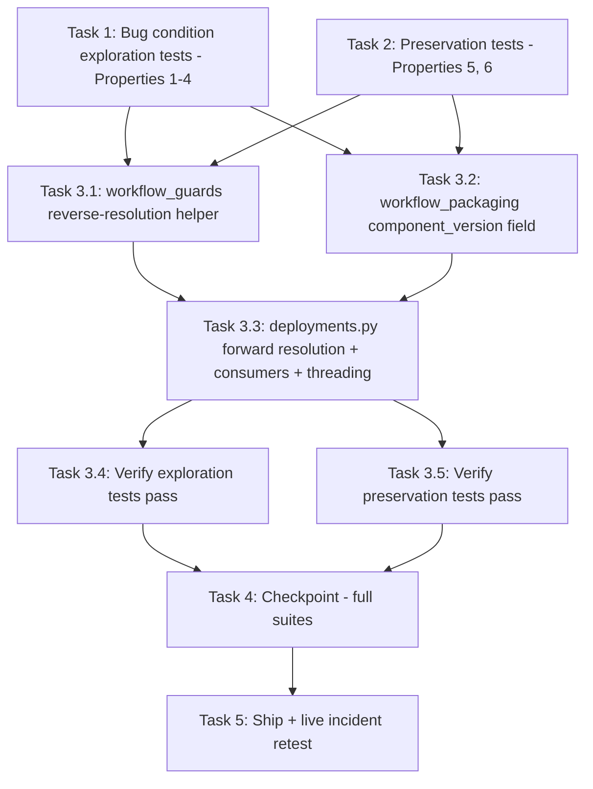

# Implementation Plan

## Overview

Fix the portal workflow deploy path pinning re-packaged workflow versions at the OLD component version (`{workflow_version}.0.0` instead of the registered version — live incident: `modbus_test` v1 re-packaged to `2.0.0`, portal deploy `72c2f784` pinned `1.0.0`, device reported COMPLETED and installed nothing), plus the three major-parse consumers that misresolve bumped-major component entries (subscribe grant merge, camera-binding prune keys, vLLM gate). Exploratory bugfix workflow: write the bug condition exploration tests (Properties 1–4) and preservation tests (Properties 5, 6) against UNFIXED code first, then implement the three-leg fix (forward resolution on the deploy path, scan-first reverse resolution in the consumers, discrete `component_version` field at packaging time), then verify with the same tests plus the existing suites (Properties 7, 8).

**Working-tree caution**: this fix builds on the current working tree, NOT HEAD — `deployments.py` and `workflow_packaging.py` carry uncommitted verified fixes (workflow-path subscribe merge, run-script cleanup) that must keep working (Requirement 3.8). Touch nothing under `src/backend/workflow_engine/`; edits are confined to `edge-cv-portal/backend/functions/{deployments.py, workflow_packaging.py, workflow_guards.py}` and new files under `edge-cv-portal/backend/tests/`.

## Task Dependency Graph

```json
{
  "waves": [
    { "wave": 1, "description": "Run on UNFIXED code: exploration tests surface the stale pin and consumer misresolution (task 1 FAILS - Properties 1-4) and preservation baselines are captured (task 2 PASSES - Properties 5, 6). Independent of each other.", "tasks": ["1", "2"] },
    { "wave": 2, "description": "Independent fix legs: reverse-resolution helper in workflow_guards (3.1) and the discrete component_version field at packaging time (3.2).", "tasks": ["3.1", "3.2"] },
    { "wave": 3, "description": "Deploy-path fix: forward resolution, consumer rewiring, and threading in deployments.py (uses 3.1's helper).", "tasks": ["3.3"] },
    { "wave": 4, "description": "Verify the fix: re-run task 1 tests (now PASS) and task 2 tests (still PASS).", "tasks": ["3.4", "3.5"] },
    { "wave": 5, "description": "Checkpoint: full deployment and packaging suites pass unchanged (Properties 7, 8).", "tasks": ["4"] },
    { "wave": 6, "description": "Ship: portal Lambda deploy, then the live incident retest on ryan-orin-nano.", "tasks": ["5"] }
  ]
}
```



## Tasks

- [x] 1. Write bug condition exploration tests
  - **Property 1: Bug Condition (Fix Check)** - Deploy path pins and reports the registered component version
  - **Property 2: Bug Condition (Fix Check)** - Subscribe-topic resolution survives bumped majors
  - **Property 3: Bug Condition (Fix Check)** - Binding keys and the vLLM gate resolve the true workflow version
  - **Property 4: Bug Condition (Fix Check)** - Packaging records the component version discretely
  - **CRITICAL**: These tests MUST FAIL on unfixed code - failure confirms the bug exists
  - **DO NOT attempt to fix the tests or the code when they fail**
  - **NOTE**: These tests encode the expected behavior - they will validate the fix when they pass after implementation
  - **GOAL**: Reproduce C(X) in the exact incident shape — version item's `component_arn` ends `:versions:2.0.0` while `workflow_version=1` (`latest_version: 1`), the modbus_test shape
  - Create `edge-cv-portal/backend/tests/test_workflow_deploy_component_version_exploration.py` using the WorkflowDeployEnv harness from `tests/test_workflow_deploy_subscribe_merge_exploration.py` (FakeGreengrass/FakeIot as Use_Case-account clients, moto-backed tables) plus the FleetEnv integration fixtures from `test_workflow_packaging_deployment_integration.py` for the packaging case
  - Case 1 — Re-packaged pin (incident shape): deploy v1 with arn `:versions:2.0.0` → assert the submitted entry is `{"componentVersion": "2.0.0"}` and the association record, audit entry, and 201 response all say `component_version == "2.0.0"` (will fail on unfixed code: all say `1.0.0`)
  - Case 2 — Subscribe resolution on bumped major (the bedrock_test shape): assert the consumer directly against a seeded components map carrying a `2.0.0` workflow entry (carried-over) plus a LocalServer entry, `subscribed_topics` on the v1 item, via `apply_subscribe_access_control` → assert the LocalServer merge carries the workflow's `dda:workflow-subscribe:<workflowId>` grant with v1's topics (will fail on unfixed code: `get_version_item(id, 2)` resolves nothing, no topics collected)
  - Case 3 — Binding-key survival: seeded map with a `2.0.0` entry for workflow v1 → assert `_deployed_workflow_binding_keys` yields `{workflowId}/1` (will fail on unfixed code: yields `{workflowId}/2`, so the live key would be pruned)
  - Case 4 — vLLM gate on bumped major: `2.0.0` entry, v1 item with `has_llm_inference` + `packaged_architectures` → assert `collect_vllm_component_manifests` produces the workflow manifest (will fail on unfixed code: no manifest, gate skipped)
  - Case 5 — Packaging field: package through FleetEnv, read the version item → assert `component_version` equals the response's `component_version` and agrees with the `component_arn` suffix (will fail on unfixed code: attribute absent)
  - Run tests on UNFIXED code
  - **EXPECTED OUTCOME**: All five cases FAIL (entry/record/audit/response pinned at `1.0.0` while the arn says `2.0.0`; consumers resolve nonexistent version item 2 — empty topics, `{workflowId}/2` key, missing vLLM manifest; no `component_version` attribute)
  - Document the counterexamples found; if assertions fail differently than predicted (e.g. the packaged-check gate reading more than `component_arn`, or FakeGreengrass rejecting the entry shape), re-hypothesize per the design
  - Mark task complete when tests are written, run, and failures are documented
  - _Requirements: 1.1, 1.2, 1.3, 1.4, 1.5, 2.1, 2.2, 2.3, 2.4, 2.5_

- [x] 2. Write preservation tests (BEFORE implementing fix)
  - **Property 5: Preservation** - First-package deploys are byte-identical
  - **Property 6: Preservation** - Generic path and consumer fallback unchanged
  - **IMPORTANT**: Follow observation-first methodology - observe UNFIXED behavior first, then encode it
  - Create `edge-cv-portal/backend/tests/test_workflow_deploy_component_version_preservation.py` (same harnesses as task 1)
  - First-package byte-identity, fresh deploy: WorkflowDeployEnv version item with arn `:versions:{v}.0.0` → capture the submitted components map, association record, audit entry, and 201 body on unfixed code; assert exact shapes (resolution returns the same string the current code derives, so these must not change)
  - First-package byte-identity, revision deploy: seeded existing deployment with LocalServer + extra components → assert the submitted map deep-equals the carried-over components plus the workflow entry at `{v}.0.0`, deployment name reused, record/audit shapes unchanged
  - Consumer fallback fidelity: components map with workflow entries matching NO recorded component version (unrecorded/faked items) → assert `collect_workflow_subscribed_topics`, `_deployed_workflow_binding_keys`, and `collect_vllm_component_manifests` produce exactly today's major-parse results (the population `test_property_subscribed_topics.py` rides)
  - Run tests on UNFIXED code
  - **EXPECTED OUTCOME**: Tests PASS (this confirms the baseline behavior to preserve)
  - Mark task complete when tests are written, run, and passing on unfixed code
  - _Requirements: 3.1, 3.2, 3.3, 3.5, 3.6_

- [ ] 3. Fix the component version resolution

  - [x] 3.1 Add find_version_item_by_component_version to workflow_guards
    - In `edge-cv-portal/backend/functions/workflow_guards.py`, near `get_version_item`: new `find_version_item_by_component_version(workflow_id, component_version)` — Query the WorkflowVersions partition (paged; version counts per workflow are small), return the `_decimal_to_native` item whose `component_version` field OR `component_arn` `:versions:` suffix equals `component_version`, else None; table-read errors return None (callers fall back)
    - Unambiguous by construction: majors strictly increase per `next_component_version`, so at most one item matches
    - _Bug_Condition: isBugCondition(X), kind components_map_consumer — bumped-major entry resolves no version item by major parse (design)_
    - _Expected_Behavior: D2 reverse resolution — componentVersion → version item by recorded component version (design)_
    - _Preservation: no-match returns None so consumers fall back to today's major parse (Property 6)_
    - _Requirements: 2.3, 2.4_

  - [x] 3.2 Record component_version discretely at packaging time
    - In `edge-cv-portal/backend/functions/workflow_packaging.py` success bookkeeping (~line 2266): extend the SAME `update_item` that records `component_arn` — `update_expression` gains `component_version = :cv`, `update_values[':cv'] = resolved_component_version`. Nothing else moves
    - Do NOT touch `component_version_for` / `next_component_version` — the version-numbering scheme is unchanged (first package `{v}.0.0`, re-package bumps to the next free major)
    - _Bug_Condition: isBugCondition(X), kind packaging — version item records component_arn but not component_version (design)_
    - _Expected_Behavior: D3 — discrete field recorded in the same update, agreeing with the arn suffix (Property 4)_
    - _Preservation: additive field only; numbering scheme and run-script-cleanup working-tree fix untouched (Property 8)_
    - _Requirements: 2.5, 3.7, 3.8_

  - [x] 3.3 Resolve and thread the component version in deployments.py
    - In `edge-cv-portal/backend/functions/deployments.py`:
    - **`resolve_workflow_component_version(version_item, workflow_version)`** (new, next to `workflow_component_version` ~2125): D1 forward resolution — discrete `component_version` field if a non-empty string, else the `component_arn` suffix after the last `:versions:` (validated `^\d+\.\d+\.\d+$`), else `workflow_component_version(workflow_version)` as last resort
    - **`_resolve_workflow_version_item(workflow_id, entry_component_version)`** (new, near the consumers): D2 scan-first resolver — `workflow_guards.find_version_item_by_component_version` first (authoritative match wins), else fall back to today's major parse routed through `workflow_guards.get_version_item` (preserves pre-change items and the `test_property_subscribed_topics.py` fake); returns `(workflow_version, version_item_or_None)`; exceptions logged and degraded to the fallback
    - **Rewire the three consumers**, keeping each one's current resilience shape (`major.isdigit()` gate on the fallback, try/except-with-warning around table reads): `collect_workflow_subscribed_topics` (~2130, topic extraction unchanged), `collect_vllm_component_manifests` workflow branch (~2021, `has_llm_inference`/`packaged_architectures` logic unchanged), `_deployed_workflow_binding_keys` (~3044, binding keys from the resolved workflow version; read failures fall back to the major parse rather than raising)
    - **`create_workflow_deployment` threading** (~3350): replace `component_version = workflow_component_version(workflow_version)` with `resolve_workflow_component_version(version_item, workflow_version)`; use it in the components-map entry and the inline vLLM manifest `version` label (~3270); pass `record_workflow_deployment(..., component_version=component_version)`; `audit_details` and `response_body` already read the local variable
    - **`record_workflow_deployment`** (~2376): add keyword `component_version=None`; item value becomes `component_version or workflow_component_version(workflow_version)` — signature-safe for any other caller
    - **Rewrite the stale comment** above the `apply_subscribe_access_control` call (~3356): the entry is authoritative by resolution (D2 covers the generic path and carried-over entries), superseding the subscribe-merge design's "by construction" note
    - Do NOT touch the generic `create_deployment` path, `apply_subscribe_access_control`'s merge semantics, gate ordering or error envelopes, name reuse, rollout policies, or camera binding delivery
    - _Bug_Condition: isBugCondition(X), kinds workflow_deploy and components_map_consumer (design)_
    - _Expected_Behavior: D1 + D2 + D4 — submitted entry, record, audit, response, vLLM manifest, and consumer resolution all carry/resolve the registered component version (Properties 1-3)_
    - _Preservation: first-package byte-identity by construction (arn suffix == {v}.0.0); generic path untouched; fallback preserves unrecorded/faked populations; revision semantics, gates, subscribe-merge working-tree fix unchanged (Properties 5-8)_
    - _Requirements: 2.1, 2.2, 2.3, 2.4, 3.1, 3.2, 3.3, 3.4, 3.5, 3.6, 3.8_

  - [x] 3.4 Verify bug condition exploration tests now pass
    - **Properties 1-4: Expected Behavior**
    - **IMPORTANT**: Re-run the SAME tests from task 1 - do NOT write new tests
    - The tests from task 1 encode the expected behavior; when they pass, the expected behavior is satisfied
    - Run `edge-cv-portal/backend/tests/test_workflow_deploy_component_version_exploration.py`
    - **EXPECTED OUTCOME**: All five cases PASS (entry/record/audit/response at `2.0.0`, subscribe grant carries v1's topics, binding key `{workflowId}/1`, vLLM manifest produced, `component_version` recorded and agreeing with the arn)
    - _Requirements: 2.1, 2.2, 2.3, 2.4, 2.5_

  - [x] 3.5 Verify preservation tests still pass
    - **Properties 5, 6: Preservation**
    - **IMPORTANT**: Re-run the SAME tests from task 2 - do NOT write new tests
    - Run `edge-cv-portal/backend/tests/test_workflow_deploy_component_version_preservation.py`
    - **EXPECTED OUTCOME**: Tests PASS (first-package deploys byte-identical, consumer fallback results unchanged — confirms no regressions)
    - _Requirements: 3.1, 3.2, 3.3, 3.5, 3.6_

- [x] 4. Checkpoint - Existing suites pass unchanged
  - **Property 7: Preservation** - Revision semantics and pre-submit gates unchanged
  - **Property 8: Preservation** - Packaging numbering scheme and working-tree fixes unchanged
  - Run `cd edge-cv-portal/backend && python3 -m pytest tests/ -q -k "workflow_deployment or deployment"` — baseline: 110 passed, now plus the new tests from tasks 1–2
  - Run `cd edge-cv-portal/backend && python3 -m pytest tests/ -q -k "packaging or recipe or shutdown"` — baseline: 191 passed (includes the `1.0.0 → 2.0.0 → 3.0.0` re-package test, which must pass unchanged; the new field agrees with the arn each time)
  - Must include unchanged passes of `tests/test_property_subscribed_topics.py` (fallback path via faked `get_version_item`) and `tests/test_deployment_vllm_gate.py` (arn `:versions:1.0.0`, v1 entries) — run both explicitly
  - Known pre-existing failure to ignore: the `test_property_setup_command_wellformed` collection error
  - Ensure all tests pass, ask the user if questions arise
  - _Requirements: 3.2, 3.4, 3.7, 3.8_

- [x] 5. Ship - portal deploy and live incident retest
  - Portal-only fix: no device build, no LocalServer or component changes
  - Deploy the portal backend Lambda (the standard `edge-cv-portal` deploy flow); user go-ahead for this fix is standing
  - Live incident retest on ryan-orin-nano — this resumes the interrupted end-to-end verification: portal-deploy `modbus_test` (`e830f55d-5744-4edf-be43-1a33fbd4605d`) workflow v1 → expect the submitted entry at componentVersion `2.0.0`, Greengrass actually delivering the component (artifacts present on-device), the workflow registering with the LocalServer watcher, and the association record/audit/201 all reporting `2.0.0`
  - Optionally re-package first to pick up a fresh `3.0.0` and confirm the deploy follows it
  - _Requirements: 2.1, 2.2_

## Notes

- Write the exploration tests BEFORE implementing the fix, and run them on UNFIXED code — their failure confirms the bug and the root-cause analysis.
- Follow observation-first methodology for preservation tests: observe unfixed behavior, then encode it.
- **Working-tree caution**: this fix builds on uncommitted verified fixes in `deployments.py` and `workflow_packaging.py` (subscribe-merge on the workflow deploy path, run-script cleanup) — layer on the current working tree, not HEAD, and preserve those behaviors (Requirement 3.8). Do NOT touch anything under `src/backend/workflow_engine/`.
- No existing test hardcodes the `{workflow_version}.0.0` pin for a re-packaged deploy scenario — the integration suite re-packages (asserting `2.0.0`, `3.0.0`) but never deploys afterward; that missing coverage is exactly how this bug shipped, and task 1's case 1 closes it.
- For first packages the arn suffix equals `{workflow_version}.0.0`, so forward resolution returns the identical string — Requirement 3.1's byte-identity holds by construction, not by special-casing.
