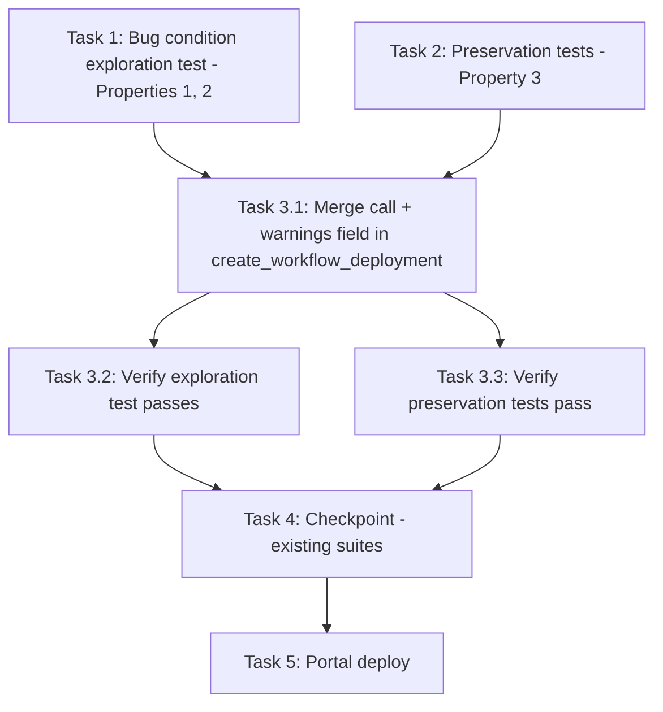

# Implementation Plan

## Overview

Fix the missing subscribe accessControl merge on the portal's workflow deployment path using the exploratory bugfix workflow: write the bug condition exploration test (Properties 1 and 2) and preservation tests (Property 3) against the UNFIXED code first, then implement the single addition (`apply_subscribe_access_control(components_map)` + additive `warnings` field in `create_workflow_deployment`), then verify with the same tests and the existing suites (Property 4). Portal Lambda code only — one function in `edge-cv-portal/backend/functions/deployments.py`; `create_deployment`, `apply_subscribe_access_control`, and everything under `src/backend/workflow_engine/` are untouched (other work is in flight in this tree).

## Task Dependency Graph

```json
{
  "waves": [
    { "wave": 1, "description": "Run on UNFIXED code: exploration test surfaces the missing policy/warning (task 1 FAILS - Properties 1, 2) and preservation baselines are captured (task 2 PASSES - Property 3). Independent of each other.", "tasks": ["1", "2"] },
    { "wave": 2, "description": "Implement the fix in create_workflow_deployment.", "tasks": ["3.1"] },
    { "wave": 3, "description": "Verify the fix: re-run task 1 tests (now PASS) and task 2 tests (still PASS).", "tasks": ["3.2", "3.3"] },
    { "wave": 4, "description": "Checkpoint: existing deployment suites pass unchanged (Property 4).", "tasks": ["4"] },
    { "wave": 5, "description": "Ship: portal backend deploy (user go-ahead already given).", "tasks": ["5"] }
  ]
}
```



## Tasks

- [x] 1. Write bug condition exploration test
  - **Property 1: Bug Condition (Fix Check)** - Subscribe policy rides every workflow deployment with LocalServer in the merged set
  - **Property 2: Bug Condition (Fix Check)** - Warning surfaced when LocalServer is absent from the merged set
  - **CRITICAL**: This test MUST FAIL on unfixed code - failure confirms the bug exists
  - **DO NOT attempt to fix the test or the code when it fails**
  - **NOTE**: This test encodes the expected behavior - it will validate the fix when it passes after implementation
  - **GOAL**: Reproduce C(X) at the `create_workflow_deployment` level: portal workflow deployments ship no subscribe grant (live incident: bedrock_test v5 → deployment 2014a473 → on-device SubscribeToIoTCore denial)
  - Create `edge-cv-portal/backend/tests/test_workflow_deploy_subscribe_merge_exploration.py` using the DeployEnv-style harness from `tests/test_subscribe_deployment_warning.py`: `FakeGreengrass`/`FakeIot` from `test_workflow_packaging_deployment_integration.py` wired in via monkeypatched `get_usecase_client`, moto-backed tables from `conftest.py`
  - Seed what the path validates before submitting (read `create_workflow_deployment` for the gates): workflows-table item (`get_workflow_metadata` — workflow_id + usecase_id + latest_version), version item with `validation_status: passed`, `component_arn`, and `subscribed_topics` (no camera/plugin/LLM attributes so those gates no-op), and `gg.register_device(thing, local_server_version="99.0.0", arch="arm64JP6")` to pass the min-LocalServer gate
  - Deploy via the handler with `component_type: workflow` / `workflow_id` / `target_devices` (the portal's dispatch shape)
  - Case A (revision — the live incident shape): `gg.seed_deployment(target_arn, {LocalServer arm64JP6 entry, ...})` so the merged map carries LocalServer → assert 201 and the SUBMITTED LocalServer entry's `configurationUpdate.merge` carries `dda:workflow-subscribe:<workflowId>` with operations `["aws.greengrass#SubscribeToIoTCore"]` and resources exactly the recorded topics, and no `warnings` in the response
  - Case B (fresh — no existing deployment, merged map has no LocalServer) → assert 201 response carries the additive `warnings` field naming the workflow, topics, LocalServer, and the denial consequence
  - Case C (existing-merge preservation): seeded LocalServer entry already carries a `configurationUpdate.merge` document (e.g. a manually-added subscribe grant key or store config) → assert every pre-existing merge key survives AND the workflow's policy key is upserted
  - Run test on UNFIXED code
  - **EXPECTED OUTCOME**: All three cases FAIL (no policy, no warnings key, no upsert) — this is correct, it proves the bug
  - Document the failures (the submitted LocalServer entry has no configurationUpdate; the 201 body has no `warnings` key)
  - Mark task complete when test is written, run, and failure is documented
  - _Requirements: 1.1, 1.2, 2.1, 2.2, 2.3_

- [x] 2. Write preservation tests (BEFORE implementing fix)
  - **Property 3: Preservation** - Non-subscribing workflow deployments are byte-identical
  - **IMPORTANT**: Follow observation-first methodology - observe UNFIXED behavior first, then encode it
  - Add `edge-cv-portal/backend/tests/test_workflow_deploy_subscribe_merge_preservation.py` (same harness as task 1)
  - Non-subscribing fresh deploy: version item WITHOUT `subscribed_topics` → capture the submitted components map and 201 body on unfixed code; assert the map is exactly `{dda.workflow.<id>: {componentVersion: "{v}.0.0"}}` and the body has no `warnings` key
  - Non-subscribing revision: seeded existing deployment with LocalServer + extra components → assert the submitted map deep-equals the carried-over components plus the workflow entry (no configurationUpdate added anywhere), deployment name reused, deployment record written with the usual shape
  - Run tests on UNFIXED code
  - **EXPECTED OUTCOME**: Tests PASS (this confirms the baseline behavior to preserve)
  - Mark task complete when tests are written, run, and passing on unfixed code
  - _Requirements: 3.1, 3.3_

- [x] 3. Fix the workflow deployment path

  - [x] 3.1 Call apply_subscribe_access_control in create_workflow_deployment and surface warnings
    - In `edge-cv-portal/backend/functions/deployments.py`, `create_workflow_deployment` ONLY:
    - After the workflow entry is placed into `components_map` (post existing-deployment merge, ~line 3353) and before `deployment_params` is built: `deployment_warnings = apply_subscribe_access_control(components_map)` — the final merged set, mirroring line ~1222 on the generic path
    - In the 201 response construction: add `warnings` to the body only when `deployment_warnings` is non-empty (mirroring `create_deployment`'s additive pattern)
    - Do NOT touch `create_deployment`, `apply_subscribe_access_control`, `collect_workflow_subscribed_topics`, gate ordering, name reuse, rollout policies, camera binding delivery, `record_workflow_deployment`, or audit logging
    - Topic resolution is authoritative by construction: the deployed entry's componentVersion is `{workflow_version}.0.0`, so the helper's major-parse resolves the version item this function already loaded (design, Requirement 2.3)
    - _Bug_Condition: isBugCondition(X) — subscribing version item in the merged set, policy missing or warning absent (design)_
    - _Expected_Behavior: policy on the submitted LocalServer entry / additive warnings when absent (Properties 1, 2)_
    - _Preservation: Preservation Requirements from design (byte-identity for non-subscribing, generic path, gates, revision semantics, helper untouched)_
    - _Requirements: 2.1, 2.2, 2.3, 3.1, 3.2, 3.3, 3.4, 3.5_

  - [x] 3.2 Verify bug condition exploration test now passes
    - **Properties 1, 2: Expected Behavior**
    - **IMPORTANT**: Re-run the SAME test from task 1 - do NOT write a new test
    - The test from task 1 encodes the expected behavior; when it passes, the expected behavior is satisfied
    - Run the exploration test from task 1
    - **EXPECTED OUTCOME**: All three cases PASS (policy attached in the revision case, warnings surfaced in the fresh case, existing merge preserved with the policy upserted)
    - _Requirements: 2.1, 2.2, 2.3_

  - [x] 3.3 Verify preservation tests still pass
    - **Property 3: Preservation**
    - **IMPORTANT**: Re-run the SAME tests from task 2 - do NOT write new tests
    - Run the preservation tests from task 2
    - **EXPECTED OUTCOME**: Tests PASS (confirms no regressions)
    - _Requirements: 3.1, 3.3_

- [x] 4. Checkpoint - Existing suites pass unchanged
  - **Property 4: Preservation** - Generic path, helper, gates, and revision semantics unchanged
  - Run `cd edge-cv-portal/backend && python3 -m pytest tests/ -q -k "workflow_deployment or deployment"` — baseline: 102 passed plus the 6 subscribe-warning tests, now plus the new tests from tasks 1–2
  - Must include unchanged passes of `tests/test_subscribe_deployment_warning.py` and `tests/test_property_subscribed_topics.py`
  - Known pre-existing failure to ignore: the `test_property_setup_command_wellformed` collection cascade (appears with `--continue-on-collection-errors`, per repo steering)
  - Ensure all tests pass, ask the user if questions arise
  - _Requirements: 3.2, 3.4, 3.5_

- [x] 5. Ship - portal backend deploy
  - Portal-only fix: no device build required
  - Deploy the portal backend (the standard `edge-cv-portal` deploy flow); user go-ahead for this fix has already been given
  - After deploy, the user re-deploys the `bedrock_test` workflow through the portal and confirms the new deployment's LocalServer entry carries the `dda:workflow-subscribe:f81a4c66-...` grant and the device trigger subscribes (the manual-revision workaround becomes unnecessary)
  - _Requirements: 2.1, 2.2_

## Notes

- Write the exploration test BEFORE implementing the fix, and run it on UNFIXED code — its failure confirms the bug.
- Follow observation-first methodology for preservation tests: observe unfixed behavior, then encode it.
- Working-tree caution: greengrass-denial-health-race and stale-workflow-registrations are in progress here — touch nothing under `src/backend/workflow_engine/` and no file with uncommitted changes other than `functions/deployments.py` and new files under `edge-cv-portal/backend/tests/`.
- The live incident's manual recovery (deployment revision with a hand-added grant) is exactly the existing-merge shape Case C protects: `apply_subscribe_access_control` upserts the policy key without clobbering the manual document.
