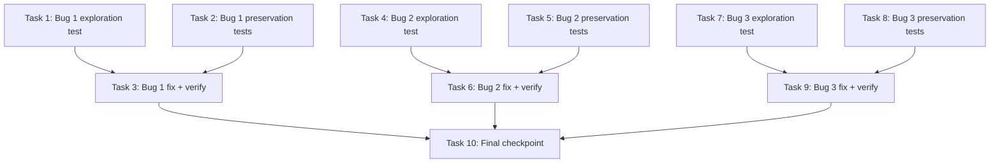

# Implementation Plan

## Overview

The three bugs are independent, so the plan is organized as three parallel streams plus a final checkpoint. Within each stream the order is strict (exploration test → preservation tests → fix → verification), but Stream A (tasks 1–3), Stream B (tasks 4–6), and Stream C (tasks 7–9) have no dependencies on each other and can proceed in parallel.

## Task Dependency Graph



Streams A (1→2→3), B (4→5→6), and C (7→8→9) are mutually independent and may proceed in parallel; only task 10 requires all three.

```json
{
  "waves": [
    {
      "wave": 1,
      "tasks": ["1", "2", "4", "5", "7", "8"],
      "description": "Exploration and preservation tests for all three bugs, written and run against the UNFIXED code. All six tasks are mutually independent."
    },
    {
      "wave": 2,
      "tasks": ["3", "6", "9"],
      "description": "Implement and verify each fix. Task 3 depends on tasks 1 and 2; task 6 depends on tasks 4 and 5; task 9 depends on tasks 7 and 8. The three fix tasks are mutually independent."
    },
    {
      "wave": 3,
      "tasks": ["10"],
      "description": "Final checkpoint: full backend suite, full frontend suite, and TypeScript build. Depends on tasks 3, 6, and 9."
    }
  ]
}
```

## Tasks

### Stream A — Bug 1: Temperature omitted when unset (backend + settings form)

- [x] 1. Write Bug 1 bug condition exploration test
  - **Property 1: Bug Condition** - Temperature omitted when unset
  - **CRITICAL**: This test MUST FAIL on unfixed code - failure confirms the bug exists
  - **DO NOT attempt to fix the test or the code when it fails**
  - **NOTE**: This test encodes the expected behavior - it will validate the fix when it passes after implementation
  - **GOAL**: Surface counterexamples demonstrating the bug (expected: `inferenceConfig == {maxTokens: 4096, temperature: 0.2}` with nothing stored; 400 "temperature must be a number between 0 and 1" for a null-temperature save)
  - Create `edge-cv-portal/backend/tests/test_property_bedrock_sampling_unset.py` using hypothesis with existing conftest fixtures (moto/mocked Bedrock `converse` as in `test_workflow_generation.py`)
  - Property over unset-temperature store states from `isBugCondition1` (no stored item at all, stored item without the `temperature` key, stored explicit null) × generation requests without a temperature override: assert the captured `inferenceConfig` contains no `temperature` key, and no `topP` key unless a top_p was explicitly stored (from Property 1 in design)
  - Cover both pipelines: workflow generation (`workflow_generator.py`) and node scaffold generation (`node_generator.py`, which reuses `get_bedrock_configuration()`)
  - Settings path: PUT bedrock-configuration with `{"temperature": null}` (and `{"top_p": null}`) expecting 200, with the value round-tripping as unset through GET (`read_stored_bedrock_configuration`)
  - Run: `python3 -m pytest tests/test_property_bedrock_sampling_unset.py` from `edge-cv-portal/backend` on UNFIXED code
  - **EXPECTED OUTCOME**: Test FAILS (this is correct - it proves the bug exists)
  - Document counterexamples found to understand root cause
  - Mark task complete when test is written, run, and failure is documented
  - _Requirements: 1.1, 1.2, 1.3, 2.1, 2.2, 2.3_

- [x] 2. Write Bug 1 preservation property tests (BEFORE implementing fix)
  - **Property 2: Preservation** - Explicit temperature behavior unchanged
  - **IMPORTANT**: Follow observation-first methodology - observe behavior on UNFIXED code for non-buggy inputs (explicitly stored temperatures, per-request overrides), then encode it
  - Create `edge-cv-portal/backend/tests/test_property_bedrock_sampling_preservation.py` (hypothesis)
  - Property over stored temperatures in [0, 1] (numeric and Decimal-encoded) × optional valid overrides: the applicable temperature is sent as `inferenceConfig.temperature` with `topP` suppressed; an override replaces the configured value for that invocation only (from Preservation Requirements in design)
  - Property over invalid overrides (out of range, non-numeric, boolean): rejected with 400 `INVALID_TEMPERATURE` before any Bedrock call
  - Invariant across all generated cases: `temperature` and `topP` never both present in an `inferenceConfig`
  - Non-temperature settings validation unchanged: invalid-value rejections (e.g. 1.5, -0.1, non-numbers) and model_id/region/max_tokens/timeout rules keep rejecting/accepting as today
  - Run: `python3 -m pytest tests/test_property_bedrock_sampling_preservation.py` from `edge-cv-portal/backend` on UNFIXED code
  - **EXPECTED OUTCOME**: Tests PASS (this confirms baseline behavior to preserve)
  - Mark task complete when tests are written, run, and passing on unfixed code
  - _Requirements: 3.1, 3.2, 3.3, 3.4, 3.5_

- [x] 3. Fix Bug 1 — unset sampling defaults and blank-temperature settings round-trip

  - [x] 3.1 Implement the backend fix
    - `edge-cv-portal/backend/functions/workflow_generator.py`: change `DEFAULT_BEDROCK_CONFIG` to `'temperature': None` and `'top_p': None` (both together — leaving `top_p: 0.9` would start sending `topP` on every unconfigured invocation, violating Req 3.4); update the comment (unset by default; sampling parameters sent only when explicitly configured or overridden). No changes to `get_bedrock_configuration()` or `invoke_generation()` — they already carry stored nulls and omit `None`
    - `edge-cv-portal/backend/functions/node_generator.py`: no changes (fixed transitively via `get_bedrock_configuration`)
    - `edge-cv-portal/backend/functions/data_accounts.py`: mirror the `DEFAULT_BEDROCK_CONFIG` change; `read_stored_bedrock_configuration()` special-cases `temperature`/`top_p` with `if key in stored` so a stored null reads back as unset; `validate_bedrock_configuration()` accepts `None` for `temperature`/`top_p` (non-None values keep requiring a number in [0, 1]); verify `_native_to_dynamo` passes `None` through
    - Update existing test `test_workflow_generation.py::test_default_configuration_sends_temperature_without_top_p` (it asserts the buggy `temperature == 0.2`) to "default configuration sends no sampling parameters"
    - _Bug_Condition: isBugCondition1(input) from design — GenerationRequest with no stored temperature and no override, or SettingsSave with blank temperature_
    - _Expected_Behavior: Property 1 from design — no temperature/topP in inferenceConfig unless explicitly configured; blank/null temperature saves accepted and round-trip as unset_
    - _Preservation: Property 2 from design — explicit temperature, override, and INVALID_TEMPERATURE behavior unchanged_
    - _Requirements: 2.1, 2.2, 2.3, 3.1, 3.2, 3.3, 3.4_

  - [x] 3.2 Implement the settings form fix
    - `edge-cv-portal/frontend/src/components/BedrockConfigurationSettings.tsx`: `validate()` treats blank temperature/top_p as valid (unset); load effect maps null/undefined `config.temperature`/`config.top_p` to `''` (not `String(null)`); `handleSave()` sends explicit `null` for blank fields (`form.temperature.trim() === '' ? null : Number(form.temperature)`) since the backend merges provided keys; constraint text notes "0 to 1 — leave blank to let the model use its default (parameter is omitted)"
    - `GenerateChatPanel.tsx` is NOT modified — its blank-field omission behavior is already correct (Req 3.5)
    - Update/extend `BedrockConfigurationSettings` component tests: blank temperature/top_p accepted, null loads as blank, blank saves as null
    - _Bug_Condition: isBugCondition1(SettingsSave) — blank temperature field rejected client-side_
    - _Expected_Behavior: Property 1 from design — blank field accepted, stored unset_
    - _Preservation: non-blank values keep requiring a number in [0, 1]; all other field validations unchanged_
    - _Requirements: 2.3, 3.5_

  - [x] 3.3 Verify Bug 1 bug condition exploration test now passes
    - **Property 1: Expected Behavior** - Temperature omitted when unset
    - **IMPORTANT**: Re-run the SAME test from task 1 - do NOT write a new test
    - The test from task 1 encodes the expected behavior; when it passes, it confirms the fix
    - Run: `python3 -m pytest tests/test_property_bedrock_sampling_unset.py` from `edge-cv-portal/backend`
    - **EXPECTED OUTCOME**: Test PASSES (confirms bug is fixed)
    - _Requirements: 2.1, 2.2, 2.3_

  - [x] 3.4 Verify Bug 1 preservation tests still pass
    - **Property 2: Preservation** - Explicit temperature behavior unchanged
    - **IMPORTANT**: Re-run the SAME tests from task 2 - do NOT write new tests
    - Run: `python3 -m pytest tests/test_property_bedrock_sampling_preservation.py` from `edge-cv-portal/backend`
    - **EXPECTED OUTCOME**: Tests PASS (confirms no regressions)
    - _Requirements: 3.1, 3.2, 3.3, 3.4, 3.5_

  - [x] 3.5 Run affected existing suites for Bug 1
    - Backend: `python3 -m pytest tests/test_workflow_generation.py tests/test_bedrock_configuration.py tests/test_node_generator.py tests/test_node_generator_integration.py` from `edge-cv-portal/backend` (with the one inverted default-behavior test from 3.1)
    - Frontend: `npx vitest run src/components/BedrockConfigurationSettings.test.tsx src/components/GenerateChatPanel.test.tsx` from `edge-cv-portal/frontend` (adjust paths to actual test file locations)
    - Fix any regressions before proceeding
    - _Requirements: 3.1, 3.2, 3.3, 3.4, 3.5_

### Stream B — Bug 2: Category-driven default ports (node-designer wizards)

- [x] 4. Write Bug 2 bug condition exploration test
  - **Property 3: Bug Condition** - Default ports follow the selected category
  - **CRITICAL**: This test MUST FAIL on unfixed code - failure confirms the bug exists
  - **DO NOT attempt to fix the test or the code when it fails**
  - **NOTE**: This test encodes the expected behavior - it will validate the fix when it passes after implementation
  - **GOAL**: Surface counterexamples (expected: untouched port rows stay `in`/`out` after selecting category `input`)
  - Create `edge-cv-portal/frontend/src/pages/node-designer/categoryDefaultPorts.property.test.ts` (fast-check over categories in `CATEGORY_ARRANGEMENTS`) plus RTL component assertions in/alongside `CreateWizard.test.tsx` and `RegistrationWizard.test.tsx`
  - From `isBugCondition2`: for every palette category selected while port rows are Untouched_Defaults, the presented default rows' port-type multisets match that category's typical arrangement — in particular `input` → zero input rows and one VideoFrames output; `output` → one input row and zero outputs (from Property 3 in design)
  - Assert every seeded row has a non-empty name (`portsStepErrors` stays clean) and `guidanceDivergence(category, inputs, outputs)` is null for the seeded rows
  - Assert the ports step states the category's input/output requirements (Req 2.6)
  - Run: `npx vitest run src/pages/node-designer/categoryDefaultPorts.property.test.ts src/pages/node-designer/CreateWizard.test.tsx src/pages/node-designer/RegistrationWizard.test.tsx` from `edge-cv-portal/frontend` on UNFIXED code
  - **EXPECTED OUTCOME**: Test FAILS (this is correct - it proves the bug exists)
  - Document counterexamples found to understand root cause
  - Mark task complete when test is written, run, and failure is documented
  - _Requirements: 1.4, 1.5, 2.4, 2.5, 2.6_

- [x] 5. Write Bug 2 preservation property tests (BEFORE implementing fix)
  - **Property 4: Preservation** - Edited rows, advisory guidance, and Port_Scan unchanged
  - **IMPORTANT**: Follow observation-first methodology - observe UNFIXED wizard behavior for user-edited rows and Port_Scan, then encode it
  - Create `edge-cv-portal/frontend/src/pages/node-designer/portDefaultsPreservation.property.test.ts` (fast-check)
  - Property: for any port rows that are NOT untouched defaults (any rename, retype, addition, removal) and any sequence of category changes, the rows are returned exactly unchanged (Req 3.6)
  - Property: `guidanceDivergence` and `portsStepErrors` answer identically to today for generated inputs; guidance stays advisory/non-blocking; the dismissable divergence advisory keeps firing (Req 3.8, 3.9)
  - Property: `applySuggestions` replace-over-untouched-defaults / merge-over-edited semantics unchanged, including over today's in/out default pair (Req 3.10); non-input categories present their typical arrangements (Req 3.7)
  - Run: `npx vitest run src/pages/node-designer/portDefaultsPreservation.property.test.ts` from `edge-cv-portal/frontend` on UNFIXED code
  - **EXPECTED OUTCOME**: Tests PASS (this confirms baseline behavior to preserve)
  - Mark task complete when tests are written, run, and passing on unfixed code
  - _Requirements: 3.6, 3.7, 3.8, 3.9, 3.10_

- [x] 6. Fix Bug 2 — category-driven default ports in both wizards

  - [x] 6.1 Implement the fix
    - `edge-cv-portal/frontend/src/pages/node-designer/declaration.ts`: add pure helpers `defaultPortsForCategory(category)` (derived from `CATEGORY_ARRANGEMENTS`: input → no inputs + one VideoFrames "out"; preprocessing → byte-identical to today's in/out seeds; inference → VideoFrames "in" / InferenceMeta "out"; post_processing → InferenceMeta "in" / EventSignal "out"; output → one VideoFrames "in" / no outputs; unknown → preprocessing shape) and `isDefaultPortArrangement(inputs, outputs)` (true exactly when rows deep-equal some category's defaults)
    - `edge-cv-portal/frontend/src/pages/node-designer/portScan.ts`: `isUntouchedDefaults()` delegates to `isDefaultPortArrangement()`; `applySuggestions()` and `removalBlockReason()` untouched
    - `CreateWizard.tsx`: `initialForm()` seeds from `defaultPortsForCategory('preprocessing')`; category `Select.onChange` rewrites port rows to the new category's defaults only when `isDefaultPortArrangement(form.inputs, form.outputs)` is true, otherwise patches `category` only
    - `RegistrationWizard.tsx`: same seeding for the detail-load form seed (~line 138) and same category-change rewrite
    - `portGuidance.ts` + `PortGuidancePanel.tsx`: add pure `arrangementRequirements(category)` and render per-kind requirement lines (e.g. input → "Inputs: none · Outputs: 1 × VideoFrames"); panel stays purely advisory, no step gating
    - Add/extend unit tests: `defaultPortsForCategory` per-category shapes; `PortGuidancePanel` requirement lines; wizard category change rewrites untouched defaults and preserves edited rows
    - _Bug_Condition: isBugCondition2(input) from design — untouched default rows while the selected category's arrangement differs_
    - _Expected_Behavior: Property 3 from design — seeded rows match the category's typical arrangement, names non-empty, guidanceDivergence null, requirements stated_
    - _Preservation: Property 4 from design — edited rows invariant, guidance advisory, Port_Scan replace/merge semantics unchanged_
    - _Requirements: 2.4, 2.5, 2.6, 3.6, 3.7, 3.8, 3.9, 3.10_

  - [x] 6.2 Verify Bug 2 bug condition exploration test now passes
    - **Property 3: Expected Behavior** - Default ports follow the selected category
    - **IMPORTANT**: Re-run the SAME test from task 4 - do NOT write a new test
    - Run: `npx vitest run src/pages/node-designer/categoryDefaultPorts.property.test.ts src/pages/node-designer/CreateWizard.test.tsx src/pages/node-designer/RegistrationWizard.test.tsx` from `edge-cv-portal/frontend`
    - **EXPECTED OUTCOME**: Test PASSES (confirms bug is fixed)
    - _Requirements: 2.4, 2.5, 2.6_

  - [x] 6.3 Verify Bug 2 preservation tests still pass
    - **Property 4: Preservation** - Edited rows, advisory guidance, and Port_Scan unchanged
    - **IMPORTANT**: Re-run the SAME tests from task 5 - do NOT write new tests
    - Run: `npx vitest run src/pages/node-designer/portDefaultsPreservation.property.test.ts` from `edge-cv-portal/frontend`
    - **EXPECTED OUTCOME**: Tests PASS (confirms no regressions)
    - _Requirements: 3.6, 3.7, 3.8, 3.9, 3.10_

  - [x] 6.4 Run affected existing suites for Bug 2
    - `npx vitest run src/pages/node-designer/portScan.test.ts src/pages/node-designer/declaration.test.ts src/pages/node-designer/PortGuidancePanel.test.tsx src/pages/node-designer/PortScanPanel.test.tsx src/pages/node-designer/portReplaceDefaults.property.test.ts src/pages/node-designer/portMergePreservation.property.test.ts src/pages/node-designer/categoryDivergence.property.test.ts` from `edge-cv-portal/frontend`
    - Fix any regressions before proceeding
    - _Requirements: 3.7, 3.8, 3.9, 3.10_

### Stream C — Bug 3: Opt-in module import selection

- [x] 7. Write Bug 3 bug condition exploration test
  - **Property 5: Bug Condition** - Import selection defaults to none with an explicit gate
  - **CRITICAL**: This test MUST FAIL on unfixed code - failure confirms the bug exists
  - **DO NOT attempt to fix the test or the code when it fails**
  - **NOTE**: This test encodes the expected behavior - it will validate the fix when it passes after implementation
  - **GOAL**: Surface counterexamples (expected: `selectedModulePlugins.length === plugins.length` immediately after list load, import enabled with no explicit opt-in)
  - Create `edge-cv-portal/frontend/src/pages/node-designer/importSelectionDefault.property.test.ts` (fast-check over non-empty plugin lists, including after switching modules) plus RTL assertions in/alongside `ImportView.test.tsx` with a mocked module plugin list
  - From `isBugCondition3`: for any non-empty module plugin list loading in the import view, the selection is seeded empty (0 of N selected) and the import stays blocked (`formComplete` false, gate message shown) until the user selects at least one plugin individually or via "Select all" (from Property 5 in design)
  - Run: `npx vitest run src/pages/node-designer/importSelectionDefault.property.test.ts src/pages/node-designer/ImportView.test.tsx` from `edge-cv-portal/frontend` on UNFIXED code
  - **EXPECTED OUTCOME**: Test FAILS (this is correct - it proves the bug exists)
  - Document counterexamples found to understand root cause
  - Mark task complete when test is written, run, and failure is documented
  - _Requirements: 1.6, 2.7, 2.8_

- [x] 8. Write Bug 3 preservation property tests (BEFORE implementing fix)
  - **Property 6: Preservation** - Import serialization and fallbacks unchanged
  - **IMPORTANT**: Follow observation-first methodology - observe UNFIXED serialization/fallback behavior, then encode it
  - Create `edge-cv-portal/frontend/src/pages/node-designer/importSelectionPreservation.property.test.ts` (fast-check)
  - Property: for any plugin list and selection, `selectedPluginsParam` answers as today — a proper subset serializes to that subset as `selected_plugins` (Req 3.11); a full selection or no available list serializes to no `selected_plugins` parameter, i.e. whole-module import (Req 3.12); `moduleSelectionSummary` unchanged
  - Property: an unavailable or empty plugin list never blocks the import (non-blocking whole-module fallback, Req 3.13)
  - The post-fetch `pending_selection` dialog keeps its default-none, at-least-one-required (`pluginSelectionError`) behavior (Req 3.14)
  - Run: `npx vitest run src/pages/node-designer/importSelectionPreservation.property.test.ts` from `edge-cv-portal/frontend` on UNFIXED code
  - **EXPECTED OUTCOME**: Tests PASS (this confirms baseline behavior to preserve)
  - Mark task complete when tests are written, run, and passing on unfixed code
  - _Requirements: 3.11, 3.12, 3.13, 3.14_

- [x] 9. Fix Bug 3 — opt-in module plugin selection

  - [x] 9.1 Implement the fix
    - `edge-cv-portal/frontend/src/pages/node-designer/ImportView.tsx`: module plugin load effect (~line 258) seeds `setSelectedModulePlugins([])` instead of `allPluginNames(plugins)`; update the comment ("Default: none selected — the user opts in explicitly"); checkbox FormField description (~line 859) becomes opt-in wording, with the existing `errorText` ("Select at least one plugin to import") serving as the visible gate on the pristine empty state
    - `edge-cv-portal/frontend/src/pages/node-designer/importFlow.ts` (optional, for testability): extract pure `moduleSelectionIncomplete(source, availableNames, selectedNames)` mirroring the inline gate expression
    - No other changes: `selectedPluginsParam()`, `moduleSelectionSummary()`, "Select all"/"Clear" buttons, listing-unavailable fallback, and the `pending_selection` dialog stay untouched
    - _Bug_Condition: isBugCondition3(input) from design — non-empty module plugin list load seeds a full selection_
    - _Expected_Behavior: Property 5 from design — selection seeds empty, import blocked until explicit opt-in_
    - _Preservation: Property 6 from design — serialization semantics and whole-module fallbacks unchanged_
    - _Requirements: 2.7, 2.8, 3.11, 3.12, 3.13, 3.14_

  - [x] 9.2 Verify Bug 3 bug condition exploration test now passes
    - **Property 5: Expected Behavior** - Import selection defaults to none with an explicit gate
    - **IMPORTANT**: Re-run the SAME test from task 7 - do NOT write a new test
    - Run: `npx vitest run src/pages/node-designer/importSelectionDefault.property.test.ts src/pages/node-designer/ImportView.test.tsx` from `edge-cv-portal/frontend`
    - **EXPECTED OUTCOME**: Test PASSES (confirms bug is fixed)
    - _Requirements: 2.7, 2.8_

  - [x] 9.3 Verify Bug 3 preservation tests still pass
    - **Property 6: Preservation** - Import serialization and fallbacks unchanged
    - **IMPORTANT**: Re-run the SAME tests from task 8 - do NOT write new tests
    - Run: `npx vitest run src/pages/node-designer/importSelectionPreservation.property.test.ts` from `edge-cv-portal/frontend`
    - **EXPECTED OUTCOME**: Tests PASS (confirms no regressions)
    - _Requirements: 3.11, 3.12, 3.13, 3.14_

  - [x] 9.4 Run affected existing suites for Bug 3
    - Frontend: `npx vitest run src/pages/node-designer/importFlow.test.ts src/pages/node-designer/ImportView.test.tsx` from `edge-cv-portal/frontend`
    - Backend: `python3 -m pytest tests/test_plugin_import_selection.py` from `edge-cv-portal/backend` (pending_selection / selected_plugins wire behavior)
    - Fix any regressions before proceeding
    - _Requirements: 3.11, 3.12, 3.13, 3.14_

### Final checkpoint

- [x] 10. Checkpoint - Ensure all tests pass
  - Run the full portal backend suite: `python3 -m pytest` from `edge-cv-portal/backend`
  - Run the full frontend suite: `npx vitest run` from `edge-cv-portal/frontend`
  - Run the TypeScript build: `npx tsc -b` from `edge-cv-portal/frontend`
  - Ensure all tests pass, ask the user if questions arise
  - _Requirements: 2.1, 2.2, 2.3, 2.4, 2.5, 2.6, 2.7, 2.8, 3.1, 3.2, 3.3, 3.4, 3.5, 3.6, 3.7, 3.8, 3.9, 3.10, 3.11, 3.12, 3.13, 3.14_

## Notes

- Backend property tests: hypothesis, in `edge-cv-portal/backend/tests/test_property_*.py`, run with `python3 -m pytest` from `edge-cv-portal/backend`. Hypothesis profiles already cap examples (fast profile, 25 examples, default locally) — do NOT hardcode `max_examples` in new tests.
- Frontend tests: vitest + React Testing Library + fast-check, under `edge-cv-portal/frontend/src`, run with `npx vitest run` from `edge-cv-portal/frontend`; typecheck with `npx tsc -b`.
- Exploration tests (tasks 1, 4, 7) are expected to FAIL on unfixed code — that failure is the confirmation of each bug, not a problem to fix at that stage.
- Requirement numbers reference `bugfix.md`: 1.x = current defective behavior, 2.x = expected behavior, 3.x = unchanged behavior (regression prevention). Properties 1–6 reference the Correctness Properties in `design.md`.
