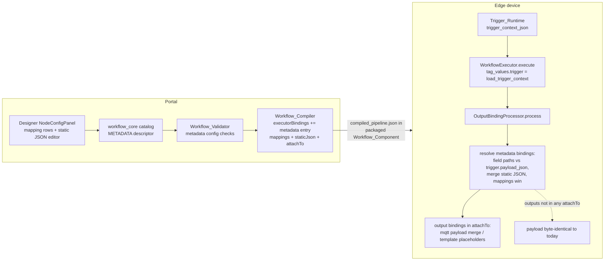
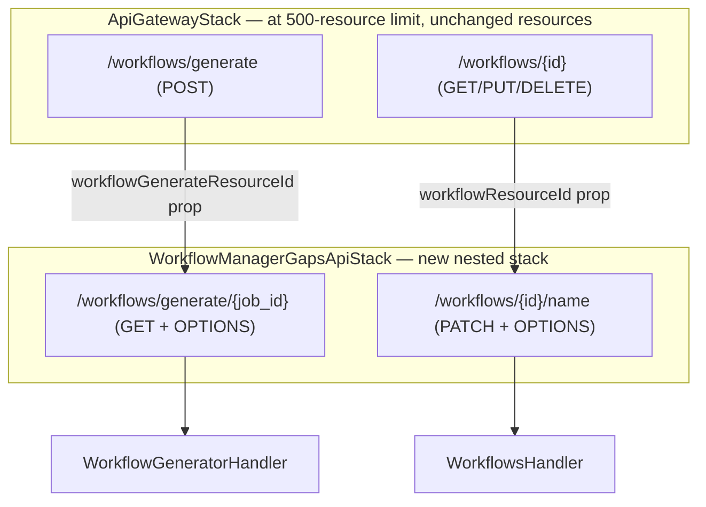

# Design Document: Workflow Manager Gaps

## Overview

This feature closes three gaps in the Workflow Manager of the Edge CV Portal:

1. **Asynchronous workflow generation (504 fix)** — `POST /workflows/generate` today runs the full Bedrock Converse invocation, Generation_Gate evaluation, and session persistence inside the API Gateway request. The Portal_API is an EDGE-optimized REST API whose integration timeout is hard-capped at 29 seconds and cannot be raised, while the `WorkflowGeneratorHandler` Lambda has a 270-second timeout and a Bedrock client timeout configurable up to 240 seconds (`MAX_TIMEOUT_SECONDS` in `bedrock_common.py`). Generation moves to a **submit (202 + Job_ID) / poll** pattern that changes only the transport: every generation semantic in `workflow_generator.generate_workflow()` — synchronous request validation, RBAC, session resolution, `invoke_generation()`, the Generation_Gate accept/repair/reject flow, and accept-only session persistence — is preserved verbatim in a background execution.

2. **Workflow display-name rename** — `PUT /workflows/{id}` requires a `definition` and always allocates a new version (`workflows.update_workflow`). A metadata-only `PATCH /workflows/{id}/name` operation updates the `name` attribute of the Workflows-table record (and `updated_at`) without touching versions, stored definitions, packaged components (named `dda.workflow.{workflow_id}`), or deployments. The Portal designer toolbar gains a rename affordance.

3. **Metadata_Node (custom ID / JSON passthrough)** — a new `metadata` node type in the shared `workflow_core` Node_Type_Catalog that maps fields from the trigger payload (dotted field paths against the parsed MQTT payload) and attaches them, together with optional static JSON, to the data flowing to output nodes. It spans the catalog descriptor, validator checks, compiler emission (a new `metadata` executor binding carrying the mappings, static JSON, and the transitively-reachable output nodes), the designer configuration UI, and the edge runtime (`OutputBindingProcessor` in `src/backend/workflow_engine/output_bindings.py`), which already receives the run's Trigger_Context under `tag_values["trigger"]` with a pre-parsed `payload_json` (`pipeline_executor.load_trigger_context`).

Implementation lands on branch `spec/workflow-manager-gaps` (off `integration/all-specs`).

### Key design decisions

| Decision | Choice | Rationale |
| --- | --- | --- |
| Background execution mechanism | Async Lambda **self-invocation** (`InvocationType='Event'`) | This is the proven in-repo pattern: `node_generator.py` already implements 202 + poll with a self-invoked worker for the identical problem (Bedrock generations exceeding the 29 s cap). SQS would add a queue, a second event source, IAM, and DLQ handling for no benefit at this concurrency. Async retries are disabled (`maximumRetryAttempts: 0`) so an abnormal termination is terminal and the reaper rule (Req 3.6) is race-free. |
| Generation_Job state store | The existing **WorkflowChatSessions** DynamoDB table, job items keyed `session_id = "genjob#{job_id}"` | The generator Lambda already has read/write access and the table already has the TTL attribute (`ttl`) enabled with the exact retention semantics Requirement 2.6 asks for (Chat_Session TTL window). No new table, IAM, or environment wiring. Job keys are UUID-prefixed with `genjob#`, so they can never collide with real session ids (UUIDv4). |
| Generation_Result payload | Stored in **portal S3** next to the session snapshots, referenced from the job item | Generated definitions plus complete findings lists can be large; S3 avoids the 400 KB item limit and mirrors how session canvas snapshots are stored today (`snapshot_s3_key`). |
| Abnormal-termination detection (Req 3.6) | **Lazy poll-time reaping**: the status endpoint conditionally transitions a non-terminal job to `failed` once `now > dispatched_at + 270 s + 60 s` | No scheduler resource needed; the requirement's purpose is that *polling clients* observe `failed`. The threshold sits exactly at "60 s after the maximum execution duration", past the point where any worker (Lambda hard-kills at 270 s; retries disabled) could still write. First-terminal-write-wins conditional updates make repeated reads immutable (Req 2.6). |
| New API routes | New nested stack **`WorkflowManagerGapsApiStack`** importing `/workflows/generate` and `/workflows/{id}` by resource id | `api-gateway-stack.ts` sits at the CloudFormation 500-resource limit; the repo precedent is `CameraRegistryApiStack` (imports `deviceResourceId` and attaches `/devices/{id}/cameras/...`) and `DdaLabelingApiStack` (imports `labelingJobResourceId`). `ApiGatewayStack` only needs to expose two existing resource ids as props — zero new resources in the maxed stack. |
| Rename operation shape | `PATCH /workflows/{id}/name` with body `{"name": "..."}` | A dedicated static sub-resource keeps `PUT /workflows/{id}` byte-identical (Req 8.3) and follows the existing static-sibling routing convention (`/workflows/node-catalog`, `/devices/{id}/cameras/refresh`). |
| Metadata_Mappings parameter encoding | Two string parameters on the descriptor: `mappings` (JSON array of `{path, key}` objects) and `static_json` (JSON object) | `ParameterDescriptor` supports scalar types only (`string/int/float/bool/enum/code/model_ref`); structured values are carried as JSON strings, exactly as `custom_python.requirements` carries a multi-line list. The designer renders a structured editor that serializes to the string; the validator and compiler parse it. |
| Metadata attachment scope at runtime | Compiler emits `attachTo` (the output-category node ids transitively reachable from the Metadata_Node) on the `metadata` executor binding | The compiled document's `executorBindings` only carry executor-level nodes with *direct* adjacency (`upstreamNodeIds`/`downstreamNodeIds`); the device cannot reconstruct full-graph reachability through GStreamer nodes. The compiler has the full graph (`_node_successors`) and already emits derived routing structures (`portConditions`, `activates`). |
| Metadata inclusion in emitted payloads | `mqtt_publish`: attached entries merged **top-level** into the rendered JSON-object payload, workflow-result keys win on collision; non-object payloads wrapped as `{"payload": <original>, "metadata": {...}}`. All downstream output bindings additionally see attached entries in their template/condition metadata plus a `{metadata_json}` placeholder | Top-level merge makes the motivating example natural (publish to `swagfactory/quality` carries `job_id` beside the result fields) and literally satisfies "alongside, and without altering or replacing, the workflow result values". Scalar-write outputs (`opcua_write`, `modbus_write`, `digital_output`) cannot physically carry a JSON map; they get the entries through template placeholders instead. Both behaviors apply only to outputs downstream of a Metadata_Node, so pre-existing workflows emit byte-identical payloads (Req 7.8, 8.1). |

## Architecture

### Gap 1: Asynchronous generation

```mermaid
sequenceDiagram
    participant CP as Chat_Panel (GenerateChatPanel.tsx)
    participant APIGW as Portal_API (29s cap)
    participant WG as WorkflowGeneratorHandler (270s)
    participant DDB as WorkflowChatSessions table
    participant S3 as Portal artifacts S3
    participant BR as Bedrock Converse

    CP->>APIGW: POST /workflows/generate {usecase_id, prompt, session_id?, current_definition?, temperature?}
    APIGW->>WG: invoke (sync)
    WG->>WG: parse/validate body, RBAC, usecase check (unchanged)
    alt synchronous validation fails
        WG-->>CP: 400/403/404 Error_Envelope (no job created)
    else accepted
        WG->>DDB: put job item {genjob#job_id, status=pending, dispatched_at, deadline_at, ttl}
        WG->>WG: self-invoke (InvocationType=Event, retries=0)
        WG-->>CP: 202 {job_id, session_id, status}
    end

    Note over WG: background worker (same Lambda, worker payload)
    WG->>DDB: status pending -> running (conditional)
    WG->>BR: converse() ... Generation_Gate ... at most one Repair_Pass
    alt gate accepts
        WG->>S3: put session snapshot + append history (accept path only, unchanged)
        WG->>S3: put Generation_Result payload (jobs/{job_id}/result.json)
        WG->>DDB: status -> succeeded (conditional, refresh ttl)
    else failure (timeout / reject / validator exception / ...)
        WG->>DDB: status -> failed {http_status, error envelope} (conditional; session untouched)
    end

    loop poll <= every 5s, <= 300s
        CP->>APIGW: GET /workflows/generate/{job_id}
        APIGW->>WG: invoke (sync)
        WG->>DDB: read job (reap if past deadline)
        alt pending/running
            WG-->>CP: 200 {job_id, status}
        else succeeded
            WG->>S3: get result.json
            WG-->>CP: 200 {job_id, status, ...sync-endpoint payload}
        else failed
            WG-->>CP: original HTTP status + Error_Envelope
        end
    end
```

### Generation_Job state machine

```mermaid
stateDiagram-v2
    [*] --> pending: submit accepted (202 returned)
    pending --> running: worker start (conditional update)
    pending --> failed: worker dispatch never ran / reaped past deadline
    running --> succeeded: gate accept, result stored
    running --> failed: recorded failure envelope OR reaped past deadline
    succeeded --> [*]: TTL expiry (>= Chat_Session TTL after terminal)
    failed --> [*]: TTL expiry
    note right of succeeded: terminal states are immutable —\nevery terminal write is conditional on\nstatus IN (pending, running); first write wins
```



### Gap 3: Metadata passthrough end to end



### New API route topology



## Components and Interfaces

### 1. Backend: `workflow_generator.py` (async submit/poll)

The existing `generate_workflow(event, user)` is split along its existing internal seams — no gate, session, or invocation logic changes:

**`submit_generation(event, user)`** (serves `POST /workflows/generate`):
- Runs exactly today's synchronous prefix: `parse_body`, `MISSING_FIELDS`/`INVALID_PROMPT`, `INVALID_TEMPERATURE`, RBAC (`WORKFLOW_CREATE` or `WORKFLOW_EDIT` → `forbidden_response`), `USECASE_NOT_FOUND`, and `INVALID_CURRENT_DEFINITION` parsing of the provided snapshot. Any failure returns the existing envelope synchronously and creates no job (Req 1.3, 1.4).
- **Session resolution (behavior delta, Req 1.5–1.7):** a `session_id` that resolves to a live session owned by the same user and Use_Case keeps today's follow-up semantics. A `session_id` that does not resolve (expired, unknown, or another user's/Use_Case's — indistinguishable by design) no longer returns 404 `SESSION_NOT_FOUND`; instead a **fresh session id is minted** and the prompt proceeds with follow-up semantics over the client-provided `current_definition` (or an empty canvas when absent). No session_id likewise mints a fresh session. The effective session id is returned in the 202 body.
- Creates the Generation_Job item (`status=pending`, see Data Models) in the WorkflowChatSessions table, then self-invokes the Lambda asynchronously with the worker payload. If the `lambda.invoke` call itself fails, the job is conditionally marked `failed` with a 502 `GENERATION_NOT_STARTED` envelope and the same envelope is returned synchronously.
- Returns `202 {job_id, session_id, usecase_id, status: "pending"}` (Req 1.1, 1.8).

**`run_generation_worker(event)`** (worker entry, dispatched from `handler()` before HTTP routing when the payload carries `workflow_gen_worker: true` — mirroring `node_generator.py`):
- Conditionally transitions the job `pending → running`.
- Executes **`run_generation_core(...)`**: the body of today's `generate_workflow` from Bedrock configuration resolution onward, refactored to return `(status_code, payload_dict)` instead of an API Gateway response. Everything inside is unchanged: `get_bedrock_configuration()` + temperature override, `converse_messages` over the session history, `palette_catalog_for_usecase`, `invoke_generation`, parse + `serialize_graph`, `run_validator` + `gate_classify` (fail-closed `GENERATION_VALIDATION_INCOMPLETE`), at most one Repair_Pass via `build_repair_message`, `generation_rejected_response` semantics, and **accept-only** `put_snapshot` + `save_session` (Req 3.1–3.4, 3.7, 3.8).
- **Combined-failure recording (Req 3.5, 2.9):** on the repair path, when the Repair_Pass invocation fails with `GENERATION_TIMEOUT` (today collapsed into `GENERATION_REJECTED` with `repair_attempted: true`), the worker records a single `failed` state whose `GENERATION_REJECTED` envelope `details` additionally carry a `timeout` object (`{timeout_seconds, model_id}`) beside `structural_errors`.
- On a 200 outcome: writes the full response payload to S3 (`.../chat-sessions/{session_id}/jobs/{job_id}/result.json`) and conditionally transitions to `succeeded` with the result reference; on any error outcome: conditionally transitions to `failed` storing `{http_status, error}`. Terminal writes refresh `ttl = now + SESSION_TTL_SECONDS` (Req 2.6, 2.7 — a zero-configured TTL yields immediate removability). The worker's outermost `try/except` guarantees a terminal write for every exception path; only a Lambda timeout/crash escapes it, which the reaper covers.

**`get_generation_job(event, user, job_id)`** (serves `GET /workflows/generate/{job_id}`):
1. Load `genjob#{job_id}`; absent (never existed, or TTL-removed) → 404 `JOB_NOT_FOUND` with a fixed envelope that never distinguishes the cases (Req 2.4, 2.10).
2. Resolve the job's `usecase_id`. A user with no access to that Use_Case gets the **same 404** (no cross-tenant existence leak); a user with Use_Case access but neither `WORKFLOW_CREATE` nor `WORKFLOW_EDIT` gets the existing 403 RBAC envelope (Req 2.4, 2.5).
3. **Reap:** if `status ∈ {pending, running}` and `now_ms > deadline_at`, conditionally update to `failed` with the 504 `GENERATION_ABNORMAL_TERMINATION` envelope; on `ConditionalCheckFailed` (worker won the race) re-read and serve the stored terminal state (Req 3.6).
4. Respond: `pending`/`running` → `200 {job_id, status}` with neither result nor failure envelope (Req 2.8); `succeeded` → `200 {job_id, status: "succeeded", ...result.json}` — the embedded fields are the sync endpoint's exact payload (`session_id, usecase_id, definition, findings, error_count, warning_count, validation_passed, assistant_text, model_id, gate`) (Req 2.2); `failed` → the stored `http_status` with the stored envelope verbatim (Req 2.3). Reads never mutate terminal jobs, so repeated polls are identical (Req 2.6).

`handler()` routing adds `('/workflows/generate/{job_id}', 'GET')` and the worker-payload dispatch; `('/workflows/generate', 'POST')` now routes to `submit_generation`.

### 2. Infrastructure

- **`compute-stack.ts`:** grant the generator role `lambda:InvokeFunction` on its own function (self-invoke; same pattern as `ddaLabelingWorker.grantInvoke`), set `WORKFLOW_GENERATOR_FUNCTION_NAME` in its environment (fallback `AWS_LAMBDA_FUNCTION_NAME`), and add an `EventInvokeConfig` with `maximumRetryAttempts: 0` so an abnormally terminated worker is never silently re-run after the reaper fires. Lambda timeout stays 270 s. Pass `workflowsHandler` + `workflowGeneratorHandler` and the two resource ids into the new nested stack.
- **`api-gateway-stack.ts`:** expose two *existing* constructs as public readonly props — `workflowGenerateResourceId` (the `workflowsResource.addResource('generate')` at line ~795) and `workflowResourceId` (`/workflows/{id}`). No new resources in this stack.
- **`workflow-manager-gaps-api-stack.ts` (new `cdk.NestedStack`):** clones the `CameraRegistryApiStack` pattern — `RestApi.fromRestApiAttributes`, `Resource.fromResourceAttributes` for both parents, its own Cognito authorizer, `defaultCorsPreflightOptions` on the resources it creates, `allowTestInvoke: false` integrations, and a `CfnDeployment` whose logical id is salted with the route table. Routes: `GET /workflows/generate/{job_id}` → generator handler; `PATCH /workflows/{id}/name` → workflows handler.

### 3. Backend: `workflows.py` rename operation

**`rename_workflow(event, user, workflow_id)`** (serves `PATCH /workflows/{id}/name`):
- `get_workflow_item(workflow_id)`; absent → existing `not_found_response()` (uniform cross-tenant 404, Req 5.5).
- `authorize_workflow_access(user, event, item, Permission.WORKFLOW_SAVE)` — the same permission the definition-saving update uses (Req 5.4).
- Body `{name}`: reject with 400 `INVALID_NAME` when `name` is missing/not a string, empty or whitespace-only after `strip()`, or longer than 128 characters (Req 5.3). The trimmed value is stored.
- Single `update_item` on the Workflows table: `SET #name = :name, updated_at = :updated` with `ConditionExpression='attribute_exists(workflow_id)'`, `ReturnValues='ALL_NEW'`. **No writes** to WorkflowVersions, S3 definitions, or `latest_version` (Req 5.1, 5.2, 8.2 — packaged components are named `dda.workflow.{workflow_id}` and deployments resolve by `workflow_id`, so nothing else can be affected).
- `log_audit_event(action='rename_workflow', ...)` with `previous_name`, `new_name`, `usecase_id` (Req 5.6).
- Returns `200 {workflow: workflow_summary(new_item)}`.

`handler()` gains the `('/workflows/{id}/name', 'PATCH')` route. `update_workflow` (PUT) is untouched (Req 8.3).

### 4. Frontend

**`services/api.ts`:** `generateWorkflow` now returns the 202 shape `{job_id, session_id, usecase_id, status}`; new `getWorkflowGenerationJob(jobId)` typed as a discriminated union on `status` (in-progress / succeeded-with-`WorkflowGenerationResult` fields); new `renameWorkflow(workflowId, name)` calling `PATCH /workflows/{id}/name`.

**`GenerateChatPanel.tsx`:** the single `apiService.generateWorkflow(...)` call becomes submit-then-poll:
- On submit: show the existing in-progress state immediately (Req 4.1's ≤1 s indicator is the current synchronous-spinner behavior, retained), adopt the returned `session_id`, disable the prompt input while the job is non-terminal (Req 4.4), and start polling every **3 seconds** (≤5 s bound, Req 4.1).
- The poll loop is extracted into a pure, unit-testable reducer (`pollReducer(state, event)`) driving: terminal-success → render result exactly as the sync path does today (`fromWorkflowDefinition` parse, `onApplyGenerated`, findings + gate Alerts, clear prompt) (Req 4.2); terminal-failure envelope → existing error/gate-rejection rendering with the prompt retained (Req 4.3); **3 consecutive poll transport failures** (network error or non-success response that is not a job-failure envelope) → stop, show "generation status could not be retrieved", retain prompt (Req 4.6); **300 s without a terminal state** → stop, show "generation did not complete in time", retain prompt (Req 4.7). Follow-up prompts keep sending `session_id` + the current canvas definition (Req 4.5).

**`WorkflowToolbar.tsx`:** a Rename action (enabled only when a workflow is loaded and `canEditWorkflows(role)`, Req 5.8) opens a modal pre-filled with the current name, client-validates the same trim/length rules, calls `renameWorkflow`, and on success updates the loaded-workflow name in component state and the open-picker cache — no reload (Req 5.7). On failure it shows the envelope message and leaves the displayed name unchanged (Req 5.9).

### 5. workflow_core: catalog, validator, compiler

**Catalog (`catalog/nodes.py`):**

```python
METADATA = NodeTypeDescriptor(
    type_id="metadata",
    category=CATEGORY_POST_PROCESSING,
    display_name="Metadata",
    inputs=[PortDescriptor("in", PORT_TYPE_INFERENCE_META)],
    outputs=[PortDescriptor("out", PORT_TYPE_INFERENCE_META)],
    parameters=[
        # JSON array of {"path": "...", "key": "..."} objects (0..50).
        ParameterDescriptor("mappings", "string", required=False, default="[]",
                            constraints={}, description=..., examples=[
                                '[{"path": "job_id", "key": "job_id"}]']),
        # Optional static JSON object, <= 10240 characters.
        ParameterDescriptor("static_json", "string", required=False, default="",
                            constraints={"max_length": 10240},
                            description=..., examples=['{"station": "line-1"}']),
    ],
    mappings=_same_on_all_archs(executor_binding="metadata"),
    hardware_dependent=False,
)
```

`InferenceMeta` in/out ports let it sit between inference/post-processing nodes and output nodes exactly like `inference_filter`. Appended to `NODE_CATALOG`; a shared pure helper module `workflow_core/catalog/metadata_config.py` provides `parse_mappings(raw) -> (list[{path,key}], errors)` and `parse_static_json(raw) -> (dict|None, errors)` consumed by the validator, the compiler, and (mirrored in TypeScript) the designer, so all three agree on validity (Req 6.1).

**Validator (`validator/checks.py`)** — two new checks appended to `validate()`'s check list, firing only on `metadata`-typed nodes so graphs without them produce identical findings (Req 8.1):

- `_check_v10_metadata(graph, typed_nodes)` — per node, one `SEVERITY_ERROR` finding per violation (Req 6.4):
  - `CODE_V10_METADATA_MAPPINGS_INVALID` — `mappings` not parseable as a JSON array of `{path, key}` string pairs;
  - `CODE_V10_METADATA_EMPTY_FIELD_PATH` — a mapping with an empty/whitespace `path`;
  - `CODE_V10_METADATA_EMPTY_KEY` — a mapping with an empty/whitespace `key`;
  - `CODE_V10_METADATA_DUPLICATE_KEY` — the same output key in more than one mapping;
  - `CODE_V10_METADATA_TOO_MANY_MAPPINGS` — more than 50 mappings;
  - `CODE_V10_METADATA_STATIC_JSON_INVALID` — `static_json` non-empty and (longer than 10 240 characters, not parseable as JSON, or parsing to a non-object).
- `_check_w2_metadata_no_trigger(graph, typed_nodes)` — when the graph contains **no** `CATEGORY_TRIGGER` node: exactly one `SEVERITY_WARNING` `CODE_W2_METADATA_NO_TRIGGER` per Metadata_Node that has ≥1 mapping; none for static-JSON-only nodes (Req 6.5).

The new error codes are **not** added to `generation_gate.STRUCTURAL_ERROR_CODES` — like parameter violations they flow to the client inside the findings list without changing gate decisions, so gate behavior on existing findings is untouched.

**Compiler (`compiler/compiler.py`):** the `metadata` node has an empty `element_chain` and `executor_binding="metadata"`, so it flows through the existing executor-level collapse (like `inference_filter`/`conditional`) — GStreamer stream topology already looks through it. In the executor-bindings emission loop, the metadata entry gains three keys (mirroring the `portConditions`/`activates` precedent):

```python
if mappings[node_id].executor_binding == BINDING_METADATA:
    parsed_mappings, _ = parse_mappings(parameters.get("mappings"))
    parsed_static, _ = parse_static_json(parameters.get("static_json"))
    entry["metadataMappings"] = [
        {"fieldPath": m["path"], "key": m["key"]} for m in parsed_mappings]
    entry["staticJson"] = parsed_static or {}
    entry["attachTo"] = _reachable_output_nodes(node_id, successors, typed_nodes)
```

`_reachable_output_nodes` walks the full node-level `successors` adjacency (BFS) and returns, in stable order, every node whose descriptor category is `CATEGORY_OUTPUT` — this is the "input data flowed through a Metadata_Node" relation of Req 7.7/7.8 computed where the whole graph is available. Every mapping and the complete static JSON reach the compiled document unaltered (Req 6.6). Compilation refuses on validation errors as today, so only valid configs reach devices. The vendored copy under `src/backend/workflow_engine/vendor/workflow_core` is refreshed via `vendor/re_vendor.sh`.

### 6. Designer: `NodeConfigPanel.tsx` + palette

The Metadata node appears in the palette under Post-processing automatically (catalog-driven). `NodeConfigPanel` adds a type-specific branch for `typeId === 'metadata'` (the established pattern — `custom_python`, `unified_input`, `aravis_camera_source` all have one):
- A **mapping rows editor** (add/edit/remove up to 50 rows of *trigger payload field path* → *output metadata key*) that serializes to the `mappings` JSON-array parameter (Req 6.2).
- A **static JSON textarea** bound to `static_json`.
- Client-side validation mirroring the validator via a TypeScript port of `metadata_config` rules: unparseable/non-object static JSON, duplicate keys, empty paths/keys, row/size limits each surface a field error on the node configuration and block saving that configuration (Req 6.3, 6.7), feeding the existing inline-check marker plumbing (`inlineChecks.ts`).

### 7. Edge runtime: `output_bindings.py`

The Trigger_Context already reaches `OutputBindingProcessor.process` — `WorkflowExecutor.execute` seeds `tag_values["trigger"] = load_trigger_context(execution.trigger_context_json)` for every run, and `load_trigger_context` already adds `payload_json` (parsed payload or `None`) for MQTT-shaped contexts (Req 7.1). New pure functions in `output_bindings.py`:

- `resolve_field_path(document, dotted_path)` — resolves `a.b.c` segment-by-segment through JSON objects (list indices supported as numeric segments); returns `(found: bool, value)` so a resolved JSON `null` is distinguishable from "not found" (Req 7.2, 7.3).
- `resolve_metadata_binding(binding, trigger)` — builds one metadata node's attached map: start from `staticJson` (top-level entries, Req 7.5); resolve each `metadataMappings` entry against `trigger.get("payload_json")` **only when it is a dict** — a non-JSON payload (`payload_json` is `None`) or a missing Trigger_Context (manual run, `trigger == {}`) resolves nothing and logs once (Req 7.4, 7.9); a resolved mapping (including `None`) overwrites a static entry of the same key with a logged collision (Req 7.6); an unresolved path omits the key and logs it (Req 7.3). Never raises — the run always continues.
- `attached_metadata_by_output(bindings, trigger)` — evaluates every `metadata` binding once and returns `{output_node_id: merged_attached_map}` from the bindings' `attachTo` lists; when several Metadata_Nodes attach to the same output, maps merge in `executorBindings` emission order (later binding wins, logged).

`OutputBindingProcessor.process` changes:
- The binding loop `continue`s on `BINDING_METADATA` (pass-through, like `inference_filter`).
- Before the loop it computes `attached_by_output = attached_metadata_by_output(bindings, metadata.get("trigger") or {})`.
- For each output binding with an attached map: the runner receives an **effective metadata dict** — `dict(metadata)` extended with the attached entries (existing tag keys win, logged) and `metadata_json` = the attached map as JSON — so `payload_template` placeholders and `condition` expressions can reference them.
- `_run_mqtt_publish`, for a binding with an attached map: after rendering `payload_template`, if the payload text parses as a JSON object, attached entries are merged top-level with **workflow-result keys winning** on collision (logged) and the object re-serialized; otherwise the emitted payload becomes `{"payload": <rendered text>, "metadata": {...attached}}` (Req 7.7). Outputs with no attached map take the exact current code path — payload byte-identical (Req 7.8).
- `opcua_write` / `modbus_write` / `digital_output` gain no automatic embedding (a scalar register/pin write cannot carry a JSON map); their value/condition parameters see the attached entries through the effective metadata dict. This scoping decision is recorded here deliberately: Req 7.7's "emitted result payload" is realized on payload-bearing outputs, which is the requirement's motivating case (MQTT).

No changes to `trigger_runtime.py`, `pipeline_executor.py`, or the executor dispatch path.

## Data Models

### Generation_Job item (WorkflowChatSessions table)

```json
{
  "session_id": "genjob#7f3a2b10-...",         // table PK; 'genjob#' prefix never collides with UUID session ids
  "record_type": "generation_job",
  "job_id": "7f3a2b10-...",
  "usecase_id": "uc-123",
  "user_id": "user-abc",
  "chat_session_id": "9d2e...-uuid",            // the session returned in the 202
  "status": "pending | running | succeeded | failed",
  "request": { "prompt": "...", "temperature": 0.2,
                "session_existed": false,
                "current_definition_json": "..." },   // canonical snapshot resolved at submit time
  "created_at": 1723760000000,
  "dispatched_at": 1723760000000,
  "deadline_at": 1723760330000,                  // dispatched_at + 270_000 + 60_000 (Req 3.6)
  "updated_at": 1723760031000,
  "terminal_at": 1723760031000,                  // set with the terminal write
  "result_s3_key": "workflows/uc-123/chat-sessions/{sid}/jobs/{job_id}/result.json",  // succeeded only
  "failure": { "http_status": 422, "error": { "code": "GENERATION_REJECTED",
               "message": "...", "details": { "structural_errors": [...],
               "timeout": {"timeout_seconds": 240} } } },                             // failed only
  "ttl": 1723846431                              // seconds; terminal_at/1000 + SESSION_TTL_SECONDS
}
```

State-transition writes always use `ConditionExpression`:
`pending → running`: `status = :pending`; any `→ terminal`: `status IN (:pending, :running)`. A `ConditionalCheckFailedException` on a terminal write means another writer already settled the job; the loser logs and stops. This makes terminal states immutable and repeated status reads identical (Req 2.6).

### Generation_Result document (S3)

Byte-for-byte the sync endpoint's 200 body: `{session_id, usecase_id, definition, findings, error_count, warning_count, validation_passed, assistant_text, model_id, gate}` (Req 2.2).

### Rename request/response

`PATCH /workflows/{id}/name`, body `{"name": "New display name"}` → `200 {"workflow": {workflow_summary fields}}`. Errors: `400 INVALID_NAME`, `403 FORBIDDEN` (existing envelope), `404 WORKFLOW_NOT_FOUND` (existing uniform envelope).

### Metadata_Node definition parameters (Workflow_Definition JSON)

```json
{
  "id": "n4", "type": "metadata",
  "position": {"x": 750, "y": 120},
  "parameters": {
    "mappings": "[{\"path\": \"job_id\", \"key\": \"job_id\"}, {\"path\": \"batch.lot\", \"key\": \"lot\"}]",
    "static_json": "{\"station\": \"line-1\"}"
  }
}
```

Parameters are strings, so the existing serializer (`parse.py`/`serialize.py` copy `parameters` as a plain dict) round-trips them without modification (Req 8.4) — no schema change is needed beyond the catalog descriptor.

### Compiled `metadata` executor binding entry

```json
{
  "nodeId": "n4",
  "binding": "metadata",
  "parameters": { "mappings": "[...]", "static_json": "{...}" },
  "upstreamNodeIds": ["n3"],
  "downstreamNodeIds": ["n5"],
  "metadataMappings": [ {"fieldPath": "job_id", "key": "job_id"},
                         {"fieldPath": "batch.lot", "key": "lot"} ],
  "staticJson": { "station": "line-1" },
  "attachTo": ["n5", "n6"]
}
```

### Emitted MQTT payload with attached metadata (example)

Trigger on `swagfactory/invoke` with payload `{"job_id": "J-1042", "file": "/in/1042.png"}`; workflow result `{"is_anomalous": true, "confidence": 0.93}`; publish to `swagfactory/quality`:

```json
{ "is_anomalous": true, "confidence": 0.93, "job_id": "J-1042", "station": "line-1" }
```

## Correctness Properties

*A property is a characteristic or behavior that should hold true across all valid executions of a system — essentially, a formal statement about what the system should do. Properties serve as the bridge between human-readable specifications and machine-verifiable correctness guarantees.*

Reflection on redundancy: the prework identified overlapping candidates that were consolidated — submit-acceptance criteria (1.1, 1.2, 1.7, 1.8, 8.5) collapse into Properties 1–2; rejection criteria (1.3, 1.4) into Property 3; the resolver criteria (7.2–7.6, 7.9, and 7.1's observability) into a single resolution-semantics property (Property 14); session invariance under every failure mode (3.2, 3.4, 3.8) and accept-only persistence (3.3) into one persistence-partition property (Property 8); the two combined-failure criteria (2.9 ≡ 3.5) into Property 10; rename criteria (5.1, 5.2, 5.6, 8.2) into one frame-condition property (Property 12).

### Property 1: Accepted submission creates a pollable job

*For any* valid generation request body (with or without `session_id`, `current_definition`, `temperature`), the submit handler returns HTTP 202 whose body carries a `job_id` and a `session_id`, a Generation_Job item for that `job_id` exists in state `pending` or `running` before the response is produced, and an immediately following status request for that `job_id` returns that state rather than a 404 — with a fresh `session_id` whenever the request carried none or one that did not resolve.

**Validates: Requirements 1.1, 1.2, 1.6, 1.7, 1.8**

### Property 2: Submit path never invokes Bedrock

*For any* generation request (valid or invalid), the submit handler completes without any Bedrock client invocation and returns either HTTP 202 or a synchronous Error_Envelope — never a response dependent on generation duration.

**Validates: Requirements 8.5**

### Property 3: Synchronous rejection creates nothing

*For any* generation request failing synchronous validation (missing fields, invalid prompt, out-of-range or non-numeric temperature, unparseable `current_definition`, unknown usecase) or submitted without WORKFLOW_CREATE/WORKFLOW_EDIT permission, the submit handler returns the same status code and Error_Envelope code the synchronous endpoint produces today, writes no Generation_Job item, and dispatches no background invocation.

**Validates: Requirements 1.3, 1.4**

### Property 4: Follow-up semantics preserved across session states

*For any* prior session state (live session with history and snapshot, expired/unknown session id, or no session id) and any prompt, the worker's Converse message list equals what today's synchronous path would send: replayed history capped at MAX_HISTORY_MESSAGES for live sessions, and a user turn embedding the effective canvas snapshot (client-provided definition when given, else the stored snapshot for live sessions, else no canvas block) with the modification instruction exactly when a canvas snapshot exists.

**Validates: Requirements 1.5, 1.6**

### Property 5: Job state machine legality and terminal immutability

*For any* interleaving of worker transitions, reaper evaluations, and status reads, a Generation_Job only ever moves along pending → running → {succeeded, failed} (with pending → failed permitted), at most one terminal write ever binds (all terminal writes are conditional on a non-terminal stored state), and once terminal, every subsequent status read returns the identical payload — the identical Generation_Result for succeeded, the identical Error_Envelope and HTTP status for failed.

**Validates: Requirements 2.1, 2.6**

### Property 6: Status responses carry exactly the state-appropriate payload

*For any* stored Generation_Job, the status endpoint returns: for `pending`/`running` (within deadline) HTTP 200 with the state and neither result fields nor a failure envelope; for `succeeded` HTTP 200 embedding field-for-field the synchronous endpoint's success payload (`session_id`, `usecase_id`, `definition`, `findings`, `error_count`, `warning_count`, `validation_passed`, `assistant_text`, `model_id`, `gate`); for `failed` the stored HTTP status with the stored Error_Envelope's code, message, and details verbatim.

**Validates: Requirements 2.2, 2.3, 2.8**

### Property 7: Status 404 indistinguishability

*For any* status request whose `job_id` never existed, whose job item was removed after its retention window, or whose job belongs to a Use_Case the requesting user cannot access, the endpoint returns a byte-identical 404 Error_Envelope; and for any failed job the user can access, the endpoint returns its failure envelope, never the 404. A user with Use_Case access but neither WORKFLOW_CREATE nor WORKFLOW_EDIT receives the existing 403 RBAC envelope.

**Validates: Requirements 2.4, 2.5, 2.10**

### Property 8: Session persistence happens exactly on gate acceptance

*For any* generation outcome — accept, repair-then-accept, gate reject, repair-still-failing, Bedrock timeout, Bedrock invocation failure, unparseable model output, or a validator exception on either pass — the worker persists the session snapshot and appends to the message history if and only if the outcome is an accept-class outcome; on every failure outcome the Chat_Session item, its message history, and its S3 canvas snapshot are unchanged, and the Generation_Job records the corresponding existing Error_Envelope (GENERATION_REJECTED with `user_readable_errors` details, GENERATION_TIMEOUT stating the applied `timeout_seconds`, GENERATION_VALIDATION_INCOMPLETE, respectively).

**Validates: Requirements 3.1, 3.2, 3.3, 3.4, 3.8**

### Property 9: Exactly one Repair_Pass, always re-gated

*For any* generation whose first gate decision is repair, the worker performs exactly one additional Bedrock invocation (never more than two total per job), passes the repair result through the Generation_Gate before any result is stored, and stores a success only when the re-gated decision is accept.

**Validates: Requirements 3.7**

### Property 10: Combined gate-rejection and timeout failures record one terminal state with both

*For any* generation where a gate rejection and a Bedrock timeout both occur (the Repair_Pass invocation times out after the first pass produced Structural_Errors), the Generation_Job ends in exactly one terminal `failed` state whose Error_Envelope details contain both the gate rejection's structural errors and the timeout indication.

**Validates: Requirements 2.9, 3.5**

### Property 11: Reaper transitions exactly the overdue non-terminal jobs

*For any* Generation_Job state and any read time, the status endpoint's reaping rule transitions the job to `failed` with the abnormal-termination Error_Envelope exactly when the stored state is non-terminal and the read time exceeds `deadline_at` (dispatch time + maximum execution duration + 60 s); reads within the deadline return the stored non-terminal state, terminal jobs are never reaped, and a reap racing a concurrent terminal write yields to whichever write bound first. Terminal writes set `ttl` to the terminal time plus the session TTL window, including a zero-configured TTL yielding immediate removability.

**Validates: Requirements 2.6, 2.7, 3.6**

### Property 12: Rename is a two-attribute frame

*For any* stored workflow record (any version count) and any valid Display_Name (non-empty after trimming, ≤ 128 characters), the rename operation changes exactly the record's `name` and `updated_at` attributes and nothing else — `workflow_id`, `latest_version`, every WorkflowVersions item, every stored S3 definition document, and the derived packaged-component name `dda.workflow.{workflow_id}` are unchanged — and emits an audit event carrying the workflow_id, the previous name, the new name, and the acting user's identity.

**Validates: Requirements 5.1, 5.2, 5.6, 8.2**

### Property 13: Rename validity and safety partition

*For any* rename request: an invalid name (empty, whitespace-only, or longer than 128 characters) returns 400 with the workflow record unchanged; a request without modify permission returns the existing 403 envelope with the record unchanged; a request against a nonexistent or inaccessible workflow_id returns the same 404 envelope in both cases; and a valid, authorized request succeeds.

**Validates: Requirements 5.3, 5.4, 5.5**

### Property 14: Metadata resolution and merge semantics

*For any* trigger context (JSON-object payload, non-JSON payload, non-object JSON payload, or absent/manual-run context), any list of Metadata_Mappings, and any static JSON object, resolving a `metadata` binding never raises and produces exactly: every static top-level entry; plus, when the parsed payload is a JSON object, each mapping whose dotted field path resolves — attached under its output key with the document's value preserved (including JSON `null`) and overriding a colliding static entry; every non-resolving mapping's key omitted; and, when the payload is not a JSON object or no trigger context exists, the static entries alone.

**Validates: Requirements 7.1, 7.2, 7.3, 7.4, 7.5, 7.6, 7.9**

### Property 15: Attachment reaches exactly the downstream outputs

*For any* compiled document with metadata bindings and any run metadata, processing the output bindings emits, for every output node listed in a metadata binding's `attachTo`, a payload containing every attached metadata entry alongside every original workflow-result entry unaltered (result values win key collisions); and for every output node in no `attachTo` list, a payload byte-identical to the payload produced by the pre-feature processing of the same document without metadata bindings.

**Validates: Requirements 7.7, 7.8**

### Property 16: Metadata_Node validator partition

*For any* generated Metadata_Node configuration, the validator produces one SEVERITY_ERROR finding per present violation — duplicate output keys, an empty field path, an empty output key, more than 50 mappings, unparseable mappings, and static JSON longer than 10 240 characters or not parsing to a JSON object — and produces none of these findings for a valid configuration; the same validity predicate, evaluated by the designer's TypeScript port, accepts and rejects exactly the same configurations.

**Validates: Requirements 6.3, 6.4, 6.7**

### Property 17: Trigger-less mapping warning counts

*For any* workflow graph, the validator emits the metadata-no-trigger SEVERITY_WARNING exactly once per Metadata_Node that has at least one Metadata_Mapping when the graph contains no trigger-category node, and emits none for graphs containing a trigger node or for Metadata_Nodes configured with only static JSON.

**Validates: Requirements 6.5**

### Property 18: Compiler emission completeness

*For any* valid workflow containing Metadata_Nodes, the compiled document's `metadata` executor binding entries carry every configured Metadata_Mapping (field path and output key) and the complete parsed static JSON object, unaltered, and each entry's `attachTo` equals exactly the set of output-category node ids reachable from that Metadata_Node in the definition graph.

**Validates: Requirements 6.6**

### Property 19: Serializer round-trip for Metadata_Node definitions

*For any* Workflow_Definition containing Metadata_Nodes with arbitrary valid `mappings`/`static_json` parameter strings, parsing, serializing, and re-parsing yields a semantically equivalent graph: the same node ids, types, parameters, and connections.

**Validates: Requirements 8.4**

### Property 20: Non-interference with metadata-free workflows

*For any* Workflow_Definition containing no Metadata_Node, the new validator checks produce zero findings, the compiled document contains no `metadata` bindings and no `attachTo`/`metadataMappings`/`staticJson` keys, and the output-binding processing produces results identical to the pre-feature behavior on the same inputs.

**Validates: Requirements 8.1**

### Property 21: Chat panel poll loop stops exactly when it should

*For any* sequence of poll responses (in-progress, terminal success, terminal failure envelope, transport failure) and any timing, the panel's poll reducer polls at intervals of at most 5 seconds, keeps prompt submission disabled exactly while a job is in flight, and stops polling exactly on the first of: a terminal response, the third consecutive transport failure (the counter resets on any successful poll), or 300 seconds since submission — retaining the submitted prompt text on every non-success termination.

**Validates: Requirements 4.1, 4.4, 4.6, 4.7**

## Error Handling

### Asynchronous generation

| Failure | Where | Behavior |
| --- | --- | --- |
| Invalid body / RBAC / unknown usecase | submit (sync) | Existing envelopes unchanged (`MISSING_FIELDS`, `INVALID_PROMPT`, `INVALID_TEMPERATURE`, `INVALID_CURRENT_DEFINITION`, `FORBIDDEN`, `USECASE_NOT_FOUND`); no job, no dispatch. |
| Async dispatch (`lambda.invoke`) fails | submit (sync) | Job conditionally marked failed; 502 `GENERATION_NOT_STARTED` returned; "your prompt was not lost" message mirrors `node_generator`. |
| Bedrock timeout / unreachable / invocation failure / no tool call | worker | Existing envelopes (`GENERATION_TIMEOUT` with `timeout_seconds`, `BEDROCK_UNREACHABLE`, `BEDROCK_INVOCATION_FAILED`, `NO_WORKFLOW_RETURNED`) recorded on the job with their HTTP status; session untouched. |
| Unparseable model output | worker | 422 `GENERATED_DEFINITION_INVALID` recorded; session untouched. |
| Gate reject / repair still failing | worker | 422 `GENERATION_REJECTED` with `user_readable_errors`, `repair_attempted`, `prompt_preserved`; plus `details.timeout` when the Repair_Pass failure was a timeout (Req 3.5). |
| Validator exception (either pass) | worker | 422 `GENERATION_VALIDATION_INCOMPLETE`; fail-closed as today. |
| Unexpected worker exception | worker outer guard | 500 `INTERNAL_ERROR` envelope recorded as the terminal failure — never a silent non-terminal job. |
| Lambda timeout/crash (guard never ran) | status-time reaper | 504 `GENERATION_ABNORMAL_TERMINATION` bound conditionally at first poll past `deadline_at`; concurrent-write races resolved by first-terminal-write-wins. |
| Job unknown / TTL-removed / cross-tenant | status | Uniform 404 `JOB_NOT_FOUND`; no existence disclosure. |
| S3 result unreadable for a succeeded job | status | 500 `INTERNAL_ERROR`; job record left untouched so a later poll can succeed. |

### Rename

`400 INVALID_NAME` (empty/whitespace/>128 after trim), existing `403 FORBIDDEN`, uniform `404 WORKFLOW_NOT_FOUND`; DynamoDB conditional failure (record deleted concurrently) maps to the 404. The frontend shows the envelope message and keeps displaying the previous name.

### Metadata_Node

- Portal: invalid configurations are stopped twice — in the designer (save blocked with field errors) and by the validator (SEVERITY_ERROR findings); the compiler refuses to compile on validation errors as today, so no invalid config reaches a device.
- Edge: `resolve_metadata_binding` is total — unresolved paths are omitted and logged, non-JSON payloads degrade to static-only with a logged parse failure, collisions are logged with the documented precedence; a defective `metadata` binding entry (malformed keys) resolves to an empty attachment and logs, never failing the run. mqtt embedding failures (payload JSON re-serialization) fall back to the wrapped `{"payload", "metadata"}` form; output-binding exceptions stay contained per binding via the existing `OutputBindingError` aggregation.

## Testing Strategy

Property-based tests use **Hypothesis** on the Python side (already used across `edge-cv-portal/backend/tests/` and `test/backend-test/`) and **fast-check** on the TypeScript side (already used by the `*.property.test.ts` suites under `frontend/src/pages/workflows/`). Every property test runs a minimum of **100 iterations** and carries a comment tag referencing its design property:

```
# Feature: workflow-manager-gaps, Property N: <property title>
```

**Property test mapping (one property-based test per property):**

| Property | Suite / technique |
| --- | --- |
| 1–11 | `edge-cv-portal/backend/tests/test_workflow_generation_async*.py` — Hypothesis over request bodies, session states, failure injections; DynamoDB/S3/Lambda/Bedrock stubbed with the module-level fakes the existing `test_workflow_generation.py` fixtures use. Property 5/11 drive generated operation interleavings against an in-memory conditional-write table fake. |
| 12–13 | `edge-cv-portal/backend/tests/test_workflow_rename_properties.py` — Hypothesis over names (unicode whitespace, length boundaries) and stored records. |
| 14–15, 20 (runtime half) | `test/backend-test/` — Hypothesis over trigger contexts, payload documents, mapping sets, compiled documents; `OutputBindingProcessor` with injected stub publishers capturing payloads. |
| 16–18, 19, 20 (portal half) | `edge-cv-portal/backend/tests/` — Hypothesis over generated Metadata_Node configs and graphs against `validate()`, `compile()`, and `parse`/`serialize`. |
| 16 (TS half), 21 | `frontend/src/pages/workflows/*.property.test.ts` — fast-check over config strings (shared-predicate parity) and poll-event sequences against the extracted reducer with fake timers. |

**Example-based unit tests** (concrete behaviors and UI interactions, deliberately few — properties carry the input coverage): chat panel success/failure/follow-up rendering (Req 4.2, 4.3, 4.5) extending `GenerateChatPanel.test.tsx`; rename affordance visibility, optimistic name update, and failure display (Req 5.7–5.9) in `WorkflowToolbar.test.tsx`; Metadata_Node config editor interactions (Req 6.2) in `NodeConfigPanel.test.tsx`; a PUT `/workflows/{id}` regression example (Req 8.3); the catalog-descriptor smoke check (Req 6.1).

**Integration/smoke checks** (not property-based): a deployed-stack check that `POST /workflows/generate` returns 202 within the gateway timeout and `GET /workflows/generate/{job_id}` settles (Req 1.1's latency bound); CDK synth assertion that the new nested stack attaches the two routes and `ApiGatewayStack` gains no resources; the on-hardware harness (`test/on-hardware/harness/stages/test_30_workflows.py`) gains one trigger-driven metadata-passthrough scenario (MQTT `swagfactory/invoke` → `swagfactory/quality` with `job_id` echo).

**Regression safety:** the full existing suites for `workflow_generator` (`test_workflow_generation.py`, gate tests), `workflows.py`, `workflow_core` validator/compiler, and `output_bindings` must pass unchanged — they are the executable definition of the preserved semantics in Requirements 3 and 8.
