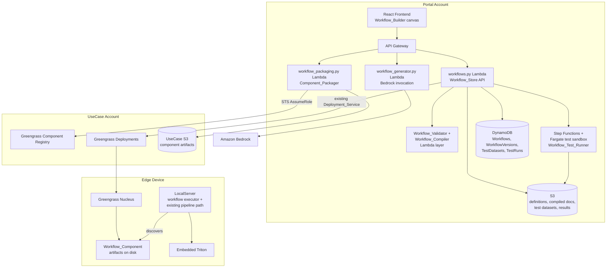
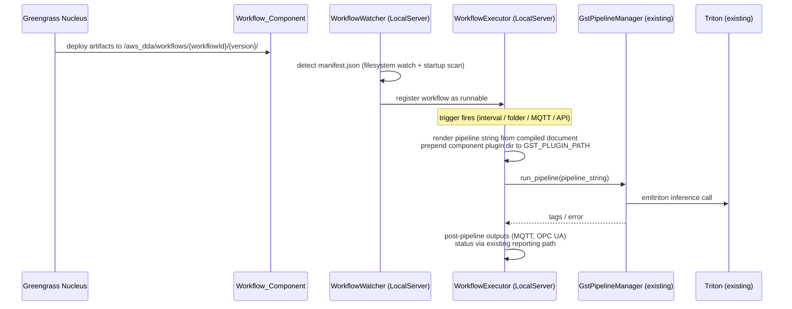

# Design Document: Workflow Manager

## Overview

The Workflow Manager adds a graphical video-pipeline builder to the edge-cv-portal. Users compose video analytics pipelines on a drag-and-drop canvas (Workflow_Builder), which produces a serializable graph document (Workflow_Definition). The portal validates the graph (Workflow_Validator), compiles it into a GStreamer pipeline configuration (Workflow_Compiler), packages it with plugin dependencies as a Greengrass component (Component_Packager), and deploys it to edge devices where LocalServer executes it through its existing GStreamer/Triton path. Two supporting capabilities round out the feature: prompt-based workflow generation via configurable Amazon Bedrock models (Workflow_Generator), and cloud-side pre-deployment testing against canned data with hardware nodes stubbed (Workflow_Test_Runner).

The design deliberately layers new capability alongside the existing system rather than replacing it:

- **Portal side**: New Lambda functions, DynamoDB tables, and S3 prefixes follow the existing patterns in `edge-cv-portal/backend/functions`, `edge-cv-portal/infrastructure/lib`, and the RBAC middleware. No existing API or table is modified in a breaking way.
- **Edge side**: LocalServer gains a `workflow/` subsystem that consumes compiled pipeline configurations delivered by Workflow_Components. The existing `src/backend/gstreamer/` path (`GstPipelineBuilder` → pipeline string → `GstPipelineManager.run_pipeline`) driven by `PipelineConfiguration` remains untouched; the workflow executor reuses `GstPipelineManager` for actual pipeline execution but never alters `GstPipelineBuilder` or `Pipeline_Configuration` handling (Requirement 13).

### Key Design Decisions

| Decision | Choice | Rationale |
|----------|--------|-----------|
| Canvas library | React Flow (`@xyflow/react`) | Established, MIT-licensed React node-graph library; typed ports, custom nodes, pan/zoom, minimap out of the box; fits existing React 18 + TypeScript + Vite stack |
| Validation/compilation location | Shared Python package in a Lambda layer, plus a TypeScript validator subset in the frontend for inline markers | Single source of truth for authoritative validation server-side; fast feedback client-side |
| Compiled artifact format | JSON "Compiled Pipeline Document" containing an ordered element list per branch segment, from which LocalServer renders a `gst-launch`-style string | Matches the existing executor, which runs `Gst.parse_launch` on a pipeline string; keeps the compiler output inspectable and testable |
| Workflow delivery to edge | Generic `aws.edgeml.dda.WorkflowRunner` recipe pattern: one Greengrass component per workflow version whose artifacts are the compiled document + plugins + Python node code; LocalServer discovers it via a well-known directory | Avoids modifying LocalServer's own component recipe; deploy/remove of a workflow never restarts LocalServer (Requirement 13.3) |
| Test execution environment | Portal-account Fargate task (x86_64 container with GStreamer + CPU Triton) orchestrated by Step Functions | Lambda cannot host GStreamer/Triton within limits; Fargate gives an isolated, time-boxed (10 min) sandbox with no device access (Requirement 12.9, 12.13) |
| Bedrock generation | Converse API with tool-use (structured output) against a configurable model; node catalog supplied in the system prompt | Structured output dramatically improves parse success; configuration lives in the existing portal settings table (Requirement 10.6) |

## Architecture

### System Context



### Portal Backend Flow

New Lambda functions follow the established pattern (`rbac_middleware` decorator, per-use-case STS AssumeRole, DynamoDB + S3):

- `workflows.py` — CRUD, versioning, duplicate, list, delete-with-deployment-check (Workflow_Store)
- `workflow_validation.py` — validate endpoint; imports the shared `workflow_core` layer
- `workflow_packaging.py` — compile + package + register Greengrass component (Component_Packager)
- `workflow_generator.py` — Bedrock chat sessions (Workflow_Generator)
- `workflow_testing.py` — test dataset upload/list, test run start/status/results (fronts the Workflow_Test_Runner state machine)

A shared Python package `workflow_core` (deployed as a Lambda layer under `edge-cv-portal/backend/layers/`, also vendored into LocalServer and the test sandbox image) contains the node catalog, serializer, validator, and compiler. This guarantees the portal, the test runner, and the edge agree on schema and semantics.

### Edge Execution Flow



LocalServer never restarts when a Workflow_Component is deployed or removed: the component's lifecycle is "install artifacts only" (no long-running process), and LocalServer's watcher picks up changes at runtime. Existing `Pipeline_Configuration` execution is a separate code path that is not touched (Requirement 13).

### Research Summary

- **React Flow** ([reactflow.dev](https://reactflow.dev)) supports custom node types with multiple typed handles, `isValidConnection` callbacks for port-type checks at drag time, and JSON-serializable state (`nodes`, `edges`, `viewport`) — a direct fit for Requirements 1 and 3. It is the de facto standard for React node editors (used by Langflow, n8n-style tools).
- **Lumeo's node reference** ([docs.lumeo.com/docs/node-reference](https://docs.lumeo.com/docs/node-reference)) informed the node taxonomy: sources, transforms (dewarp/rotate/crop), model inference, logic/filter, and outputs (MQTT, digital I/O, OPC UA, capture). The catalog below mirrors this shape while mapping onto DDA's existing GStreamer elements (`emltriton`, `emoutputevent`, `emlcapture`, `videocrop`, `videoflip`, `videoconvert`).
- **Existing executor contract** (`src/backend/gstreamer/gst_pipeline.py`): pipelines are executed via `Gst.parse_launch(pipeline_str)` with a GLib main loop, a 120 s watchdog, and tag parsing for `is_anomalous`/`confidence`. The compiler therefore targets a launch-string-renderable document. Branching uses named `tee` elements (`tee name=t ... t. ! queue ! ...`), which `parse_launch` supports and the existing builder already uses for outputs.
- **Bedrock Converse API** supports tool-use (function calling) for structured JSON output across Anthropic, Amazon Nova, and Meta models, making the model identifier configurable without per-model prompt surgery (Requirement 10.6).
- **Greengrass component model**: components with only `Artifacts` and no `Lifecycle/Run` step install files and stay `FINISHED`; deploying/removing them does not affect other components — the mechanism relied on for Requirement 13.3.

## Components and Interfaces

### 1. Workflow_Builder (Frontend)

Location: `edge-cv-portal/frontend/src/pages/workflows/`, `edge-cv-portal/frontend/src/components/workflow-builder/`

- **Canvas**: React Flow instance with custom node component rendering category color, title, ports (handles) labeled with port types, and inline validation badges.
- **Node_Palette**: left sidebar listing node types grouped by category (input, preprocessing, model inference, post-processing, output), sourced from the node catalog endpoint (`GET /api/v1/workflows/node-catalog`), draggable via HTML5 drag-and-drop onto the canvas (Requirement 1.1, 1.2).
- **Connection rules**: React Flow `isValidConnection` calls `arePortsCompatible(sourcePort, targetPort)`; incompatible attempts are rejected and a toast/tooltip shows the reason, e.g. "Cannot connect VideoFrames output to EventSignal input" (Requirement 1.4).
- **Config panel**: right sidebar showing the selected node's parameter schema rendered as CloudScape form controls; edits validated against parameter type/constraints with inline errors (Requirement 1.7, 1.8). Model inference node's `modelName` parameter is a select populated from the existing model registry API filtered by Use_Case (Requirement 2.6). Custom_Python_Node exposes a code editor field plus declared input/output port type pickers (Requirement 2.7).
- **Inline validation**: a lightweight TypeScript mirror of validator checks V4 (missing required parameters) and V5 (unreachable nodes) runs on every graph mutation; affected nodes get warning badges that clear when resolved (Requirement 1.9, 1.10). Full validation (all checks) is invoked explicitly via a Validate button calling the backend (Requirement 4.8, 4.9).
- **Actions toolbar**: Save (versioned), Validate, Test, Generate (chat panel), Package, Deploy — each gated by the user's role from the existing auth context (Requirement 11).
- **Chat panel**: collapsible panel for prompt-based generation; maintains a session id, renders generated workflows onto the canvas only after client-side parse + backend validation, and never clobbers the canvas on failure (Requirement 10.3, 10.4).
- **Test panel**: dataset picker/uploader and per-node test result display, marking stubbed nodes with a "simulated" badge and limitation text (Requirement 12.2, 12.8).

### 2. Node Catalog (`workflow_core.catalog`)

The catalog is data, not code: a list of `NodeTypeDescriptor` records (see Data Models) declaring ports, parameters, per-architecture GStreamer mappings, and hardware-dependence flags (Requirement 2.8). Initial catalog:

| Category | Node type | Ports (in → out) | GStreamer mapping (sketch) | Hardware-dependent |
|---|---|---|---|---|
| input | `camera_source` | → VideoFrames | `appsrc`/`v4l2src`/CSI file source chains reused from existing builder logic | yes |
| input | `folder_source` | → VideoFrames | `filesrc ! (jpegparse ! jpegdec | pngdec) ! videoconvert` per-arch variants (JP6 PNG staging path) | no |
| input | `digital_input` | → EventSignal | GPIO poll adapter (executor-level, not a GStreamer element) | yes |
| preprocessing | `dewarp` | VideoFrames → VideoFrames | `opencv`-based `dewarp` plugin (packaged dependency) | no |
| preprocessing | `rotate` | VideoFrames → VideoFrames | `videoflip method=<n>` | no |
| preprocessing | `crop` | VideoFrames → VideoFrames | `videocrop top=.. bottom=.. left=.. right=..` | no |
| preprocessing | `format_convert` | VideoFrames → VideoFrames | `videoconvert ! capsfilter caps=video/x-raw,format=<fmt>` | no |
| inference | `model_inference` | VideoFrames → InferenceMeta | `emltriton model-repo=<TRITON_MODEL_DIR> server-path=<TRITON_INSTALLATION_DIR> model=<name> ...` (mirrors existing `_add_inference_plugins`) | no |
| post-processing | `custom_python` | declared → declared | `emlpython` bridge element invoking user code via appsink/appsrc pair | no |
| post-processing | `inference_filter` | InferenceMeta → InferenceMeta | executor-evaluated condition over inference metadata (confidence/anomaly rules), compiled to `emoutputevent`-style rule strings where applicable | no |
| output | `digital_output` | InferenceMeta → | `emoutputevent script-path=<dio> config=<json>` (existing element) | yes |
| output | `mqtt_publish` | InferenceMeta → | executor-level MQTT client publish on pipeline completion | yes |
| output | `opcua_write` | InferenceMeta → | executor-level OPC UA client write (`opcua` Python lib packaged as dependency) | yes |
| output | `capture` | VideoFrames/InferenceMeta → | `jpegenc ! emlcapture ...` (existing element chain) | no |

Port types: `VideoFrames`, `InferenceMeta`, `EventSignal`. Compatibility is exact-match plus declared coercions (e.g., `InferenceMeta` flows over the same GStreamer buffer stream as `VideoFrames` with attached metadata, so `capture` accepts both).

### 3. Workflow_Serializer (`workflow_core.serializer`)

- `serialize(graph: WorkflowGraph) -> str`: emits canonical JSON — keys sorted, stable node/connection ordering by id — containing `schemaVersion`, all nodes (id, type, position, parameter values), and connections (Requirement 3.1). Canonicalization is what makes the round-trip property "identical JSON structure" achievable (Requirement 3.4).
- `parse(doc: str) -> ParseResult`: JSON-Schema validation first (returns the first violation with a JSON-pointer path, Requirement 3.3), then graph construction, then migration: if `schemaVersion` is older but supported, registered migration functions upgrade the document stepwise and the result carries `migrations: [from, to]` (Requirement 3.5).
- A TypeScript twin of the schema (generated from the JSON Schema) is used by the frontend; the JSON document itself is the interchange format, so only the Python implementation is authoritative.

### 4. Workflow_Validator (`workflow_core.validator`)

Pure function `validate(graph, catalog) -> list[ValidationFinding]`, always running all checks and returning the complete list (Requirement 4.6):

| Check | Rule | Requirement |
|---|---|---|
| V1 | ≥1 input node and ≥1 output node | 4.1 |
| V2 | every connection joins output port → input port with compatible types | 4.2 |
| V3 | no cycles; on failure, report the node ids in each cycle (Tarjan SCC) | 4.3 |
| V4 | every required parameter has a value satisfying its constraints | 4.4 |
| V5 | every node reachable from some input node (forward BFS from inputs) | 4.5 |
| W1 (warning) | output node with no incoming connection, unused output ports, etc. | 4.6 |

Each `ValidationFinding` carries `severity`, `code`, `message`, and `nodeId`/`connectionId`. Packaging, publishing, and deployment endpoints call `validate` and reject on any error-severity finding; they additionally verify the stored version's recorded validation status (Requirement 4.7, 4.10).

### 5. Workflow_Compiler (`workflow_core.compiler`)

`compile(graph, target_arch, context) -> CompiledPipelineDocument | list[CompileError]`

Algorithm:
1. Re-run the validator; refuse to compile with errors.
2. Topologically sort nodes (graph is a DAG after V3).
3. For each node, look up the `GstMapping` for `target_arch` in the catalog; missing mapping → `CompileError{nodeId, arch}` (Requirement 6.5).
4. Emit one `ElementChain` per node (1..n GStreamer elements with args), tagged with the originating `nodeId` — every node appears exactly once (Requirement 6.6). Model inference nodes emit the `emltriton` chain with model name and the Triton repo/server paths LocalServer uses (Requirement 6.2). Executor-level nodes (digital input, MQTT, OPC UA, inference filter conditions) emit `ExecutorBinding` entries instead of GStreamer elements; they still appear exactly once in the document.
5. Linearize connections: a node whose output feeds N>1 downstream nodes gets `tee name=t<i>` and each branch starts with `queue` (Requirement 6.3), producing named segments renderable as a single `parse_launch` string.
6. Compute `pluginDependencies`: the set of GStreamer plugins/Python packages referenced by mappings minus the LocalServer-bundled set (per-arch bundled manifest in the catalog) (Requirement 6.4).

Output `CompiledPipelineDocument` (JSON): `{schemaVersion, workflowId, workflowVersion, targetArch, segments: [{name, elements: [{nodeId, factory, args}]}], executorBindings: [...], pluginDependencies: [...]}`. LocalServer renders segments to a launch string with `" ! "` joins and `t. !` branch references — the same string dialect `GstPipelineManager.run_pipeline` already executes.

### 6. Component_Packager (portal backend, `workflow_packaging.py`)

1. Compile the workflow for each user-selected architecture (x86_64, arm64 JP4/JP5/JP6) (Requirement 7.4).
2. Assemble artifacts per arch: `manifest.json` (component metadata + arch), `workflow.json` (Workflow_Definition), `compiled_pipeline.json`, `plugins/<arch>/*.so` (resolved from a curated plugin artifact library in portal S3), and for Custom_Python_Nodes `python/{nodeId}/handler.py` + `requirements.txt` (Requirement 7.1, 7.3).
3. Upload artifacts to the Use_Case account S3 bucket (via assumed role), then `CreateComponentVersion` with name `dda.workflow.{workflowId}` and version `{workflowVersion}.0.0` in the Use_Case account's Greengrass registry (Requirement 7.2). Recipe has per-arch platform manifests and **no Run lifecycle** — install-only, so deployment never disturbs LocalServer or other components (Requirement 13.3).
4. All-or-nothing: artifacts staged under a temporary S3 prefix; component registration happens only after all artifacts for all selected architectures upload successfully. On any failure, the temp prefix is deleted and the failing artifact reported; no partial component version exists (Requirement 7.5).

### 7. Deployment_Service extension (`deployments.py`)

Reuses the existing deployment Lambda: adds Workflow_Component as a deployable component type, device/thing-group targeting within the Use_Case (Requirement 8.1), records `workflowId + version → deployment → devices` association in the Deployments table (Requirement 8.2), and surfaces per-device Greengrass deployment status on the workflow page (Requirement 8.3). Pre-submit compatibility check: each target device's reported LocalServer component version is compared against the Workflow_Component's `minLocalServerVersion` (from the compiled document schema version); incompatible devices are reported before submission (Requirement 8.4). Greengrass semantics already replace an older component version with a newer one in a revised deployment (Requirement 8.5).

### 8. LocalServer Workflow Subsystem (edge, `src/backend/workflow_engine/` — new package)

- **WorkflowWatcher**: scans `/aws_dda/workflows/` at startup and watches for changes (inotify with poll fallback); on discovery of a `manifest.json` + `compiled_pipeline.json`, registers the workflow in a new `workflow_registrations` table (SQLAlchemy + alembic migration, additive only) and exposes it via new Flask endpoints (`/workflows` list/trigger/status) (Requirement 9.1).
- **WorkflowExecutor**: on trigger, renders the launch string from the compiled document, prepends the component's `plugins/<arch>/` directory to `GST_PLUGIN_PATH` for that run (Requirement 9.2), and executes via the existing `GstPipelineManager.run_pipeline` — inheriting the watchdog, error capture, and tag parsing. Model inference flows through `emltriton` → embedded Triton exactly as today (Requirement 9.3). After pipeline completion it processes `executorBindings`: digital output actuation via the existing `dio_utils` (Requirement 9.4), MQTT publish via the existing `mqtt/` client (Requirement 9.5), OPC UA writes via the packaged client (Requirement 9.6).
- **Custom Python execution**: the `emlpython` bridge runs user code in a subprocess with a defined stdin/stdout frame+metadata protocol; the pipeline element is an `appsink`/`appsrc` pair managed by the executor (Requirement 9.8). Subprocess isolation bounds the blast radius of user code.
- **Failure handling**: pipeline errors from `GstPipelineManager` already identify the failing element; the executor maps element → `nodeId` via the compiled document tags and reports workflow status as failed through the existing status reporting path (Requirement 9.7). A workflow failure never touches `Pipeline_Configuration` execution — separate threads, separate registries (Requirement 13.4, 13.7).
- **Isolation for backward compatibility**: the workflow subsystem is additive — no changes to `gstreamer/pipeline_builder.py`, `model/PipelineConfiguration.py`, shadow handling, or existing endpoints. Devices without Workflow_Components have an empty registry and identical behavior (Requirement 13.1, 13.5, 13.6). Triton serves models to both paths concurrently; model repository contents are not modified by workflow execution (Requirement 13.8).

### 9. Workflow_Generator (portal backend, `workflow_generator.py`)

- Chat sessions stored in DynamoDB (`WorkflowChatSessions`, TTL'd) holding message history and the current canvas Workflow_Definition snapshot sent by the frontend.
- Invocation: Bedrock Converse API with a `create_workflow` tool whose input schema **is** the Workflow_Definition JSON Schema; system prompt includes the serialized node catalog (types, ports, parameters, constraints) (Requirement 10.2). Follow-up prompts include the current canvas definition and instruct modification rather than regeneration (Requirement 10.5).
- Response handling: tool-use output parsed by Workflow_Serializer, then run through Workflow_Validator; the definition plus findings are returned to the frontend for canvas rendering and review — never auto-saved or deployed (Requirement 10.3). Parse failure → error response, canvas untouched, prompt preserved client-side (Requirement 10.4, 10.7).
- `Bedrock_Configuration` (model id, region, inference params, timeout ≤ 60 s) lives in the existing portal settings storage, editable only by PortalAdmin via the settings UI (Requirement 10.6). Lambda invokes with a client-side timeout equal to the configured value.

### 10. Workflow_Test_Runner (portal backend + sandbox)

- **API** (`workflow_testing.py`): `POST /test-datasets` (S3 presigned multipart upload; server-side verification of total size ≤ 500 MB and supported formats — JPEG/PNG image sets — before the dataset record is committed; violations reject with reason and persist nothing) (Requirement 12.3, 12.11); `POST /workflows/{id}/test-runs` starts a Step Functions execution; `GET /test-runs/{id}` returns status and per-node results.
- **State machine**: Validate → Compile (target `x86_64`, `simulation=true`) → RunSandbox (Fargate) → CollectResults. Validation or compilation errors short-circuit: each error recorded with node/connection id, run marked failed, pipeline never executed (Requirement 12.4, 12.12).
- **Sandbox container**: x86_64 image with GStreamer, the DDA plugin set, CPU Triton, and a slim test harness that (a) renders the compiled document exactly as LocalServer does, (b) substitutes stubs when `simulation=true`: hardware-dependent nodes (per the catalog flag) are replaced by recorder equivalents — camera/digital-input sources are fed from the Test_Dataset via `multifilesrc`/`appsrc`, and digital output/MQTT/OPC UA bindings write their would-be actuations to a recording log instead of any endpoint (Requirement 12.5, 12.6). The task runs in an isolated subnet with no route to device networks and creates no Greengrass resources (Requirement 12.9).
- **Results**: per-node records `{nodeId, status, outputs (S3 refs for frames/metadata), stubActivity, error}` written to S3 + a `TestRuns` DynamoDB item (Requirement 12.7). On mid-run failure, results produced so far are retained and the failing node identified (Requirement 12.10). Step Functions enforces a 10-minute execution timeout; on timeout the task is stopped, status = failed (timeout), partial results retained (Requirement 12.13).

### 11. Access Control and Audit

RBAC enforced in `rbac_middleware` with new permission actions mapped to existing roles (Requirement 11.1–11.4):

| Action | DataScientist | Operator | UseCaseAdmin | Viewer |
|---|---|---|---|---|
| workflow:read | ✓ | ✓ | ✓ | ✓ |
| workflow:create/edit/save/delete | ✓ | – | ✓ | – |
| workflow:test | ✓ | – | ✓ | – |
| workflow:package/deploy | – | ✓ | ✓ | – |
| bedrock-config:write | PortalAdmin only | | | |

Create/modify/delete/package/deploy operations write to the existing AuditLog table with user, action, workflow id/version, timestamp (Requirement 11.5).

## Data Models

### Workflow_Definition JSON (schema version `1`)

```json
{
  "schemaVersion": 1,
  "nodes": [
    {
      "id": "n1",
      "type": "camera_source",
      "position": {"x": 100, "y": 200},
      "parameters": {"device": "/dev/video0", "gain": 4}
    },
    {
      "id": "n2",
      "type": "model_inference",
      "position": {"x": 400, "y": 200},
      "parameters": {"modelName": "widget-anomaly-v3"}
    }
  ],
  "connections": [
    {"id": "c1", "from": {"node": "n1", "port": "out"}, "to": {"node": "n2", "port": "in"}}
  ]
}
```

Serialization is canonical: object keys sorted, `nodes` sorted by `id`, `connections` sorted by `id`, no insignificant whitespace variation.

### Node catalog descriptor (Python dataclasses in `workflow_core.catalog`)

```python
@dataclass(frozen=True)
class PortDescriptor:
    name: str                  # "in", "out"
    port_type: str             # "VideoFrames" | "InferenceMeta" | "EventSignal"

@dataclass(frozen=True)
class ParameterDescriptor:
    name: str
    param_type: str            # "string" | "int" | "float" | "bool" | "enum" | "code" | "model_ref"
    required: bool
    default: Any | None
    constraints: dict          # min/max, enum values, regex, etc.

@dataclass(frozen=True)
class GstMapping:
    arch: str                  # "x86_64" | "arm64_jp4" | "arm64_jp5" | "arm64_jp6" | "sim"
    element_chain: list[dict]  # [{factory, args_template}] or [] for executor-level nodes
    executor_binding: str | None
    plugin_dependencies: list[str]

@dataclass(frozen=True)
class NodeTypeDescriptor:
    type_id: str
    category: str              # input | preprocessing | inference | post_processing | output
    display_name: str
    inputs: list[PortDescriptor]
    outputs: list[PortDescriptor]
    parameters: list[ParameterDescriptor]
    mappings: list[GstMapping]
    hardware_dependent: bool   # drives test-runner stubbing
```

### DynamoDB tables (new, additive)

| Table | Key | Attributes |
|---|---|---|
| Workflows | `workflow_id` | usecase_id, account_id, name, description, created_at, updated_at, latest_version, GSI: usecase_id |
| WorkflowVersions | `workflow_id` + `version` | s3_definition_key, validation_status {passed/failed/none, findings_key, validated_at}, compiled_arch_keys, component_arn, created_by |
| TestDatasets | `dataset_id` | usecase_id, name, s3_prefix, total_bytes, format, created_by, GSI: usecase_id |
| TestRuns | `test_run_id` | workflow_id, version, dataset_id, status, started_at, finished_at, results_s3_key, failure {nodeId, message, timeout} |
| WorkflowChatSessions | `session_id` | usecase_id, messages, current_definition_key, ttl |

Workflow_Definition documents, compiled documents, test datasets, and test results live in portal S3 under `workflows/{usecase_id}/...` prefixes. Deployment associations reuse the existing Deployments table with a `component_type: workflow` attribute.

### Edge-side additions (SQLAlchemy, alembic migration — additive only)

```
workflow_registrations(id, workflow_id, version, arch, artifact_path, status, registered_at)
workflow_executions(id, registration_id, started_at, finished_at, status, failing_node_id, error)
```

## Correctness Properties

*A property is a characteristic or behavior that should hold true across all valid executions of a system-essentially, a formal statement about what the system should do. Properties serve as the bridge between human-readable specifications and machine-verifiable correctness guarantees.*

The workflow-manager's pure core (`workflow_core`: catalog, serializer, validator, compiler) is highly amenable to property-based testing. Generators produce random valid workflow graphs (and controlled corruptions/defect seedings of them) from the node catalog.

### Property 1: Serialization round trip

For all valid Workflow_Definition graphs, `parse(serialize(g))` produces a graph equivalent to `g`, and `serialize(parse(serialize(g)))` produces JSON byte-identical to `serialize(g)`.

**Validates: Requirements 3.1, 3.2, 3.4**

### Property 2: Parser rejects invalid documents descriptively

For all invalid JSON documents (random junk, or valid documents corrupted by random schema-violating mutations), `parse` returns a descriptive error identifying a violation location, never a graph and never an unhandled exception.

**Validates: Requirements 3.3**

### Property 3: Validator finding-set exactness

For all graphs constructed by seeding a random valid graph with a random set of known defects (missing input/output nodes, incompatible-port connections, injected cycles, cleared required parameters, detached unreachable nodes), the validator returns findings that exactly match the seeded defect set — every seeded defect is reported with the correct node/connection identifier (and cycle findings name nodes actually in the cycle), and no findings are reported for defect classes that were not seeded.

**Validates: Requirements 4.1, 4.2, 4.3, 4.4, 4.5, 4.6**

### Property 4: Compiler references every node exactly once

For all valid Workflow_Definitions, the compiled pipeline document references every node in the definition exactly once — the multiset of `nodeId` tags across all segment elements and executor bindings equals the definition's node set with multiplicity one.

**Validates: Requirements 6.6, 6.1**

### Property 5: Compiled order respects the graph, branches get tee/queue

For all valid Workflow_Definitions, for every connection the elements of the source node precede the elements of the target node in the rendered pipeline order, and every node whose output feeds more than one downstream node is followed by a `tee` element with a `queue` element at the head of each branch — and nodes without fan-out get no `tee`.

**Validates: Requirements 6.1, 6.3**

### Property 6: Inference nodes compile to correctly configured emltriton elements

For all valid Workflow_Definitions containing model inference nodes, each such node compiles to exactly one `emltriton` element whose args include the node's configured model name and the Triton model-repository and server paths used by LocalServer.

**Validates: Requirements 6.2**

### Property 7: Plugin dependency set correctness

For all valid Workflow_Definitions and target architectures, the compiler's `pluginDependencies` output equals the union of the catalog-declared plugin dependencies of the definition's nodes for that architecture minus the LocalServer-bundled plugin set for that architecture.

**Validates: Requirements 6.4**

### Property 8: Unmapped architecture yields identifying compile errors

For all Workflow_Definitions containing at least one node type with no GStreamer mapping for the chosen target architecture, compilation fails with errors that identify exactly those nodes and the unsupported architecture, and compilation succeeds when all node types have mappings.

**Validates: Requirements 6.5**

### Property 9: Parameter constraint predicate correctness

For all parameter descriptors in the catalog and all generated values (valid and invalid against the descriptor's type and constraints), the shared parameter-validation predicate accepts the value if and only if the value satisfies the descriptor's declared type and constraints.

**Validates: Requirements 1.8**

### Property 10: Connection acceptance equals port compatibility

For all pairs of ports drawn from catalog node types, attempting to create a connection succeeds if and only if the source is an output port, the target is an input port, and their declared types are compatible; every rejection carries a non-empty reason.

**Validates: Requirements 1.3, 1.4**

### Property 11: Node deletion leaves no dangling connections

For all workflow graphs and any node in them, deleting that node removes the node and results in a graph containing no connection that references the deleted node, while all connections between remaining nodes are preserved.

**Validates: Requirements 1.5**

### Property 12: Inline markers are exactly the offending nodes

For all workflow graphs (including graphs reached by any sequence of canvas mutations), the set of nodes carrying inline validation markers equals exactly the set of nodes with missing required parameter values plus the set of nodes unreachable from any input node — so resolving a condition removes its marker.

**Validates: Requirements 1.9, 1.10**

### Property 13: Catalog well-formedness

For all node type descriptors in the catalog, the descriptor declares its input ports, output ports, and parameters completely: every port has a type from the known port-type set, every parameter has a valid type and satisfiable constraints, every declared default value satisfies its own parameter's constraints, and the category is one of the five palette sections.

**Validates: Requirements 2.8**

### Property 14: Simulation stubs exactly the hardware-dependent nodes

For all valid Workflow_Definitions compiled with `simulation=true`, every hardware-dependent node (per the catalog flag) is mapped to a recording stub, no hardware executor binding or hardware element remains in the output, and every non-hardware-dependent node compiles identically to the non-simulation output.

**Validates: Requirements 12.6**

### Property 15: Test report covers every node

For all valid Workflow_Definitions executed by the test harness (with the pipeline layer mocked), the per-node results report contains exactly one entry per node in the definition, each keyed by its node identifier.

**Validates: Requirements 12.7**

## Error Handling

### Portal backend

- **API errors**: all new Lambdas follow the existing error envelope (`{error: {code, message, details}}`) with appropriate HTTP statuses — 400 for validation/parse failures (including the full findings list, Requirement 4.7), 403 for RBAC denials (Requirement 5.8, 11.4), 404 for missing workflows scoped correctly to avoid cross-tenant existence leaks, 409 for delete-with-active-deployments (with referencing deployment ids, Requirement 5.6).
- **Serializer**: parse errors carry a JSON-pointer path and the first violation encountered; migration failures for unsupported versions return a distinct `UNSUPPORTED_SCHEMA_VERSION` code.
- **Packaging atomicity**: staged S3 prefix + register-last ordering; any artifact failure aborts, cleans the stage, and reports the failing artifact — no partial component versions (Requirement 7.5).
- **Bedrock invocation**: configured timeout (≤ 60 s) enforced client-side; throttling/model errors surface as a user-visible failure with the prompt preserved in the chat panel state for retry; malformed model output is caught by the serializer and never mutates the canvas (Requirement 10.4, 10.7).
- **Test runs**: validator/compiler errors fail the run before any sandbox task starts (Requirement 12.12); Step Functions timeout (10 min) stops the Fargate task and marks the run failed-with-timeout, retaining partial per-node results already flushed to S3 (Requirement 12.10, 12.13); dataset upload violations reject before any dataset record is written (Requirement 12.11).

### Edge (LocalServer)

- **Workflow discovery**: malformed or incompatible-schema artifacts are registered with status `invalid` and reported through the existing status path; they never enter the runnable set.
- **Execution failures**: `GstPipelineManager` already converts bus errors to `PipelineExecutionException` naming the failing element and enforces a 120 s watchdog; the workflow executor maps the element name back to the `nodeId` via compiled-document tags and reports failure through the existing status reporting path (Requirement 9.7). Failures are contained to the workflow's execution thread — `Pipeline_Configuration` execution is unaffected (Requirement 13.7).
- **Custom Python nodes**: user code runs in a subprocess with a wall-clock limit and bounded memory; non-zero exit, protocol violation, or timeout fails only that workflow run with the node identified.
- **Plugin loading**: `GST_PLUGIN_PATH` is extended per-run, not globally, so a bad delivered plugin cannot poison the existing pipeline path.

## Testing Strategy

The feature uses a dual approach: property-based tests for the pure `workflow_core` logic and the frontend graph-state logic, and example/integration tests for wiring, UI affordances, external services, and device behavior.

### Property-based tests

- **Library**: `hypothesis` for Python (`workflow_core` — Properties 1–9, 13, 14, 15), `fast-check` for TypeScript (frontend graph state and the TS validator mirror — Properties 10, 11, 12).
- **Configuration**: minimum 100 iterations per property test.
- **Traceability**: each property is implemented by a single property-based test tagged with a comment in the format `**Feature: workflow-manager, Property {number}: {property_text}**`.
- **Generators**: a shared `graph_strategy` builds random valid Workflow_Definitions from the catalog (random node subsets, valid parameter values, type-compatible DAG wiring, optional fan-out); defect-seeding combinators produce controlled invalid graphs for Properties 2, 3, and 8. Generators cover edge cases: empty parameter strings, whitespace, unicode in names/descriptions, single-node graphs, and maximal fan-out.

### Unit and example-based tests

- Catalog content checks (Requirements 2.1–2.5), model-picker population (2.6), Custom_Python_Node parameter acceptance (2.7).
- Schema-migration fixtures per registered migration (3.5).
- API guard examples: packaging/deployment rejection on validation errors and on missing passed-validation records (4.7, 4.10), delete-with-deployments (5.6), RBAC role×action matrix as a parameterized table covering all roles and operations (11.1–11.4), Bedrock config admin-only access (10.6).
- Frontend component tests (Vitest + Testing Library): palette rendering (1.1), validate button and findings display (4.8, 4.9), chat panel presence and failure handling (10.1, 10.3, 10.4, 10.5, 10.7), test action and dataset picker (12.1, 12.2), stub identification in reports (12.8).
- Error-path examples: packaging artifact failure atomicity (7.5), test-run mid-execution failure (12.10), validator/compiler failure short-circuit (12.12), dataset upload boundary cases at/over 500 MB and unsupported formats (12.3, 12.11).

### Integration tests

- **Portal**: Workflow_Store CRUD/versioning/duplication against local DynamoDB (moto) (5.1–5.5, 5.7), packaging against mocked S3/Greengrass asserting artifact sets and registration calls (7.1–7.4), deployment creation and association records (8.1–8.5), audit log writes per operation (11.5), Bedrock invocation with mocked Converse API (10.2), Step Functions test-run ordering and absence of any Greengrass interaction in the test path (12.4, 12.9).
- **Test sandbox**: containerized end-to-end run of a sample workflow against a small Test_Dataset with CPU Triton (12.5), timeout behavior with a shortened limit (12.13).
- **Edge (device/CI images per arch)**: workflow discovery and registration (9.1), execution through `GstPipelineManager` with delivered plugins (9.2), Triton inference (9.3), digital output/MQTT/OPC UA against local endpoints or mocks (9.4–9.6), failure reporting (9.7), custom Python bridge end-to-end (9.8).
- **Backward compatibility (Requirement 13)**: the existing LocalServer and portal test suites run unchanged against the new build (13.1, 13.2, 13.6); device regression tests deploy/remove a Workflow_Component while a Pipeline_Configuration runs and assert no restarts, unchanged results, and fault isolation (13.3, 13.4, 13.7); concurrent Triton usage compared against baseline inference results (13.8); alembic migration applied to a copy of a production-shaped DB asserting additive-only changes (13.5).
