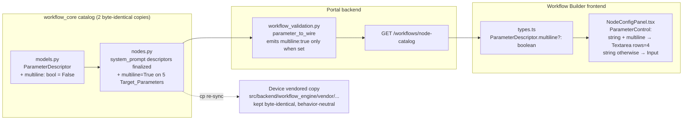

# Design Document

## Overview

This feature makes five long-text workflow parameters render as adjustable multi-line text areas in the Workflow Builder's node configuration panel, and finalizes the portal Node_Catalog's `system_prompt` declarations so those fields actually appear in the builder:

- `bedrock_inference.prompt`, `bedrock_inference.system_prompt`
- `llm_inference.prompt_template`, `llm_inference.system_prompt`
- `mqtt_publish.payload_template`

The change spans three thin layers, each already in place:

1. **Catalog data model** (`workflow_core/catalog/models.py`): a new optional `multiline: bool` field on `ParameterDescriptor` — the Multiline_Hint.
2. **Wire serialization** (`edge-cv-portal/backend/functions/workflow_validation.py::parameter_to_wire`): emit `multiline: true` only when declared, so undeclared descriptors keep a byte-identical pre-feature wire form.
3. **Frontend rendering** (`NodeConfigPanel.tsx` + `types.ts`): string parameters carrying the hint render as a Cloudscape `Textarea` (rows=4, natively vertically resizable) instead of the single-line `Input`, following the exact pattern already used for `code` (rows=12) and custom-python `requirements` (rows=4).

No compiler changes, no validator changes, no device executor changes: string values already accept newlines everywhere (JSON serialization, JSON Schema validation, executor bindings), and the hint is consumed only by the configuration panel.

### Key codebase facts that shape this design

Investigated during design (verified against the working tree and git history):

- **Byte-identical catalog mirror is enforced by tests.** `test/backend-test/workflow_engine/test_vendored_catalog_mirror.py` requires `nodes.py` and `models.py` to be byte-identical between the portal layer (`edge-cv-portal/backend/layers/workflow_core/python/workflow_core/catalog/`) and the device-vendored copy (`src/backend/workflow_engine/vendor/workflow_core/catalog/`). `test_catalog_content.py` in the portal layer asserts the same from the other side. **Consequence: every catalog edit in this feature is made identically to both copies.** This also makes Requirements 1.6, 2.6, and 6.2 (parity) structural: the files cannot drift.
- **Current working-tree state.** Both catalog copies already carry identical *uncommitted* `system_prompt` descriptor edits and are byte-identical to each other. Note: contrary to the requirements introduction, the device-side `system_prompt` support (vendored catalog, `output_bindings.py`, `text_generation.py`, `vllm_runtime/manager.py`) is also uncommitted working-tree state, not committed — this does not change the design (the mirror constraint holds either way), but committing this feature will finalize the vendored catalog file alongside the portal one.
- **Every served parameter must ship `examples`.** `edge-cv-portal/backend/tests/test_node_catalog_wire.py::test_every_parameter_serializes_nonempty_examples` fails for any parameter without non-empty examples. The working-tree `system_prompt` descriptors have none, so "finalizing" them includes adding `examples` (to both copies, identically).
- **A preservation golden pins the vendored `nodes.py` hash.** `test/backend-test/csi_nvargus_optional/goldens/backend_csi_consumers_sha256.json` pins the sha256 of `src/backend/workflow_engine/vendor/workflow_core/catalog/nodes.py` (already rebaselined once in the working tree). Editing `nodes.py` requires rebaselining this golden again in the same change. `models.py` is not pinned there.
- **The wire-shape regression test is the backward-compatibility proof.** `test_node_catalog_wire.py::test_parameter_wire_shape` pins the exact pre-feature wire dict for a descriptor without the hint. It must keep passing unmodified — that is Requirement 2.4 in test form.
- **Frontend hand-mirrored descriptors need no data changes.** `types.ts` carries hand-mirrored wire copies (`MQTT_SUBSCRIBE_DESCRIPTOR`, `OPCUA_SUBSCRIBE_DESCRIPTOR`, `MODBUS_WRITE_DESCRIPTOR`). The new `multiline?: boolean` wire field is optional and none of their parameters are Target_Parameters, so the mirrors stay untouched (absent = not multiline).
- **The LLM generation prompt embeds the wire catalog.** `workflow_generator.serialized_catalog_json` reuses `descriptor_to_wire`, so the generation system prompt will now include `"multiline": true` on five parameters. This is additive, harmless data (the generator emits parameter *values*, not descriptors).
- **Test tooling exists on both sides.** Backend: pytest + hypothesis (used throughout `workflow_core/tests/test_property_*.py`, 100 examples). Frontend: vitest + fast-check + `@testing-library/react`, with an existing `NodeConfigPanel.test.tsx` to extend.

## Architecture

The feature rides the existing catalog-to-panel data flow end to end; no new components, endpoints, or state.



Persistence and execution paths are untouched:

- **Save/load**: parameter values are plain JSON strings in the Workflow_Definition document; newlines are ordinary JSON string content (`"\n"` escapes) through the existing serializer.
- **Validation**: `system_prompt` is optional with default `""`, so documents omitting it validate unchanged; string constraint checks (`min_length` etc.) do not inspect newlines.
- **Compilation**: the compiler reads parameter *values* and mapping templates, never `ParameterDescriptor.multiline`, so executor bindings are identical with or without the hint.

### Design decisions and rationale

1. **Hint lives on the descriptor, not in the frontend.** A `multiline` field on `ParameterDescriptor` keeps the frontend free of per-node hardcoded parameter lists (Requirement 2's user story) and lets future parameters opt in with a one-line catalog edit. The alternative (a frontend name-based allowlist like the existing `REQUIREMENTS_PARAMETER` special case) was rejected as exactly the hardcoding the requirement forbids.
2. **Conditional wire emission.** `parameter_to_wire` adds the `multiline` key *only when the hint is declared*. This satisfies Requirement 2.4 literally (undeclared descriptors serialize byte-identically to today), keeps the pinned wire-shape test green untouched, and means the hand-mirrored frontend descriptors and `custom.py` custom-node declarations need no changes.
3. **Dataclass field appended with a default (`multiline: bool = False`).** Appending after `examples` with a default keeps every existing positional/keyword construction site valid in both catalog copies and in `custom.py`. The frozen dataclass stays frozen.
4. **Both catalog copies edited in lockstep, device behavior unchanged.** The mirror tests force this. The vendored copy change is data-only: device executors read parameter values by name from executor bindings and never consult `multiline`, so no device behavior changes and no on-device feature verification is required beyond the device-side unit suites (the builds.md hardware rule targets behavioral edge changes; this is inert catalog data — noted for transparency).
5. **Cloudscape `Textarea rows={4}`** matches Requirement 3.2's "at least 4 rows" and mirrors the existing `requirements` control. Cloudscape's `Textarea` renders a native `<textarea>`, which is vertically user-resizable by default (Requirement 3.3) — no custom CSS.
6. **Custom node types (`custom.py`) are out of scope.** The glossary defines Node_Catalog as `nodes.py`; Requirement 2.1 is satisfied by the data model supporting the hint on any string descriptor. Extending the custom-node declaration parser to accept `multiline` is a natural follow-up but not required here (custom descriptors default to `multiline=False` and serialize pre-feature wire forms).

## Components and Interfaces

### 1. Catalog data model — `workflow_core/catalog/models.py` (both copies)

```python
@dataclass(frozen=True)
class ParameterDescriptor:
    ...
    name: str
    param_type: str
    required: bool
    default: Any | None = None
    constraints: dict = field(default_factory=dict)
    depends_on: str | None = None
    description: str | None = None
    examples: list | None = None
    multiline: bool = False          # NEW: Multiline_Hint (Requirement 2.1)
```

Docstring addition (mirroring the existing `description`/`examples` prose): `multiline` is a rendering hint for string-typed parameters — the configuration UI renders the control as a user-resizable multi-line text area. `False` (the default) keeps every existing descriptor and its wire form unchanged.

### 2. Catalog declarations — `workflow_core/catalog/nodes.py` (both copies)

Two kinds of edits, applied identically to the portal and vendored files:

**(a) Finalize the `system_prompt` descriptors** (already present in the working tree) by adding the missing `examples` (required by the served-catalog examples test) and the hint:

```python
# BEDROCK_INFERENCE parameters (after max_tokens):
ParameterDescriptor("system_prompt", "string", required=False,
                    default="",
                    description="Optional system-role instructions "
                                "sent as the Bedrock Converse API "
                                "'system' parameter. Empty sends no "
                                "system parameter (identical to "
                                "previous behavior).",
                    examples=["You are a meticulous visual quality "
                              "inspector.\nAnswer concisely."],
                    multiline=True),
```

```python
# LLM_INFERENCE parameters (after top_p):
ParameterDescriptor("system_prompt", "string", required=False,
                    default="",
                    description="Optional system-role instructions "
                                "sent ahead of the prompt. UNLIKE "
                                "prompt_template, the value is sent "
                                "verbatim with no {placeholder} "
                                "rendering. Empty sends no system "
                                "prompt (identical to previous "
                                "behavior).",
                    examples=["You are a meticulous visual quality "
                              "inspector.\nAnswer concisely."],
                    multiline=True),
```

Name, type, `required=False`, `default=""`, and description text stay exactly as the working-tree device declarations (Requirements 1.1, 1.2, 1.6); only `examples` and `multiline` are added — and because both files receive the same bytes, parity is preserved by construction.

**(b) Add `multiline=True` to the three existing long-text descriptors**, changing nothing else about them (Requirement 2.6):

- `BEDROCK_INFERENCE` → `prompt`
- `LLM_INFERENCE` → `prompt_template`
- `MQTT_PUBLISH` → `payload_template` (default `"{inference_json}"`, constraints, description untouched — Requirement 5.2)

**(c) Re-sync**: `cp` the portal `nodes.py`/`models.py` over the vendored copies (or edit both identically) so the mirror tests stay green, and rebaseline the vendored `nodes.py` sha256 in `test/backend-test/csi_nvargus_optional/goldens/backend_csi_consumers_sha256.json`.

### 3. Wire serialization — `edge-cv-portal/backend/functions/workflow_validation.py`

```python
def parameter_to_wire(parameter: ParameterDescriptor) -> Dict:
    wire = {
        'name': parameter.name,
        'paramType': parameter.param_type,
        'required': parameter.required,
        'default': parameter.default,
        'constraints': constraints_to_wire(parameter.constraints),
        'dependsOn': parameter.depends_on,
        'description': parameter.description,
        'examples': list(parameter.examples) if parameter.examples is not None else None
    }
    # Multiline_Hint: serialized only when declared, so descriptors
    # without it keep the identical pre-feature wire form
    # (workflow-prompt-multiline-inputs Requirements 2.3, 2.4).
    if parameter.multiline:
        wire['multiline'] = True
    return wire
```

`GET /workflows/node-catalog` (Requirement 1.3) and `serialized_catalog_json` pick this up with no further changes.

### 4. Frontend wire type — `edge-cv-portal/frontend/src/pages/workflows/types.ts`

```typescript
export interface ParameterDescriptor {
  ...
  examples?: JsonValue[] | null;
  /**
   * Multiline_Hint: when true, the configuration panel renders this
   * string parameter's control as a user-resizable multi-line text
   * area (Cloudscape Textarea) instead of the single-line Input.
   * Serialized by the backend only when declared; absent means
   * single-line (the pre-feature wire form).
   */
  multiline?: boolean | null;
}
```

The hand-mirrored descriptors (`MQTT_SUBSCRIBE_DESCRIPTOR`, `OPCUA_SUBSCRIBE_DESCRIPTOR`, `MODBUS_WRITE_DESCRIPTOR`) stay unchanged: the field is optional and none of their parameters are hinted.

### 5. Panel rendering — `edge-cv-portal/frontend/src/pages/workflows/NodeConfigPanel.tsx`

One new branch in `ParameterControl`, placed immediately before the final single-line string fallback (after the `requirements`/`bool`/numeric/`code`/`model_ref`/`enum` branches, so existing special cases keep precedence):

```tsx
  // Catalog-declared Multiline_Hint: long-text string parameters
  // (prompts, templates) edit as a user-resizable multi-line Textarea
  // (workflow-prompt-multiline-inputs Requirements 3.1-3.3).
  if (paramType === 'string' && descriptor.multiline === true) {
    return (
      <Textarea
        rows={4}
        value={textValue(value)}
        onChange={({ detail }) => onChange(detail.value)}
        ariaLabel={descriptor.name}
      />
    );
  }

  // string (and any unknown paramType) falls back to free text ... (unchanged)
```

Everything around the control is untouched (Requirement 3.8): `ParameterField` still renders the label with the `- optional` marker, the catalog description (including the long-description collapsible), example chips, constraint violations via `checkParameterValue`, and `dependsOn` visibility gating — all of which operate on the descriptor, not the control kind. Value fidelity (Requirements 3.4, 3.5, 3.7, 6.1) holds because both `Textarea` and `Input` pass `detail.value` through verbatim and display `textValue(value)` verbatim; no trimming or newline handling exists anywhere in the panel's commit path.

Node duplication and export/import (Requirement 4.5) copy the node's `parameters` record and round-trip the JSON document respectively; neither transforms string values, so no changes are needed.

## Data Models

### ParameterDescriptor (Python, both catalog copies)

| Field | Type | Change |
|---|---|---|
| name / param_type / required / default / constraints / depends_on / description / examples | (existing) | unchanged |
| `multiline` | `bool`, default `False` | **new** — the Multiline_Hint |

### Wire form (camelCase, served by `GET /workflows/node-catalog`)

Pre-feature (and post-feature for every descriptor without the hint — byte-identical, Requirement 2.4):

```json
{"name": "...", "paramType": "...", "required": false, "default": null,
 "constraints": {}, "dependsOn": null, "description": "...", "examples": ["..."]}
```

With the hint (exactly the five Target_Parameters):

```json
{"name": "prompt", "paramType": "string", "required": true,
 "default": "...", "constraints": {"minLength": 1}, "dependsOn": null,
 "description": "...", "examples": ["..."], "multiline": true}
```

### Workflow_Definition document

Unchanged. Multi-line values are ordinary JSON strings (`"line1\nline2"`); schemaVersion stays 1; no migration.

## Correctness Properties

*A property is a characteristic or behavior that should hold true across all valid executions of a system — essentially, a formal statement about what the system should do. Properties serve as the bridge between human-readable specifications and machine-verifiable correctness guarantees.*

### Property 1: Wire serialization marks exactly the hinted descriptors and preserves the pre-feature form otherwise

*For any* list of `ParameterDescriptor`s with an arbitrary subset carrying `multiline=True`, serializing each with `parameter_to_wire` SHALL produce `multiline: true` on exactly the hinted subset, and for every descriptor outside the subset the wire dict SHALL equal the pre-feature serialization exactly (same keys, same values, no `multiline` key).

**Validates: Requirements 2.3, 2.4, 2.5**

### Property 2: Control kind follows the hint

*For any* string-typed parameter descriptor, the Node_Config_Panel SHALL render its control as a multi-line textarea with at least 4 rows when the descriptor carries `multiline: true`, and as the single-line input when it does not.

**Validates: Requirements 3.1, 3.2, 3.6**

### Property 3: Controls are value-faithful, newlines included

*For any* string value (including values containing newlines) and any string parameter descriptor (hinted or not), rendering the control SHALL display the stored value verbatim, and a change event entering the value SHALL commit it to the node's parameters verbatim — no trimming, newline stripping, or other transformation.

**Validates: Requirements 3.4, 3.5, 3.7, 6.1**

### Property 4: Workflow definition round trip preserves multi-line values

*For any* valid workflow graph whose Target_Parameters hold arbitrary string values with embedded newlines, serializing the graph to its Workflow_Definition document and parsing it back SHALL produce an equivalent graph with byte-identical parameter values.

**Validates: Requirements 4.3**

### Property 5: Definitions omitting system_prompt stay valid

*For any* valid workflow graph containing `bedrock_inference` and/or `llm_inference` nodes whose parameters omit `system_prompt`, catalog validation SHALL produce no finding that references `system_prompt`.

**Validates: Requirements 1.5**

### Property 6: Newlines are ordinary string content to validation

*For any* otherwise-valid workflow graph and any multi-line string value satisfying a Target_Parameter's declared constraints, assigning the value to that parameter SHALL produce no validation finding for that parameter.

**Validates: Requirements 4.4**

### Property 7: The hint is compilation-neutral

*For any* valid compilable workflow graph, compiling it against the catalog SHALL produce output identical to compiling it against a copy of the catalog with every `multiline` hint stripped (`dataclasses.replace(p, multiline=False)`).

**Validates: Requirements 6.3**

## Error Handling

This feature introduces no new error paths; the design preserves the existing ones:

- **Constraint violations** on multi-line values surface exactly as before via `checkParameterValue` → `FormField errorText` (Requirement 3.8); newlines never trigger violations because no string constraint inspects them (Property 6).
- **Older/other clients** receiving the wire form: the `multiline` key appears only on the five hinted parameters; clients that ignore unknown keys (the current frontend behavior for descriptors) are unaffected, and no key changes for unhinted descriptors (Property 1).
- **Missing hint on the frontend type** (`multiline` absent/null/false) always falls through to the pre-feature single-line input — fail-safe to the old behavior.
- **Catalog copy drift** is caught by the existing byte-identity mirror tests on both sides; the CSI preservation golden catches unbaselined vendored `nodes.py` edits. Both fail loudly in CI/builds rather than drifting silently.
- **`textValue(null)`** (unset optional `system_prompt`) renders an empty textarea, and an untouched empty value keeps the parameter at its default `""` — the existing optional-parameter behavior, preserving the empty-means-no-system-prompt semantics (Requirement 4.6, device-side behavior untouched).

## Testing Strategy

Dual approach: property-based tests verify the universal statements above across generated inputs; example-based tests pin the concrete catalog data and served shapes. Property tests use the ecosystem-standard libraries already in the repo — **hypothesis** (backend, already used across `workflow_core/tests/test_property_*.py`) and **fast-check** (frontend, already a devDependency) — never hand-rolled generators-from-scratch. Every property test runs **at least 100 iterations** and carries a comment tag referencing its design property:

```
**Feature: workflow-prompt-multiline-inputs, Property {N}: {property title}**
```

### Property-based tests

| Property | Where | Approach |
|---|---|---|
| 1 — wire exactness | `edge-cv-portal/backend/tests/` (hypothesis) | Generate random descriptors (names, types, required, defaults, constraints incl. snake_case keys, dependsOn, description, examples) with a random hinted subset; compare `parameter_to_wire` output against an inlined pre-feature reference serializer for unhinted ones; assert `multiline: true` on exactly the hinted ones |
| 2 — control kind | `NodeConfigPanel.test.tsx` (fast-check + testing-library) | Generate string descriptors ± `multiline`; render `NodeConfigPanel`; assert `textarea[aria-label=name]` with `rows >= 4` vs single-line `input` |
| 3 — value fidelity | `NodeConfigPanel.test.tsx` (fast-check) | Generate strings with newlines; assert displayed value verbatim and `onParametersChange` receives the exact string for both control kinds |
| 4 — round trip | `workflow_core/tests/` (hypothesis) | Extend the existing graph generators to place multi-line strings in Target_Parameters; assert `parse(serialize(g))` equivalence (pattern of `test_serializer_parse.py`) |
| 5 — omitted system_prompt valid | `workflow_core/tests/` (hypothesis) | Generate valid graphs with inference nodes omitting `system_prompt`; assert no finding mentions `system_prompt` |
| 6 — newline acceptance | `workflow_core/tests/` (hypothesis) | Generate valid graphs; assign generated multi-line values to Target_Parameters; assert no finding for those parameters |
| 7 — compile neutrality | `workflow_core/tests/` (hypothesis) | Generate compilable graphs; compile against the catalog and a hint-stripped `replace()` copy; assert identical output |

### Example-based unit tests

- **Catalog data** (backend): the five Target_Parameters declare `multiline=True` and no other parameter does; `system_prompt` descriptors on both inference nodes pin name/type/`required=False`/`default=""`/description/examples (Requirements 1.1, 1.2, 2.2, 2.6, 5.2).
- **Served catalog** (backend): `get_node_catalog` response contains both `system_prompt` wire descriptors with `multiline: true` (Requirement 1.3); the existing `test_parameter_wire_shape` stays untouched and green (Requirement 2.4's anchor); the existing non-empty-examples test now covers `system_prompt`.
- **Panel scenarios** (frontend): with the real bedrock/llm/mqtt_publish wire fixtures, `prompt`+`system_prompt`, `prompt_template`+`system_prompt`, and `payload_template` all render as `rows=4` textareas of the same style (Requirements 1.4, 4.1, 4.2, 5.1); a hinted descriptor renders the same label/description/examples/violation/dependsOn chrome as an unhinted one (Requirement 3.8); a builder node-duplicate carries a multi-line value verbatim (Requirement 4.5).

### Existing suites that gate this change (run, not written)

- `test_vendored_catalog_mirror.py` and the portal-layer `test_catalog_content.py` mirror check — byte-identical copies (Requirements 1.6, 6.2).
- `test/backend-test/csi_nvargus_optional/` preservation suite — after rebaselining the vendored `nodes.py` sha256 golden.
- The full `workflow_core` layer test suite and `edge-cv-portal/backend/tests/` — no regressions in validation/compilation/serialization.
- `edge-cv-portal/frontend` vitest suite (single-run mode).

### Out of scope for automated tests

- Actual drag-resizing of the textarea (Requirement 3.3): jsdom cannot exercise CSS resize; verified by the control being a native Cloudscape `Textarea` plus a manual visual check.
- Device executor behavior for `system_prompt` (Requirement 4.6): device-side code is untouched by this feature; its semantics are covered by the device-side working-tree changes' own tests.
