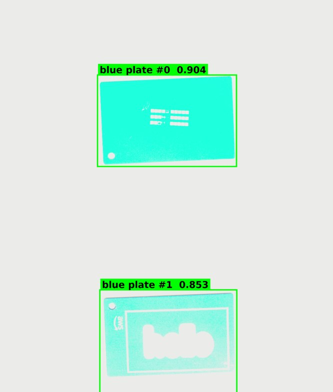

# Blue-plate detector retrain — outcome and open items

**Status (2026-09-13 04:20Z): DEPLOYED AND VERIFIED ON DEVICE.** The retrained
detector is running on `adlink-dlap-701` (DLAP JP7) inside the production
workflow `blue-plate-detection-guided-inspection`, and has been exercised
end-to-end by four workflow executions. The sections below the outcome are the
original mid-flight resume notes, kept for the record.

## Outcome



Execution `10e23f5c-5ad5-425a-a39f-7d624904991b` on the DLAP, one of four
completed runs (three console-triggered with encoded-image payloads, one
`quality/invoke` publish). Full-resolution frame with boxes:
`images/blue-plate-v2-detections-full.jpg` (2001x2352).

| | old model (`yolo-world-blue-plate`) | new model (`blue_plate_detector_v2`) |
|---|---|---|
| plate #0 confidence | 0.209 | **0.904** |
| plate #1 confidence | 0.109 | **0.853** |
| score_threshold | 0.08 (crutch) | 0.25 |
| resize path | squash | **letterbox** (`preserve_aspect: true`) |
| boxes | same two plates | same two plates, within ~1px across all 4 runs |

Deployed state: `model-blue-plate-detector-v2-jetson-xavier-jp7` **2.0.0**
(RUNNING, Triton READY), workflow `dda.workflow.25794912-…` **20.0.0**
(graph version 19, `model_1.modelName = blue_plate_detector_v2`), old model
component removed from the deployment and from the Triton repo. Deployment
`650faa25-8af7-4ea8-b61e-b29ca8fa3cca`, revision built from revision 27 with
only the three intended changes. LocalServer 1.0.29 unchanged. Backend served
200s throughout ~30 min of checks; no crash-loop.

## Open items found during verification

1. **Detection label is `person`, not `blue_plate`.** `class_names` was not
   set on the `blue_plate_detector_v2` import, and the fallback is a COCO
   class-0 name (not `"0"` as previously assumed). Cosmetic for this workflow
   (conditionals gate on `is_anomalous`; Bedrock crops by detection index) but
   it is what the results viewer / HMI show. Fix: re-import under the SAME
   name with Class names = `blue_plate`, re-package, redeploy the model
   component only. No workflow change.
2. **`bedrock_3` fails every run**: `crop_detection_index 2 but only 2
   detection(s)`. Pre-existing (the old model also found exactly two plates in
   this scene). Either the scene has two plates and the node should go, or it
   has three and both models miss one — the test image decides which.
3. **`qwen3-vl-8b-instruct` is FAILED** since the deployment restarted
   LocalServer: `Free memory on device (37.55/122.83 GiB) ... less than desired
   GPU memory utilization (0.5, 61.41 GiB)`. All four ONNX models now come up
   on GPU after the restart and starve vLLM. Breaks the LLM node `n3` in
   "IMTS - Swagfactory", which also subscribes to `quality/invoke`. Fix: lower
   `gpu_memory_utilization`, or stop the ONNX models not needed on this device
   (`yolo-test`, `cookies-segmentation` look like leftovers).
4. **Nothing listens on 8081** on the device (`ss -ltnp`, `curl` → 000). The
   HMI that consumes this workflow is not running there, or is bound elsewhere.
5. Three `quality/invoke` subscribers fire on every trigger (25794912,
   596c8577, 91084dbd) — a test trigger for one workflow runs all three.
6. `deployGroundedSamWorker` defaults ON and its download step has no timeout;
   it hung a portal deploy for 67 min. Deploy with
   `-c deployGroundedSamWorker=false` unless that worker is actually needed.

## Device access notes (for the next person)

- `aws iotsecuretunneling open-tunnel` (NOT `aws iot open-tunnel` as
  `docs/connect-to-device.md` says — that subcommand does not exist in this
  CLI). Local proxy per that doc, `--destination-client-type V1`.
- A V1 tunnel accepts exactly ONE connection ("simultaneous connections are
  not enabled"). Batch everything into a single `ssh ... 'bash -s' < script`.
- Two workflow systems coexist on the device: `/workflows/registrations`
  (graph workflows — the one that matters) and `/workflows` (legacy, e.g.
  `u724uckx` "blue blate test"). `/aws_dda/inference-results/<id>/` holds
  LEGACY captures only. Graph-workflow results live under
  `/workflows/executions/{id}/{results,log,node-status,output-image,
  node-image?nodeId=&port=}` — the `log` endpoint's final "Workflow execution
  ... completed; tags:" line carries the detections and confidences.
- `YOLO decode` lines do NOT appear in the Greengrass component log or the
  flask-app container log; use the execution log endpoint instead.
- The device sudo password was shared in-session on 2026-09-13 and should be
  rotated. `/tmp/dpw_remote` on the device may still hold it: `shred -u`.

---

## Resume here (shortest path)

1. **Finish the portal deploy.** The ComputeStack — which carries the fix — has
   NOT been deployed. Re-run, skipping the multi-gigabyte grounded-sam image
   build that is not needed for this change:

   ```
   cd edge-cv-portal/infrastructure
   cdk deploy --all --require-approval never --force \
     -c deployGroundedSamWorker=false \
     -c cloudFrontDomain=d23v4ltibogb5x.cloudfront.net
   ```

   The shell must have docker group membership. `ryvan` was added to the
   `docker` group, but **existing login sessions do not inherit it** — either
   start a fresh login or wrap the command: `sg docker -c '<command>'`.

2. **Verify the fix is actually live** before importing anything. A green
   CloudFormation status does not prove the new asset reached the function:

   ```
   aws lambda get-function --region us-east-1 \
     --function-name <ModelConverterHandler physical name> \
     --query 'Code.Location' --output text
   # download that URL, unzip, grep -n preserve_aspect model_converter.py
   ```

   If `preserve_aspect` is absent, the deploy did not take. **Do not run the
   Smart Import until it is present** — the old code writes a squash manifest,
   which is the entire bug being fixed.

3. `./deploy-frontend.sh` — needed for the letterbox checkbox / class-names /
   threshold fields in the UI. (Backend-only is enough if you drive the API
   directly.)

4. Then the model swap, below.

---

## What is already done

### Committed (branch `integration/all-specs`, working tree clean, NOT pushed)

| commit | what |
|---|---|
| `c42c68c` | Recovered `datasets/detection_training/train.py` (the SageMaker entry point that existed only inside an S3 sourcedir tarball) + `build_sourcedir.sh` + README; added `edge-cv-portal/backend/tests/test_manifest_to_detector_dataset.py` (11 tests) replacing a lost scratch harness; tracked the previously-untracked `datasets/*.py` and `docs/detection-training-gap.md` |
| `d30d1d8` | Corrected `docs/detection-training-gap.md`: §3 is closed, §1's reference to the deleted `.debug_tmp/test_converter.py` repointed |
| `d0b07ee` | **The fix.** `preserve_aspect` + `class_names` + score/IoU thresholds plumbed through Smart Import (`model_converter.py`, `SmartImport.tsx`, `api.ts`) + `test_model_converter_preserve_aspect.py` (10 tests) |
| `4f62dfd` | Rebaselined `model_converter.py`'s sha256 in `iam_out_of_scope_baseline.json` (see "Traps") |

Verification at time of writing: 21 backend tests pass; frontend `tsc --noEmit`
exits 0; the three preservation out-of-scope guards pass (6 passed, 3 skipped).

### Trained model

SageMaker job `blue-plate-yolo-20260912-231818` (us-east-1), **Completed**,
1227s on one `ml.g4dn.xlarge`. test mAP@50 **0.995**, mAP@50-95 **0.919**,
precision 0.9989, recall 1.0. yolo11s.pt base, 100 epochs, batch 4, imgsz 1280
square, opset 17. Metrics come from the converter's leakage-safe test split, but
all frames are one capture session — they say nothing about a new camera or new
lighting.

ONNX output `[1, 5, 33600]` (4 box + 1 class at 1280). No in-graph NMS, which is
what `YoloDetectionPostProcessor` expects.

**Staged and ready to import** (extracted from the tarball, verified by
download-and-rehash round trip):

```
s3://ryvan-cookies/raw-models/blue-plate-yolo/model.onnx
38,411,162 bytes
sha256 1a1144c4b760937ff86ccb74c6fab7ab5c6ee893cf9a343a5868a7314fe33dbb
```

Import must point at this bare `.onnx`, NOT at `model.tar.gz` — nothing
validates the bytes, and a wrong URI only surfaces as an on-device ORT load
failure.

---

## State of the interrupted deploy

`./deploy-infrastructure.sh` was running under `nohup sg docker` when the
machine went down. Log: `/tmp/deploy2.log` (lost on reboot).

Completed: `EdgeCVPortalAuthStack` (no changes), `EdgeCVPortalStorageStack`,
`EdgeCVPortalTestRunnerStack`. **`EdgeCVPortalComputeStack` never started** — it
was still building the grounded-sam Docker image (step 4/6, downloading the
~700 MB Grounding DINO ONNX from HuggingFace).

All portal stacks read `UPDATE_COMPLETE`. CloudFormation was not mid-mutation;
the interrupted work was a local Docker asset build only, so there is nothing to
clean up or roll back. The portal is running its previous code.

An earlier attempt failed outright with
`permission denied ... /var/run/docker.sock` — that is what prompted adding
`ryvan` to the `docker` group.

---

## Remaining work: swap the model in the workflow (Option B, chosen)

Target device: **`adlink-dlap-701`** (the DLAP JP7 at 192.168.8.224), running
LocalServer JP7 **1.0.29**. That version postdates the letterbox commit
`eb42022`, so **no LocalServer component rebuild is needed** — this is entirely
cloud-side plus a Greengrass deployment.

### 1. Smart Import

| field | value |
|---|---|
| Model S3 URI | `s3://ryvan-cookies/raw-models/blue-plate-yolo/model.onnx` |
| Model name | `blue-plate-yolo` |
| Model type | Object detection |
| Detection architecture | YOLO |
| Input size | custom 1280 x 1280 |
| Number of classes | 1 |
| Class names | `blue_plate` |
| Input resize geometry | **letterbox / preserve aspect — ON** |
| Score / IoU threshold | 0.25 / 0.45 |
| Compilation targets | must include `jetson-xavier-jp7` |

Smart Import auto-creates the `dda-portal-training-jobs` record with
`source='imported'`, which is what makes packaging skip SageMaker Neo. Result:
component `model-blue-plate-yolo-jetson-xavier-jp7` 1.0.0.

### 2. Workflow edit

Workflow **`blue-plate-detection-guided-inspection`**, id
`25794912-eb5a-4876-9aef-038e463d61ba`, currently version 17 → component
`dda.workflow.25794912-eb5a-4876-9aef-038e463d61ba` **18.0.0** (deployed).

Graph: `s3://dda-portal-artifacts-164152369890-us-east-1/workflows/645504ce-a60a-4009-8349-7548c0025cd3/25794912-eb5a-4876-9aef-038e463d61ba/versions/17/workflow.json`
(24 nodes). Exactly one node references the model:

```json
{
  "id": "model_1",
  "type": "model_inference",
  "parameters": {
    "detection_sort_order": "left_to_right",
    "modelName": "yolo-world-blue-plate"
  }
}
```

Change `modelName` to `blue-plate-yolo`. Leave `detection_sort_order` alone.
This creates workflow version 18.

`modelName` is a `model_ref` (`workflow_core/catalog/nodes.py:570`) resolved on
device by matching feature-configuration entries
(`dda_triton/model_convertor.py:79`) against the portal model record's
`model_name` — hence the bare name, not the component name.

The node carries no thresholds; score/IoU live in the model manifest, set at
import time. The old model runs `score_threshold` 0.08 (a crutch for a bad
model); the new one gets 0.25.

### 3. Package

Package workflow version 18 for `arm64_jp7` → component
`dda.workflow.25794912-…` **19.0.0**.

### 4. Greengrass deployment to `adlink-dlap-701`

Three changes, nothing else touched:

- `dda.workflow.25794912-eb5a-4876-9aef-038e463d61ba` 18.0.0 → **19.0.0**
- remove `model-yolo-world-blue-plate-jetson-xavier-jp7` **3.0.0**
- add `model-blue-plate-yolo-jetson-xavier-jp7` **1.0.0**

Leave alone: `aws.edgeml.dda.LocalServer.arm64JP7` 1.0.29,
`dda.workflow.91084dbd-…` 1.0.0, `dda.workflow.596c8577-…` 14.0.0,
`model-cookies-segmentation-onnx-jetson-xavier-jp7` 4.0.0,
`model-rf-detr-seg-nano-jetson-xavier-jp7` 8.0.0,
`model-yolo-test-jetson-xavier-jp7` 8.0.0,
`model-vllm-qwen3-vl-8b-instruct-jetson-xavier-jp7` 3.0.0.

**Rollback:** redeploy workflow 18.0.0 + model 3.0.0.

### 5. On-device verification (required by the repo's edge rule)

Publish to `quality/invoke` (the workflow's subscribed topic) and confirm:

- detections come back labelled **`blue_plate`**, not `"0"` — that alone proves
  `class_names` reached the device manifest;
- detections are present and better than the old model's;
- the backend stays healthy for a sustained period, not just at startup.

The device's Greengrass root is `/aws_dda/greengrass/v2` (not `/greengrass/v2`).
Backend is `python3 app.py` on plaintext port 5000, host network, routes at the
root path (no `/api` prefix). SSH key auth works for `nvidia@192.168.8.224`;
**sudo needs a password**, so `docker` / `/aws_dda/greengrass/v2/config` are not
readable non-interactively.

---

## Traps and open items

**`cdk.out` must be moved aside before any component build.** The failed deploy
regenerated ~53 MB of `edge-cv-portal/infrastructure/cdk.out`, unbaselined. The
preservation drift guard runs AFTER the ~1h GPU compile, so a stale baseline
wastes the whole build:
`mv cdk.out cdk.out.bak-$(date +%Y%m%dT%H%M%SZ)`

**`model_converter.py` IS preservation-tracked** — its sha256 is pinned in
`test/backend-test/security/baselines/iam_out_of_scope_baseline.json` under
`sibling_spec_files`. Editing it fails
`test_preservation_iam_out_of_scope_guard.py::test_sibling_spec_files_unchanged`.
Rebaseline that one entry (already done in `4f62dfd`). Note
`docs/detection-training-gap.md` §9 claims these portal files are not tracked —
that is WRONG for this file, and the commonly cited two-guard pre-build check
does not include the IAM guard. Run the whole
`test/backend-test/security/preservation` directory. Expected host-only noise:
`test_preservation_deserialization_roundtrip.py` needs `dill`,
`test_preservation_snapshotter.py` needs `fastapi` (both live in the flask-app
image) — not drift.

**Likely bug: `deployGroundedSamWorker` default is inverted.** The
grounded-sam Dockerfile header states the multi-gigabyte build should only
happen "when the `deployGroundedSamWorker` context flag is set: ... routine
portal deploys must never pay" it. But `cdk.json:20` sets it to `true` and
`context-helpers.ts:2` calls it "Default-ON". Combined with
`deploy-infrastructure.sh` doing `rm -rf cdk.out` (discarding the cached asset),
**every** portal deploy rebuilds and re-downloads ~700 MB+. Worth fixing
separately.

**Geometry contract.** The model trains letterboxed at square 1280 and must be
served letterboxed (`preserve_aspect: true`). Mismatch costs ~1.35x mean
confidence and up to 5.7x on high-resolution frames, silently — see
`docs/detection-training-gap.md` §7. Note `train.py` uses square 1280 while §2
of that doc recommends rectangular 1088x1280 for near-zero padding; both are
valid so long as training and serving agree.

**Do NOT request TensorRT** for this graph — `OnnxRunner.__select_providers`
excludes it deliberately for BYO detection graphs (it mis-executes YOLO's
in-graph DFL / anchor-grid ops and silently returns empty results). CUDA EP is
faithful.

### Not done

- No automated test for the `SmartImport.tsx` form wiring itself (page tests in
  that directory each carry a ~450-line render harness). The API boundary is
  covered by `test_model_converter_preserve_aspect.py`.
- The staged `model.onnx` was never validated locally with onnxruntime (not
  installed on the host, no flask-app image available). It is covered from the
  producing side: `train.py` opened an `InferenceSession` on this exact file in
  the training container and recorded `onnx_output_shape: [1,5,33600]`.
- Nothing has been pushed to the remote.

### Environment quirks worth knowing

- `fs_write`-style tooling silently no-ops against this WSL UNC path (reports
  success, writes nothing). Create files via shell heredoc and read them back.
- Always use `git --no-pager` — the pager blocks the terminal and swallows
  whatever command follows.
- The shell intermittently drops output entirely, and reports `Exit Code: -1`
  even on success. Judge by side effects, not exit codes.
